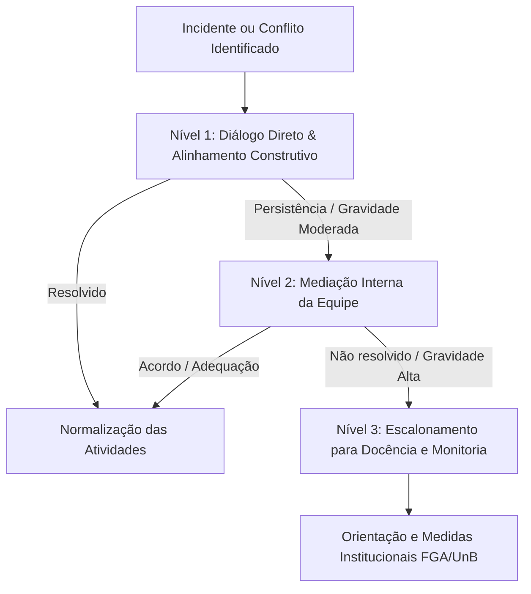

# Código de Conduta — Grupo 06

> **Projeto:** Streaming de Vídeo (Transmissões ao Vivo e Conteúdo UGC)  
> **Disciplina:** FGA0208 — Arquitetura e Desenho de Software (UnB/FGA, 2026.2)  
> **Documentação Publicada:** [GitPages do Grupo 06](https://unbarqdsw2026-2-turma01.github.io/2026.2-T01-_G6_ProjetoStreamingV-deo_Entrega_01/)

---

## Sumário

1. [Nosso Compromisso](#1-nosso-compromisso)
2. [Padrões de Convivência](#2-padrões-de-convivência)
3. [Diretrizes do Trabalho Acadêmico em Equipe](#3-diretrizes-do-trabalho-acadêmico-em-equipe)
4. [Responsabilidades e Governança](#4-responsabilidades-e-governança)
5. [Escopo de Aplicação](#5-escopo-de-aplicação)
6. [Processo de Resolução de Conflitos e Aplicação](#6-processo-de-resolução-de-conflitos-e-aplicação)
7. [Referências e Atribuições](#7-referências-e-atribuições)
8. [Histórico de Versões](#histórico-de-versões)

---

## 1. Nosso Compromisso

Nós, membros e colaboradores do Grupo 06, estamos comprometidos em promover um ambiente de aprendizado e desenvolvimento acolhedor, inclusivo, colaborativo e livre de assédio para todas as pessoas, independentemente de idade, deficiência, identidade ou expressão de gênero, nível de experiência acadêmica ou profissional, etnia, religião, orientação sexual ou formação tecnológica.

Comprometemo-nos a agir e interagir de maneira a contribuir para uma comunidade aberta, acolhedora, diversificada, inclusiva e saudável.

---

## 2. Padrões de Convivência

Para criar uma experiência positiva para todos os integrantes e colaboradores, incentivamos os seguintes **comportamentos esperados**:

* **Empatia e Respeito Mútuo:** Tratar todos os membros com consideração e respeito, reconhecendo a diversidade de pontos de vista e níveis de familiaridade com os tópicos da disciplina.
* **Direto, mas Gentil:** Comunicar-se de forma clara, sincera e objetiva sobre questões técnicas e decisões de projeto, mantendo sempre o rigor técnico com empatia, respeito e sem aspereza ou deboche.
* **Comunicação Construtiva:** Expressar opiniões, críticas técnicas e sugestões de maneira gentil, focando no progresso do projeto e no aprendizado coletivo.
* **Escuta Ativa e Acolhimento:** Ouvir atentamente as contribuições de colegas, aceitar críticas construtivas de mente aberta e buscar o alinhamento em decisões de arquitetura e design.
* **Foco no Bem Coletivo e Apoio Mútuo:** Priorizar os objetivos da equipe e a qualidade dos artefatos entregues, agindo com transparência, solidariedade e assiduidade.

Exemplos de **comportamentos inaceitáveis** incluem:

* Uso de linguagem ou imagens de cunho sexualizado, ofensivo ou inapropriado.
* *Trolling*, comentários depreciativos, ataques pessoais ou de cunho político/ideológico.
* Assédio público ou privado de qualquer natureza.
* Divulgação de informações confidenciais ou privadas de terceiros sem autorização explícita.
* Atitudes desrespeitosas, desqualificação de dúvidas ou desvalorização do trabalho de colegas.
* Qualquer conduta que comprometa o ambiente seguro e colaborativo do grupo.

---

## 3. Diretrizes do Trabalho Acadêmico em Equipe

Como este repositório integra as atividades de uma disciplina da Universidade de Brasília (UnB), aplicam-se diretrizes essenciais para o fluxo de trabalho acadêmico:

### 3.1. Compromisso, Assiduidade e Divisão de Tarefas

* **Assiduidade:** Participar ativamente das reuniões gerais do grupo e das subequipes, comunicando com antecedência justificativas de ausência.
* **Comprometimento com Prazos:** Respeitar os prazos internos acordados pela equipe para viabilizar as etapas de revisão cruzada antes da entrega final.
* **Divisão Equitativa:** Contribuir de forma proporcional e proativa na elaboração dos artefatos, registrando formalmente as participações e comprovatórios (commits/PRs).

### 3.2. Cultura de Revisão Construtiva (*Code Review & Pull Requests*)

* **Foco no Artefato:** As análises em *Pull Requests* e revisões de documentos devem focar no conteúdo técnico, consistência metodológica e conformidade com as diretrizes da disciplina, nunca na pessoa do autor.
* **Sugestões Claras e Justificadas:** Ao sugerir correções ou melhorias, apresentar justificativas embasadas (literatura, boas práticas ou critérios de avaliação) e, preferencialmente, exemplos práticos.
* **Abertura ao Feedback:** Tratar comentários de revisão como oportunidades de aprimoramento mútuo e alinhamento conceitual.

### 3.3. Integridade Acadêmica e Honestidade Intelectual

* **Autenticidade e Autoria:** Todos os artefatos devem ser fruto do trabalho e dedicação da equipe, com a devida atribuição de fontes e referências bibliográficas.
* **Repúdio ao Plágio:** É estritamente vedada a cópia não atribuída de trabalhos de semestres anteriores, conteúdos protegidos ou produções externas.
* **Ética e Conformidade:** Agir com transparência e honestidade intelectual em todas as entregas. As diretrizes operacionais de rastreabilidade, fluxo de trabalho e registro do uso de ferramentas auxiliares (como IA Generativa) são detalhadas no [Guia de Contribuição (CONTRIBUTING.md)](CONTRIBUTING.md).

---

## 4. Responsabilidades e Governança

Todos os integrantes do Grupo 06 compartilham a responsabilidade de zelar pelo cumprimento deste Código de Conduta. Os líderes e mantenedores do repositório têm o dever de:

* Esclarecer e manter atualizados os padrões de comportamento aceitáveis;
* Agir de maneira justa, imparcial e tempestiva diante de relatos de conduta inadequada;
* Moderar comentários em *issues*, *pull requests*, canais de comunicação e páginas da documentação, editando ou removendo manifestações que violem este documento.

---

## 5. Escopo de Aplicação

Este Código de Conduta se aplica a todos os espaços do projeto, incluindo:

* O repositório no GitHub (código, documentação, *issues*, *discussions*, *pull requests* e comentários);
* Páginas publicadas da documentação (GitPages / Docsify);
* Canais de comunicação síncronos e assíncronos (reuniões no Teams/Google Meet/Discord, grupos de WhatsApp/Telegram);
* Apresentações, gravações de reuniões e interações presenciais no ambiente universitário relacionadas à disciplina.

---

## 6. Processo de Resolução de Conflitos e Aplicação

Caso ocorra algum desacordo, conflito ou comportamento que viole as diretrizes deste código, adotar-se-á um processo de resolução em níveis graduados:

1. **Nível 1 — Diálogo Direto:** Diálogo amigável e privado entre as partes envolvidas para alinhamento de expectativas e esclarecimento de mal-entendidos.
2. **Nível 2 — Mediação Interna do Grupo:** Se o conflito persistir, o assunto será debatido em reunião de alinhamento com a presença de membros neutros da equipe para buscar consenso e redefinição de papéis/tarefas.
3. **Nível 3 — Escalonamento para Docência e Monitoria:** Em casos de violação grave (assédio, desrespeito continuado, fraude acadêmica ou recusa injustificada de cooperação), a questão será levada formalmente ao conhecimento do professor responsável e dos monitores da disciplina para orientação e medidas cabíveis conforme o regimento da UnB.

---

## 7. Referências e Atribuições

* **Contributor Covenant (v2.1):** Adaptado a partir do padrão internacional disponível em [https://www.contributor-covenant.org/version/2/1/code_of_conduct/](https://www.contributor-covenant.org/version/2/1/code_of_conduct/).
* **Mozilla Community Participation Guidelines (CPG):** Princípio de comunicação "Direto, mas Gentil" (*Direct but Kind*), disponível em [https://www.mozilla.org/about/governance/policies/participation/](https://www.mozilla.org/about/governance/policies/participation/).
* **Diretrizes da Disciplina:** Plano de Ensino e Critérios de Avaliação de FGA0208 — Arquitetura e Desenho de Software (UnB/FGA, 2026.2).
* **Código de Ética da Universidade de Brasília (UnB).**

---

## Histórico de Versões

| Versão | Data | Descrição | Autor(es) | Revisor(es) | Descrição da revisão |
| -- | -- | -- | -- | -- | -- |
| `1.0` | 21/08/2026 | Criação do Código de Conduta adaptado com base no Contributor Covenant 2.1, Mozilla CPG e diretrizes acadêmicas da FGA0208 | Eduardo Lôbo Moreira | Equipe Grupo 06 | Revisão da estrutura inicial do documento, conformidade com o template e organização das seções. |
