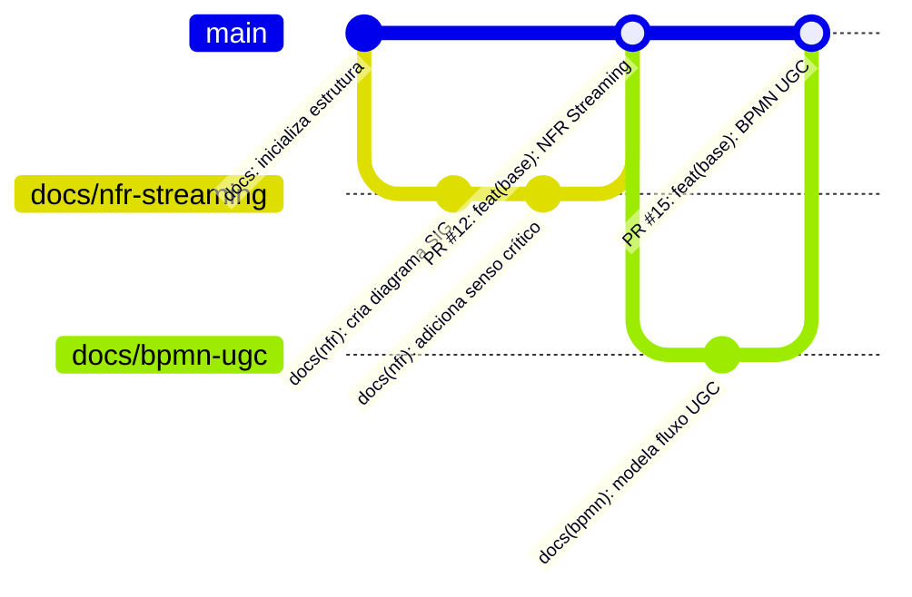

# Guia de Contribuição — Grupo 06

> **Projeto:** Streaming de Vídeo (Transmissões ao Vivo e Conteúdo UGC)  
> **Disciplina:** FGA0208 — Arquitetura e Desenho de Software (UnB/FGA, 2026.2)  
> **Documentação Publicada:** [GitPages do Grupo 06](https://unbarqdsw2026-2-turma01.github.io/2026.2-T01-_G6_ProjetoStreamingV-deo_Entrega_01/)

---

## Sumário

1. [Visão Geral e Modelo de Governança](#1-visão-geral-e-modelo-de-governança)
2. [Ambiente Local e Execução da Documentação](#2-ambiente-local-e-execução-da-documentação)
3. [Tipos de Contribuição Reconhecidos](#3-tipos-de-contribuição-reconhecidos)
4. [Padrões de Issues e Labels](#4-padrões-de-issues-e-labels)
5. [Fluxo de Trabalho no Git e GitHub](#5-fluxo-de-trabalho-no-git-e-github)
6. [Padrão de Mensagens de Commit e Co-autoria](#6-padrão-de-mensagens-de-commit-e-co-autoria)
7. [Padrão de Pull Requests e Vínculos Automáticos](#7-padrão-de-pull-requests-e-vínculos-automáticos)
8. [Diretrizes de Transparência no Uso de IA Generativa](#8-diretrizes-de-transparência-no-uso-de-ia-generativa)
9. [Rastreabilidade e Quadro de Participações](#9-rastreabilidade-e-quadro-de-participações)
10. [Critérios de Aceitação do Pull Request](#10-critérios-de-aceitação-do-pull-request)
11. [Referências e Atribuições](#11-referências-e-atribuições)
12. [Histórico de Versões](#histórico-de-versões)

---

## 1. Visão Geral e Modelo de Governança

Este repositório segue os padrões de desenvolvimento colaborativo do GitHub (GitHub Standards) e os princípios ágeis de governança definidos na [Metodologia do Projeto](docs/Projeto/Metodologia.md):


* **Padrões Oficiais do GitHub:** Utilização de branch protection na `main`, rastreabilidade via Issues vinculadas, revisões formais de Pull Requests e labels padronizadas.
* **Responsabilidade Coletiva e Descentralizada:** Todos os membros têm autonomia para propor melhorias em artefatos, código e documentação.
* **Contribuições Atômicas:** Cada *Pull Request* (PR) deve ter um escopo claro e único (responsabilidade única), facilitando a revisão rápida por pares.
* **Transparência:** Todas as discussões, decisões arquiteturais e alterações devem ser rastreáveis via *Issues*, *Pull Requests* e [Atas de Reunião](docs/Projeto/Atas/).
* **Respeito aos Prazos da Disciplina:** Todas as postagens devem respeitar os prazos estritos da disciplina. Conforme as diretrizes gerais da FGA, após o encerramento do prazo de cada entrega, o repositório é congelado para avaliação docente.

---

## 2. Ambiente Local e Execução da Documentação

As instruções detalhadas para instalação de dependências e execução do Docsify localmente via `npm run docs` ou `npx` estão centralizadas na seção de **Tecnologia & Documentação** do [README.md principal](README.md#tecnologia--documentação).


---

## 3. Tipos de Contribuição Reconhecidos

Reconhecemos e valorizamos múltiplos tipos de contribuições necessárias para o desenvolvimento do projeto:

| Categoria | Tag | Descrição |
| :--- | :---: | :--- |
| **Documentação** | `doc` | Criação e aprimoramento de páginas da wiki/Docsify, relatórios e atas. |
| **Modelagem e Design** | `design` | Criação de Rich Pictures, Mapas Mentais, diagramas BPMN e SIG (NFR Framework). |
| **Engenharia de Software** | `code` | Implementação de código, protótipos e scripts de automação. |
| **Revisão por Pares** | `review` | Revisões técnicas construtivas em PRs, validação de diagramas e checklists. |
| **Pesquisa e Experimentação** | `research` | Engenharia de prompts, análise crítica de saídas de IA e estudo de literatura. |
| **Gestão e Organização** | `management` | Organização de reuniões, gravação de atas e acompanhamento de cronogramas. |

---

## 4. Padrões de Issues e Labels

Conforme as boas práticas do GitHub Standards, o planejamento, a distribuição de tarefas e o rastreamento de entregas são gerenciados por meio de **Issues**.

### 4.1. Criação e Estrutura de Issues

Toda nova tarefa, modelo a ser elaborado ou correção deve possuir uma issue correspondente contendo:

* Título claro e objetivo;
* Contexto e escopo detalhado do que deve ser feito;
* Subequipe ou responsáveis atribuídos (*Assignees*);
* Labels de identificação adequadas.

### 4.2. Padronização de Labels

| Label | Finalidade |
| :--- | :--- |
| `documentation` | Tarefas relacionadas a documentos, relatórios e páginas no Docsify. |
| `enhancement` | Criação de novos artefatos de modelagem, arquitetura ou funcionalidades. |
| `bug` | Correções de erros conceituais, inconsistências em diagramas ou links quebrados. |
| `subequipe-1` | Artefatos e entregas sob responsabilidade da Subequipe 1. |
| `subequipe-2` | Artefatos e entregas sob responsabilidade da Subequipe 2. |
| `subequipe-3` | Artefatos e entregas sob responsabilidade da Subequipe 3. |
| `question` | Dúvidas, alinhamentos metodológicos ou debates arquiteturais. |

---

## 5. Fluxo de Trabalho no Git e GitHub

Adotamos um fluxo estruturado com branches temáticas para garantir simplicidade e rastreabilidade:



### 5.1. Política de Branches

* `main`: Branch principal e protegida. Sempre deve conter código e documentação funcionais prontos para publicação no GitPages.
* **Branches Temáticas:** Devem ser criadas a partir da `main` atualizada, seguindo o padrão de nomenclatura:
  * `docs/<nome-do-artefato>` (ex.: `docs/mapa-mental-live`, `docs/nfr-subequipe1`)
  * `feat/<nome-da-funcionalidade>` (ex.: `feat/prototipo-upload`, `feat/chat-tempo-real`)
  * `fix/<correcao-ou-link>` (ex.: `fix/links-docsify`, `fix/ajuste-tabela-versoes`)

### 5.2. Passo a Passo para Contribuir

1. **Atualize sua `main` local:**

   ```bash
   git checkout main
   git pull origin main
   ```

2. **Crie uma branch temática:**

   ```bash
   git checkout -b docs/meu-artefato
   ```

3. **Faça as modificações necessárias** e realize commits atômicos conforme os padrões da seção 6.
4. **Envie a branch para o repositório remoto:**

   ```bash
   git push origin docs/meu-artefato
   ```

5. **Abra um *Pull Request* (PR)** apontando para a `main`, preenchendo a descrição com o vínculo da issue correspondente e solicitando revisão de outra subequipe.

---

## 6. Padrão de Mensagens de Commit e Co-autoria

### 6.1. Estrutura do Commit

Os commits devem ser realizados exclusivamente pelos membros humanos da equipe e seguir a convenção padronizada:

```text
<tipo>(<escopo opcional>): <descrição clara e concisa no imperativo>

[corpo opcional explicando o motivo da mudança]

[trailers / co-autores humanos]
```

### 6.2. Tipos Permitidos

* `docs:` Criação ou alteração em arquivos de documentação (Markdown, Docsify, atas, relatórios).
* `feat:` Novo artefato de modelagem, novo diagrama finalizado ou nova funcionalidade.
* `fix:` Correção de inconsistências conceituais em diagramas, links quebrados ou bugs.
* `style:` Ajustes puramente visuais, formatação de Markdown ou CSS do Docsify sem alteração semântica.
* `refactor:` Reorganização de arquivos, renomeação de artefatos ou reescrita sem mudança de escopo.
* `chore:` Tarefas de manutenção do repositório (`package.json`, `.gitignore`, scripts).

**Exemplos:**

```bash
git commit -m "docs(base): adiciona diagrama SIG do NFR Framework para transmissões ao vivo"
git commit -m "fix(docsify): corrige caminhos relativos de imagens em docs/assets/"
```

### 6.3. Co-autoria em Commits

Quando dois ou mais integrantes desenvolverem um artefato em conjunto (em reuniões ou modelagem em par), a co-autoria deve ser registrada no rodapé da mensagem do commit para fins de comprobatório acadêmico:

```bash
git commit -m "docs(bpmn): modela fluxo de transmissão ao vivo

Co-authored-by: Nome do Colega <email.do.colega@exemplo.com>
Co-authored-by: Outro Colega <email.do.outro@exemplo.com>"
```

---

## 7. Padrão de Pull Requests e Vínculos Automáticos

### 7.1. Vínculo Automático com Issues (*Closing Keywords*)

Para manter o repositório sincronizado e rastreável, **todo Pull Request deve referenciar a Issue que resolve** utilizando as palavras-chave nativas do GitHub. Ao realizar o merge do PR na `main`, o GitHub fechará automaticamente as issues vinculadas.

As palavras-chave suportadas são:

* `Closes #<numero>` ou `Close #<numero>`
* `Fixes #<numero>` ou `Fix #<numero>`
* `Resolves #<numero>` ou `Resolve #<numero>`

**Exemplo de descrição de Pull Request:**

```markdown
## Descrição
Adiciona o modelo BPMN e a respectiva documentação da engenharia reversa do fluxo de transmissão ao vivo.

## Artefatos Impactados
* `docs/Base/Relatorios/1.1.1.Subequipe1.md`
* `docs/assets/bpmn/subequipe_01_bpmn.png`

## Vínculo com Issues
Closes #14

## Checklist
* [x] Imagens versionadas localmente conforme o padrão de assets
* [x] Histórico de versões preenchido
* [x] Revisado por par de outra subequipe
```

### 7.2. Revisão por Pares em Pull Requests

* **Critério de Aprovação:** Todo PR direcionado à `main` deve ter a aprovação formal de pelo menos **1 revisor da mesma ou de outra subequipe** (conforme estabelecido na [Metodologia do Projeto](docs/Projeto/Metodologia.md#3-fluxo-de-versionamento)).
* **Postura na Revisão:** As revisões devem seguir o princípio "Direto, mas Gentil", apontando melhorias técnicas e conformidades com cordialidade e clareza.


---

## 8. Diretrizes de Transparência no Uso de IA Generativa

O uso de ferramentas de Inteligência Artificial Generativa (como ChatGPT, Claude, Gemini, Copilot) é permitido como recurso de apoio ao aprendizado e prototipação, devendo ser conduzido com rigor metodológico, ética e transparência humana.

### 8.1. Requisitos Obrigatórios ao Utilizar IA

Sempre que uma ferramenta de IA for utilizada na concepção, elicitação, modelagem ou redação de um artefato:

1. **Declaração Explícita:** Declarar no documento quais ferramentas foram utilizadas.
2. **Registro de Prompts e Entradas:** Documentar os prompts fornecidos à IA em seção dedicada ou em apêndice rastreável.
3. **Refinamento Humano Crítico:** Explicitar as análises feitas pela equipe sobre a saída da IA:
   * Quais sugestões foram aceitas e por quê;
   * Quais alucinações, inconsistências ou inadequações técnicas foram identificadas e corrigidas pelo grupo;
   * Quais adaptações foram realizadas para atender ao domínio específico de Streaming de Vídeo / UGC.
4. **Ponto de Vista Individual:** Conforme as diretrizes da disciplina, cada membro deve registrar suas lições aprendidas e impressões críticas sobre a utilidade e limitações da IA em seu relatório de foco.

---

## 9. Rastreabilidade e Quadro de Participações

Para atender às exigências de avaliação individual e em equipe:

* Cada membro deve manter atualizado o seu registro no Quadro de Participações do módulo correspondente (ex.: [`docs/Base/1.2.ParticipacoesBase.md`](docs/Base/1.2.ParticipacoesBase.md)).
* Cada item declarado deve conter o seu link comprobatório direto (URL do commit no GitHub, PR aceito ou gravação de reunião).
* Autores e revisores devem constar explicitamente na tabela de histórico de versões de cada arquivo editado.

---

## 10. Critérios de Aceitação do Pull Request

Antes de solicitar a aprovação final do PR, certifique-se de que a contribuição atende aos seguintes requisitos:

* [ ] Imagens e mídias salvas localmente na pasta `docs/assets/`, seguindo a convenção de nomenclatura e resolução definida no [Padrão de Assets](docs/assets/README.md);
* [ ] Página incluída na navegação lateral [`docs/_sidebar.md`](docs/_sidebar.md) (se for um novo arquivo);
* [ ] Seções estruturais obrigatórias preenchidas conforme a [Metodologia do Projeto](docs/Projeto/Metodologia.md#5-definition-of-done-da-entrega-1) (Descrição, Rastreabilidade, Senso Crítico e Referências);
* [ ] Registro transparente do uso de IA Generativa (se aplicável), com prompts e refinamento humano;
* [ ] Tabela de histórico de versões preenchida com autores e revisores;
* [ ] Issue correspondente vinculada com palavra-chave de fechamento automático;
* [ ] Pull Request revisado e aprovado por pelo menos 1 membro da mesma ou de outra subequipe (conforme a [Metodologia](docs/Projeto/Metodologia.md));
* [ ] Quadro de Participações atualizado com os links comprobatórios de commits/PRs.

---

## 11. Referências e Atribuições

* **GitHub Flow & Open Source Guides:** Documentação oficial sobre fluxo de desenvolvimento e colaboração, disponível em [https://docs.github.com/en/get-started/using-github/github-flow](https://docs.github.com/en/get-started/using-github/github-flow) e [https://opensource.guide/](https://opensource.guide/).
* **Conventional Commits (v1.0.0):** Especificação para padronização de mensagens de commit, disponível em [https://www.conventionalcommits.org/en/v1.0.0/](https://www.conventionalcommits.org/en/v1.0.0/).
* **Collective Code Construction Contract (C4.1):** Especificação de governança ágil e descentralizada (RFC 42), disponível em [https://rfc.zeromq.org/spec/42/](https://rfc.zeromq.org/spec/42/).
* **All Contributors Specification:** Padrão de reconhecimento de múltiplos tipos de contribuições, disponível em [https://allcontributors.org/](https://allcontributors.org/).
* **Docsify:** Gerador de documentação oficial, disponível em [https://docsify.js.org/](https://docsify.js.org/).
* **Diretrizes da Disciplina:** Plano de Ensino e Critérios de Avaliação de FGA0208 — Arquitetura e Desenho de Software (UnB/FGA, 2026.2).

---

## Histórico de Versões

| Versão | Data | Descrição | Autor(es) | Revisor(es) |
| :---: | :---: | :---: | :---: | :---: |
| `1.0` | 21/08/2026 | Criação do Guia de Contribuição com GitHub Standards, ambiente local, fluxo de PRs, diretrizes de IA, rastreabilidade e referências | Eduardo Lôbo Moreira | Equipe Grupo 06 |
| `1.1` | 24/08/2026 | Alinhamento da regra de revisão de PRs com a Metodologia e centralização de instruções de execução no README | Eduardo Lôbo Moreira | Equipe Grupo 06 |

