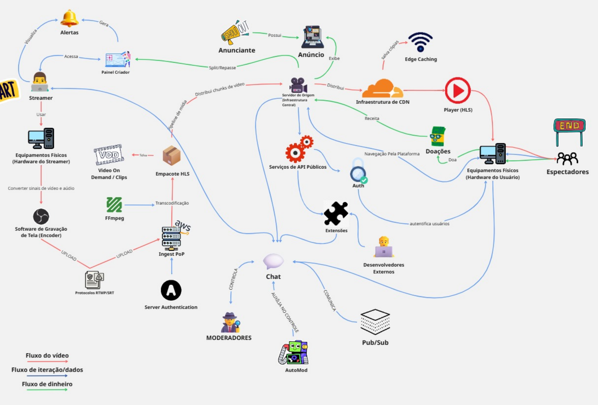

# FOCO_01 · Artefato Generalista — SubEquipe_01

> **Entrega mínima do foco**: um artefato generalista, com **escopo restrito a Rich Picture ou Mapa Mental**.
> **Status**: ⬜ não iniciado · **Responsáveis**: SubEquipe_01 (todos — construção conjunta)

## 1. Metodologia do Foco

<!--
PREENCHER:
- como o artefato foi construído (sessões de trabalho, brainstorming, revisões);
- ferramenta utilizada e por quê;
- fontes de informação (exploração da aplicação de referência, literatura, entrevistas);
- como o trabalho foi dividido dentro da subequipe.
-->

O artefato será construído **em conjunto** pela subequipe, sem divisão individual nesta fase ([Ata 02, D04](../../../Projeto/Atas/ata-02-2026-08-23.md#decisões)). Sessões de trabalho, ferramenta utilizada e fontes de informação: a preencher conforme a construção avançar.

## 2. Fundamentação Teórica

<!--
PREENCHER: o que é o artefato escolhido e por que ele é adequado a este momento do projeto.
A diretriz pede embasamento na literatura para menções superiores — citar autor/obra e
referenciar em 6.Referencias.md.
-->
_A preencher._

## 3. Artefato

<!-- Salvar a imagem em docs/assets/artefatos/ e referenciar abaixo. Manter também o arquivo-fonte (.drawio, .xmind etc.) versionado. -->

> 🖼️ **Imagem pendente.** Salvar o arquivo em `docs/assets/artefatos/subequipe_01_artefato-generalista.png` (ver [Padrão de Assets](../../../assets/README.md)) e substituir este bloco por:
>
> ```markdown
> 
> ```

*Figura 1 — _(legenda a preencher)_. Autor(es): _(preencher)_, DD/MM/AAAA.*

| Item | Valor |
| -- | -- |
| Tipo do artefato | Rich Picture ([Ata 02, D02](../../../Projeto/Atas/ata-02-2026-08-23.md#decisões)) |
| Ferramenta utilizada | _a definir_ |
| Arquivo-fonte editável | _(link no repositório)_ |
| Versão do artefato | _a definir_ |

## 4. Descrição / Leitura do Artefato

<!--
PREENCHER: percorrer o artefato explicando os elementos representados — atores, sistemas,
fluxos, preocupações. Um leitor que não participou da elaboração precisa entender a imagem
lendo esta seção.
-->
_A preencher._

## 5. Rastreabilidade & Elos com Outros Artefatos

| Elemento do artefato | Elo com | Onde (link) | Natureza do elo |
| -- | -- | -- | -- |
| | | | |

<!-- Ex.: um ator representado aqui vira uma lane no BPMN; uma preocupação representada aqui vira um softgoal no SIG. -->

## 6. Senso Crítico

<!--
PREENCHER:
- limitações do artefato e do que ele não consegue expressar;
- decisões de recorte (o que ficou de fora e por quê);
- alternativas consideradas e descartadas;
- o que a equipe faria diferente.
-->
_A preencher._

## 7. Participantes & Comprobatórios

| Membro | Contribuição | Comprobatório (commit/PR) |
| -- | -- | -- |
| _(preencher)_ | | |

## 8. Referências

<!-- Listar aqui as referências específicas deste artefato; consolidar em 6.Referencias.md. -->
_A preencher._

## Histórico de Versões

| Versão | Data | Descrição | Autor(es) | Revisor(es) |
| -- | -- | -- | -- | -- |
| 1.0 | 21/08/2026 | Criação da página | Lucas Andrade Zanetti | Heitor Macedo Ricardo |
| 1.1 | 23/08/2026 | Definição do tipo de artefato (Rich Picture), a partir da Ata 02 | [SubEquipe_01](../../../Projeto/Atas/ata-02-2026-08-23.md) | Lucas Andrade Zanetti |
