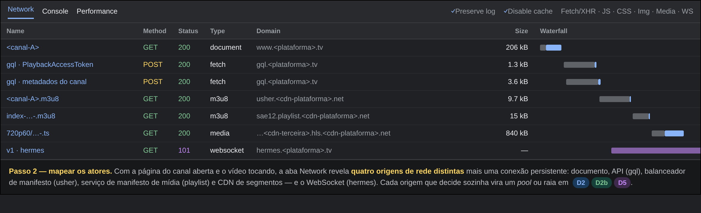
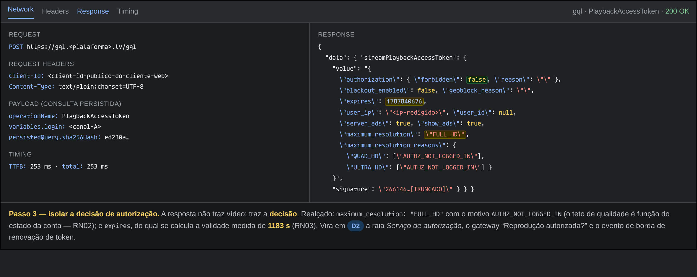
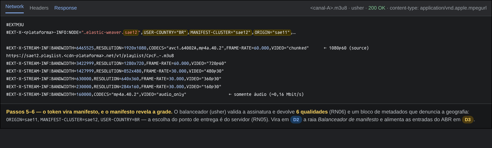
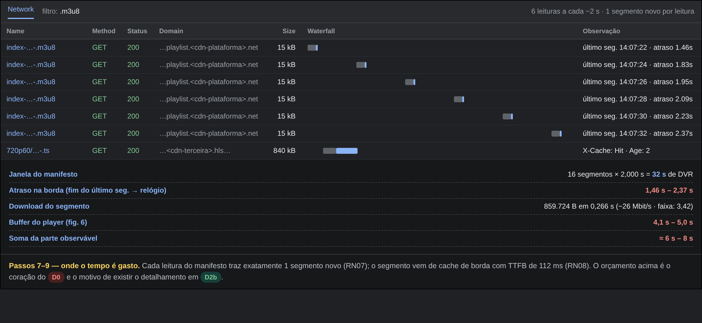
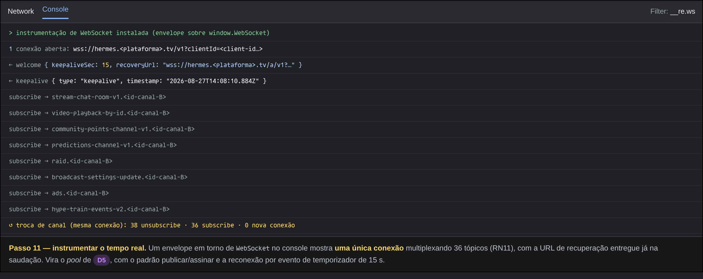
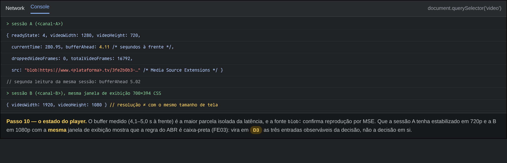

# FOCO_02 · Engenharia Reversa — SubEquipe_01

> **Entrega mínima do foco** (junto com o [BPMN](4.BPMN.md)): um modelo, na notação BPMN, do fluxo do software encontrado com a Engenharia Reversa. Esta página documenta **o processo** que levou ao modelo.
> **Status**: recorte único em **Performance/Latência**, v1 concluída em 27/08/2026, com participação de toda a subequipe.

## 0. Escopo do Foco

O foco de Engenharia Reversa da SubEquipe_01 fica restrito ao softgoal oficialmente atribuído: **Performance/Latência** ([Escopo do Produto §6](../../../Projeto/EscopoProduto.md#_6-requisitos-não-funcionais-candidatos-insumo-para-os-sigs)). Todos os quatro integrantes participaram da coleta, da análise e da documentação deste único recorte.

## 1. Metodologia do Foco

| Item | Definição |
| -- | -- |
| Estratégia | **Engenharia reversa por caixa-preta, no nível de protocolo.** A subequipe não tenta recuperar o código: recupera o *processo* observando as mensagens que a aplicação troca com os próprios serviços dela enquanto o fluxo acontece |
| Por que no nível de protocolo, e não só de interface | O softgoal da subequipe é **Performance/Latência** ([SIG §3](2.NFRFramework.md#_3-softgoal-escolhido-e-justificativa)). Latência não aparece na interface: aparece no tempo entre requisições, no tamanho da janela de segmentos e na ocupação do buffer. Um roteiro só de cliques produziria um BPMN de telas, não de desempenho |
| Instrumento principal | Aba **Network** e **Console** do navegador, e repetição das mesmas requisições fora do navegador com `curl` para poder cronometrar cada salto isoladamente |
| Reprodutibilidade | Toda a coleta está roteirizada em [`tools/engenharia-reversa/`](https://github.com/UnBArqDsw2026-2-Turma01/2026.2-T01-_G6_ProjetoStreamingVideo_Entrega_01/blob/main/tools/engenharia-reversa/coletar.sh). Qualquer membro repete a coleta com um comando e obtém um conjunto novo de evidências |
| Tratamento das evidências | Anonimização automática e documentada antes de versionar — ver [ANONIMIZACAO.md](../../../assets/engenharia-reversa/subequipe_01/ANONIMIZACAO.md) |
| Uso de IA generativa | **Sim, nesta sessão.** Assistente de IA usado como par para conduzir a coleta, roteirizar as medições, **escrever o código de reconstrução das figuras do DevTools** (§5.1 — para não expor a plataforma analisada) e redigir esta página; a interpretação dos achados e a decisão sobre o que vira modelo foram revisadas pelo membro. Detalhamento em [FOCO_03](5.IAGenerativa.md#_2-onde-a-ia-generativa-foi-utilizada) |
| Limites éticos e legais adotados | Ver [§2.3](#_23-limites-adotados-na-coleta) |

Processo geral do grupo em [Metodologia & Processo](../../../Projeto/Metodologia.md).

## 2. Fundamentação Teórica — Engenharia Reversa

### 2.1. Definição e nível de abstração

CHIKOFSKY e CROSS (1990) definem engenharia reversa como *"o processo de analisar um sistema para identificar seus componentes e as inter-relações entre eles, e criar representações do sistema em outra forma ou em um nível mais alto de abstração"*. Dois pontos da definição orientam este foco:

1. **É um processo de exame, não de alteração.** Engenharia reversa não modifica o sistema analisado. Isso separa o que a subequipe fez de reengenharia, de *refactoring* e de qualquer atividade intrusiva.
2. **O produto é uma representação em nível mais alto.** O alvo aqui não é código nem esquema de banco: é o **processo de negócio**, que é o nível pedido pela notação BPMN.

Os mesmos autores distinguem *redocumentation* (recriar uma representação no mesmo nível de abstração) de *design recovery* (recuperar abstrações que não estão explícitas em nenhum artefato do sistema, combinando o que se observa com conhecimento de domínio). O que esta página faz é **design recovery**: os manifestos e as requisições observadas não descrevem um processo; o processo é a abstração construída sobre eles com apoio da literatura de streaming ao vivo.

PRESSMAN e MAXIM (2016) organizam a engenharia reversa em três alvos — dados, processamento e interface. A subequipe atua sobre **processamento** (a sequência de trocas que produz a reprodução) e sobre **dados** (a estrutura dos manifestos e do token), e deliberadamente não sobre interface, que é o recorte de outras subequipes.

### 2.2. Caixa-preta, caixa-branca e o que isso limita

| Abordagem | Acesso | Aplicável aqui? |
| -- | -- | -- |
| Caixa-branca | Código-fonte, binários, esquema de dados | <svg width="14" height="14" viewBox="0 0 16 16" style="vertical-align:-2px"><circle cx="8" cy="8" r="7" fill="#c62828"/><path d="M5.4 5.4 10.6 10.6M10.6 5.4 5.4 10.6" stroke="#fff" stroke-width="1.7" stroke-linecap="round"/></svg> Não há acesso |
| Caixa-cinza | Documentação interna, telemetria, logs de servidor | <svg width="14" height="14" viewBox="0 0 16 16" style="vertical-align:-2px"><circle cx="8" cy="8" r="7" fill="#c62828"/><path d="M5.4 5.4 10.6 10.6M10.6 5.4 5.4 10.6" stroke="#fff" stroke-width="1.7" stroke-linecap="round"/></svg> Não há acesso |
| **Caixa-preta** | Só o comportamento observável nas fronteiras do sistema | <svg width="14" height="14" viewBox="0 0 16 16" style="vertical-align:-2px"><circle cx="8" cy="8" r="7" fill="#2e7d32"/><path d="M4.6 8.2 6.9 10.5 11.4 5.8" fill="none" stroke="#fff" stroke-width="1.7" stroke-linecap="round" stroke-linejoin="round"/></svg> É o caso |

A consequência disso é metodológica e precisa aparecer no resultado: **em caixa-preta observa-se o efeito, nunca a regra que o produz**. É possível medir que a janela do manifesto tem 16 segmentos; não é possível afirmar por que 16. É possível registrar que o player estabilizou em 720p60 numa sessão e em 1080p60 em outra; não é possível descrever o algoritmo que decidiu. Por isso os achados de §6 são classificados por **grau de confiança**, e o não-escopo [FE03](../../../Projeto/EscopoProduto.md#_7-fora-de-escopo) (algoritmo de recomendação e ordenação) é respeitado por construção.

### 2.3. Limites adotados na coleta

Engenharia reversa aplicada a um sistema de terceiros exige recorte explícito. A subequipe fixou, antes de começar:

| Limite | Como foi respeitado |
| -- | -- |
| Só requisições que a própria aplicação faz | Nenhum endpoint foi descoberto por força bruta ou por enumeração. Toda requisição repetida em `curl` foi antes observada saindo do navegador |
| Sem autenticação | A coleta rodou **sem sessão**, sem conta e sem cookie. Consequência visível na evidência: o token devolvido limita a resolução máxima com o motivo "não autenticado" |
| Sem contornar proteção | Nada de burlar geobloqueio, paywall, DRM ou limite de taxa |
| Volume de leitura | Poucas dezenas de requisições ao todo, no volume de uma sessão humana. Não houve varredura, laço automático prolongado nem download de conteúdo para redistribuição |
| Sem redistribuir conteúdo | Nenhum segmento de vídeo foi publicado. As evidências versionadas são manifestos e cabeçalhos, com identificadores substituídos |
| Sem identificar pessoas | Nome e identificador dos canais observados foram trocados por rótulos genéricos ([ANONIMIZACAO.md](../../../assets/engenharia-reversa/subequipe_01/ANONIMIZACAO.md)) |

## 3. Contexto da Aplicação Analisada

> <svg width="15" height="14" viewBox="0 0 16 16" style="vertical-align:-2px"><path fill="#c77700" d="M8 1 15.5 14.5H.5z"/><rect x="7.2" y="5.6" width="1.6" height="4.6" fill="#fff"/><rect x="7.2" y="11.4" width="1.6" height="1.6" fill="#fff"/></svg> **Não usar o nome real da fonte de inspiração** (diretriz, não-escopo [FE06](../../../Projeto/EscopoProduto.md#_7-fora-de-escopo)).

| Item | Valor |
| -- | -- |
| Descrição da aplicação de referência | Ver [Escopo do Produto §1](../../../Projeto/EscopoProduto.md#_1-identidade-do-projeto) |
| Plataforma analisada | Site (aplicação web), navegador baseado em Chromium |
| Data e hora da análise | 27/08/2026, entre 14:04 e 14:09 UTC |
| Origem da coleta | Brasília (DF), conexão doméstica de banda larga |
| Perfil de usuário utilizado | **Espectador anônimo**, sem conta e sem sessão iniciada |
| Amostra | Dois canais ao vivo distintos, um deles de audiência alta (`<canal-A>`) e outro de audiência média (`<canal-B>`) |
| Fluxo selecionado para modelagem | Assistir Transmissão ao Vivo (mínimo) — mais Início da Transmissão, Adaptação de Qualidade, Recuperação de Falha e Tempo Real como extras |
| Por que este fluxo foi escolhido | Ponto onde a latência/buffering do "ao vivo" é mais sensível ao usuário — liga diretamente ao softgoal Performance/Latência da subequipe |

### 3.1. Hipóteses Herdadas do Rich Picture — resultado da verificação

O [Rich Picture v1](1.ArtefatoGeneralista.md) foi construído a partir de conhecimento prévio dos membros e de pesquisa em documentação pública, **sem inspeção da aplicação**. Cada componente entrou como hipótese e só vira achado depois de evidenciado ([Ata S1_02](../../../Projeto/Atas/Atas_Sg1/ata-S1-02-2026-08-25.md#decisões)).

| # | Hipótese levantada no Rich Picture | Veredito | Evidência / observação |
| -- | -- | -- | -- |
| H01 | Ingestão sobre **RTMP**, com **SRT** como alternativa | <svg width="14" height="14" viewBox="0 0 16 16" style="vertical-align:-2px"><circle cx="8" cy="8" r="6.4" fill="none" stroke="#9aa0a6" stroke-width="1.5"/></svg> **Não verificável** por caixa-preta de espectador | O protocolo de ingestão não aparece do lado de quem assiste. Permanece hipótese; em D1 está modelado como atividade do criador, não como achado |
| H02 | **PoPs de ingestão** distribuídos, com autenticação por chave | <svg width="14" height="14" viewBox="0 0 16 16" style="vertical-align:-2px"><circle cx="8" cy="8" r="7" fill="#455a64"/><path d="M8 1a7 7 0 0 1 0 14z" fill="#f9a825"/></svg> **Parcial** | O manifesto mestre declara a origem (`ORIGIN`) numa região e o nó de manifesto (`MANIFEST-CLUSTER`) em outra — há distribuição geográfica de fato. A autenticação por chave continua não observável |
| H03 | Entrega em **HLS**, manifesto + segmentos, múltiplas resoluções | <svg width="14" height="14" viewBox="0 0 16 16" style="vertical-align:-2px"><circle cx="8" cy="8" r="7" fill="#2e7d32"/><path d="M4.6 8.2 6.9 10.5 11.4 5.8" fill="none" stroke="#fff" stroke-width="1.7" stroke-linecap="round" stroke-linejoin="round"/></svg> **Confirmada** | `#EXTM3U`, manifesto mestre com 6 variantes, `#EXT-X-TARGETDURATION:5`, segmentos `#EXTINF:2.000` — [EV-02](https://github.com/UnBArqDsw2026-2-Turma01/2026.2-T01-_G6_ProjetoStreamingVideo_Entrega_01/blob/main/docs/assets/engenharia-reversa/subequipe_01/performance-latencia/ev02-manifesto-mestre.m3u8), [EV-03](https://github.com/UnBArqDsw2026-2-Turma01/2026.2-T01-_G6_ProjetoStreamingVideo_Entrega_01/blob/main/docs/assets/engenharia-reversa/subequipe_01/performance-latencia/ev03-manifesto-de-midia.m3u8) |
| H03b | Uso de **LL-HLS** (segmentos parciais), como assumido em [O04 do SIG](2.NFRFramework.md#_51-operacionalizações-propostas) | <svg width="14" height="14" viewBox="0 0 16 16" style="vertical-align:-2px"><circle cx="8" cy="8" r="7" fill="#c62828"/><path d="M5.4 5.4 10.6 10.6M10.6 5.4 5.4 10.6" stroke="#fff" stroke-width="1.7" stroke-linecap="round"/></svg> **Refutada nesta amostra** | Nenhuma tag `EXT-X-PART` nos manifestos observados; `#EXT-X-VERSION:3` e segmentos inteiros de 2 s, mesmo com a requisição sinalizando interesse em baixa latência. Ver [§8](#_8-senso-crítico) |
| H04 | **CDN** com **cache de borda** | <svg width="14" height="14" viewBox="0 0 16 16" style="vertical-align:-2px"><circle cx="8" cy="8" r="7" fill="#2e7d32"/><path d="M4.6 8.2 6.9 10.5 11.4 5.8" fill="none" stroke="#fff" stroke-width="1.7" stroke-linecap="round" stroke-linejoin="round"/></svg> **Confirmada** | Segmentos servidos com `X-Cache: Hit` e `Age` entre 2 s e 26 s, de um PoP no Rio de Janeiro — [EV-04](https://github.com/UnBArqDsw2026-2-Turma01/2026.2-T01-_G6_ProjetoStreamingVideo_Entrega_01/blob/main/docs/assets/engenharia-reversa/subequipe_01/performance-latencia/ev04-tempos.txt), [EV-05](https://github.com/UnBArqDsw2026-2-Turma01/2026.2-T01-_G6_ProjetoStreamingVideo_Entrega_01/blob/main/docs/assets/engenharia-reversa/subequipe_01/performance-latencia/ev05-medicoes-de-latencia.txt) |
| H04b | O cache cobre **tudo** o que a CDN serve | <svg width="14" height="14" viewBox="0 0 16 16" style="vertical-align:-2px"><circle cx="8" cy="8" r="7" fill="#c62828"/><path d="M5.4 5.4 10.6 10.6M10.6 5.4 5.4 10.6" stroke="#fff" stroke-width="1.7" stroke-linecap="round"/></svg> **Refutada** | O manifesto de mídia vem com `Cache-Control: no-cache, no-store, private`: só os segmentos são cacheáveis. Achado central deste foco — ver [RN04](#_63-regras-de-negócio-inferidas) |
| H05 | Chat em tempo real sobre **Pub/Sub** em conexão persistente | <svg width="14" height="14" viewBox="0 0 16 16" style="vertical-align:-2px"><circle cx="8" cy="8" r="7" fill="#2e7d32"/><path d="M4.6 8.2 6.9 10.5 11.4 5.8" fill="none" stroke="#fff" stroke-width="1.7" stroke-linecap="round" stroke-linejoin="round"/></svg> **Confirmada e detalhada** | Uma única conexão WebSocket multiplexando 36 tópicos por canal, com saudação declarando `keepaliveSec` e URL de recuperação — [EV-06](https://github.com/UnBArqDsw2026-2-Turma01/2026.2-T01-_G6_ProjetoStreamingVideo_Entrega_01/blob/main/docs/assets/engenharia-reversa/subequipe_01/performance-latencia/ev06-tempo-real.txt) |
| H06 | **Clipes gerados a partir do VOD**, não do sinal ao vivo | <svg width="14" height="14" viewBox="0 0 16 16" style="vertical-align:-2px"><circle cx="8" cy="8" r="6.4" fill="none" stroke="#9aa0a6" stroke-width="1.5"/></svg> **Não investigada** | Fora do recorte desta subequipe; fluxo pertence a outro conjunto de funcionalidades ([Escopo §4, F08](../../../Projeto/EscopoProduto.md#_4-principais-funcionalidades-levantadas)) |

> **Duas hipóteses do artefato anterior caíram.** Isso é resultado, não falha: é exatamente o que separa o Rich Picture (conhecimento prévio) do FOCO_02 (observação). O SIG precisa ser corrigido — encaminhamento em [§8](#_8-senso-crítico).

## 4. Processo Aplicado — Etapas

O roteiro abaixo é o que a subequipe executou, na ordem, e é reexecutável por qualquer membro. Cada etapa responde a uma pergunta específica: quem fala com quem, o que é decidido, e quanto tempo custa.

| # | Etapa | Pergunta que responde | Como foi feito | Evidência |
| -- | -- | -- | -- | -- |
| 1 | Delimitar o alvo | *Qual fluxo, em qual plataforma, com qual perfil?* | Fixado antes de abrir o navegador: fluxo "assistir ao vivo", versão web, espectador anônimo ([§3](#_3-contexto-da-aplicação-analisada)) | — |
| 2 | Mapear os atores externos | *Quantos serviços distintos a página conversa?* | Aba Network filtrada por domínio, com a página do canal aberta e o vídeo em reprodução. Resultado: **quatro** origens distintas (documento, API, manifesto, segmentos) mais a conexão de tempo real | EV-06 |
| 3 | Isolar a chamada de decisão | *Onde o sistema autoriza a reprodução?* | Busca no corpo das requisições da API pelo nome da operação que precede o pedido de manifesto. A resposta traz o token e os motivos de restrição | [EV-01](https://github.com/UnBArqDsw2026-2-Turma01/2026.2-T01-_G6_ProjetoStreamingVideo_Entrega_01/blob/main/docs/assets/engenharia-reversa/subequipe_01/performance-latencia/ev01-token.json) |
| 4 | Repetir a chamada fora do navegador | *A decisão depende de estado do cliente?* | Mesma requisição em `curl`, sem cookie, com o mesmo cabeçalho de cliente. Resposta equivalente ⇒ a decisão é do servidor, e o cliente só transporta | EV-01 |
| 5 | Reconstruir o pedido de manifesto | *O que o player faz com o token?* | Montagem da URL do manifesto mestre com o par (valor, assinatura) devolvido — [`montar_url.py`](https://github.com/UnBArqDsw2026-2-Turma01/2026.2-T01-_G6_ProjetoStreamingVideo_Entrega_01/blob/main/tools/engenharia-reversa/montar_url.py) | [EV-02](https://github.com/UnBArqDsw2026-2-Turma01/2026.2-T01-_G6_ProjetoStreamingVideo_Entrega_01/blob/main/docs/assets/engenharia-reversa/subequipe_01/performance-latencia/ev02-manifesto-mestre.m3u8) |
| 6 | Ler a grade de qualidades | *Quais alternativas o ABR tem?* | Leitura das tags `#EXT-X-STREAM-INF` do manifesto mestre: resolução, taxa de bits e taxa de quadros de cada faixa | EV-02 |
| 7 | Amostrar a janela ao vivo | *Qual é o atraso e de quanto em quanto tempo ele anda?* | Seis leituras do manifesto de mídia a cada 2 s, comparando o relógio local com o fim do segmento mais novo — [`medir_playlist.py`](https://github.com/UnBArqDsw2026-2-Turma01/2026.2-T01-_G6_ProjetoStreamingVideo_Entrega_01/blob/main/tools/engenharia-reversa/medir_playlist.py) | [EV-05](https://github.com/UnBArqDsw2026-2-Turma01/2026.2-T01-_G6_ProjetoStreamingVideo_Entrega_01/blob/main/docs/assets/engenharia-reversa/subequipe_01/performance-latencia/ev05-medicoes-de-latencia.txt) |
| 8 | Cronometrar cada salto | *Onde o tempo é gasto: em cálculo ou em transporte?* | `curl -w` com DNS, TCP, TLS, TTFB e total para os cinco endereços do fluxo | [EV-04](https://github.com/UnBArqDsw2026-2-Turma01/2026.2-T01-_G6_ProjetoStreamingVideo_Entrega_01/blob/main/docs/assets/engenharia-reversa/subequipe_01/performance-latencia/ev04-tempos.txt) |
| 9 | Medir a entrega do segmento | *O cache de borda existe e funciona?* | Download de um segmento com leitura de `X-Cache`, `Age` e ponto de presença; repetição para observar o envelhecimento do objeto | EV-04, EV-05 |
| 10 | Observar o estado do player | *Quanto buffer o player mantém?* | Leitura, pelo console, do elemento de vídeo: `buffered`, `currentTime`, resolução e quadros descartados. Nenhuma alteração de comportamento da página | EV-05 |
| 11 | Instrumentar a camada de tempo real | *Como o chat e os eventos chegam?* | Envelope em torno de `WebSocket` e `fetch` no console, seguido de uma troca de canal dentro da própria aplicação, para observar assinatura e cancelamento | [EV-06](https://github.com/UnBArqDsw2026-2-Turma01/2026.2-T01-_G6_ProjetoStreamingVideo_Entrega_01/blob/main/docs/assets/engenharia-reversa/subequipe_01/performance-latencia/ev06-tempo-real.txt) |
| 12 | Anonimizar e versionar | *Como publicar sem violar a diretriz?* | [`anonimizar.py`](https://github.com/UnBArqDsw2026-2-Turma01/2026.2-T01-_G6_ProjetoStreamingVideo_Entrega_01/blob/main/tools/engenharia-reversa/anonimizar.py) sobre cada captura, com tabela de substituição publicada | [ANONIMIZACAO.md](../../../assets/engenharia-reversa/subequipe_01/ANONIMIZACAO.md) |
| 13 | Traduzir achados em processo | *O que disso é atividade, evento, decisão e ator?* | Cada achado de §6 recebeu um destino no modelo; a rastreabilidade elemento a elemento está em [BPMN §6](4.BPMN.md#rastreabilidade-elos) | [4.BPMN.md](4.BPMN.md) |

### 4.1. Como repetir a coleta

```bash
cp tools/engenharia-reversa/alvo.env.exemplo tools/engenharia-reversa/alvo.env
```

Preencha `alvo.env` com os quatro valores lidos na aba Network (o próprio arquivo diz onde ler cada um) e rode:

```bash
./tools/engenharia-reversa/coletar.sh <canal>
```

As capturas brutas ficam em `bruto/` (fora do versionamento) e as anonimizadas são gravadas por cima das evidências publicadas.

## 5. Evidências Coletadas

Todas em [`docs/assets/engenharia-reversa/subequipe_01/`](https://github.com/UnBArqDsw2026-2-Turma01/2026.2-T01-_G6_ProjetoStreamingVideo_Entrega_01/tree/main/docs/assets/engenharia-reversa/subequipe_01), já anonimizadas.

| # | Arquivo | O que contém | O que sustenta |
| -- | -- | -- | -- |
| **EV-01** | [`ev01-token.json`](https://github.com/UnBArqDsw2026-2-Turma01/2026.2-T01-_G6_ProjetoStreamingVideo_Entrega_01/blob/main/docs/assets/engenharia-reversa/subequipe_01/performance-latencia/ev01-token.json) | Resposta do serviço de autorização de reprodução | A03, A04, RN01, RN02, RN03 |
| **EV-02** | [`ev02-manifesto-mestre.m3u8`](https://github.com/UnBArqDsw2026-2-Turma01/2026.2-T01-_G6_ProjetoStreamingVideo_Entrega_01/blob/main/docs/assets/engenharia-reversa/subequipe_01/performance-latencia/ev02-manifesto-mestre.m3u8) + [`ev02-cabecalhos.txt`](https://github.com/UnBArqDsw2026-2-Turma01/2026.2-T01-_G6_ProjetoStreamingVideo_Entrega_01/blob/main/docs/assets/engenharia-reversa/subequipe_01/performance-latencia/ev02-cabecalhos.txt) | Manifesto mestre com a grade de qualidades e o bloco de metadados de sessão | A05, A08, RN05, RN06, H02, H03 |
| **EV-03** | [`ev03-manifesto-de-midia.m3u8`](https://github.com/UnBArqDsw2026-2-Turma01/2026.2-T01-_G6_ProjetoStreamingVideo_Entrega_01/blob/main/docs/assets/engenharia-reversa/subequipe_01/performance-latencia/ev03-manifesto-de-midia.m3u8) | Janela deslizante de uma qualidade, com marcações de anúncio e descontinuidade | A06, A07, RN04, RN07 |
| **EV-04** | [`ev04-tempos.txt`](https://github.com/UnBArqDsw2026-2-Turma01/2026.2-T01-_G6_ProjetoStreamingVideo_Entrega_01/blob/main/docs/assets/engenharia-reversa/subequipe_01/performance-latencia/ev04-tempos.txt) | DNS, TCP, TLS, TTFB e total dos cinco saltos do fluxo | RN08, orçamento de latência de D0 |
| **EV-05** | [`ev05-medicoes-de-latencia.txt`](https://github.com/UnBArqDsw2026-2-Turma01/2026.2-T01-_G6_ProjetoStreamingVideo_Entrega_01/blob/main/docs/assets/engenharia-reversa/subequipe_01/performance-latencia/ev05-medicoes-de-latencia.txt) | Amostragem da janela ao vivo, entrega do segmento e estado do player | RN04, RN07, RN09, RN10 |
| **EV-06** | [`ev06-tempo-real.txt`](https://github.com/UnBArqDsw2026-2-Turma01/2026.2-T01-_G6_ProjetoStreamingVideo_Entrega_01/blob/main/docs/assets/engenharia-reversa/subequipe_01/performance-latencia/ev06-tempo-real.txt) | Conexão persistente, saudação, tópicos assinados e troca de canal | A09, A10, RN11, RN12 |

*Quadro de evidências brutas da engenharia reversa da SubEquipe_01. Coleta: Lucas Andrade Zanetti, 27/08/2026.*

## 5.1. O processo, painel a painel

Os seis arquivos acima são a prova precisa; esta seção é a **história** — o que se via na tela do DevTools a cada passo, e como cada painel virou um elemento do [BPMN](4.BPMN.md).

> <svg width="15" height="14" viewBox="0 0 16 16" style="vertical-align:-2px"><rect x="1.3" y="4.2" width="13.4" height="9" rx="1.6" fill="none" stroke="#6a1b9a" stroke-width="1.3"/><circle cx="8" cy="8.7" r="2.5" fill="none" stroke="#6a1b9a" stroke-width="1.3"/><path fill="#6a1b9a" d="M5.2 4.2 6 2.9h4l.8 1.3z"/></svg> **Por que reconstrução, e não captura crua.** Uma captura direta do DevTools sobre o site mostraria a marca da plataforma em cada domínio — vedado pela diretriz (não-escopo [FE06](../../../Projeto/EscopoProduto.md#_7-fora-de-escopo)). As figuras abaixo **reproduzem fielmente** o que o DevTools exibiu, montadas a partir dos dados já coletados (EV-01 a EV-06): números, cabeçalhos, tags e tópicos são os reais; apenas os identificadores foram trocados pelos mesmos rótulos de [ANONIMIZACAO.md](../../../assets/engenharia-reversa/subequipe_01/ANONIMIZACAO.md). O contorno do *waterfall* é esquemático; os valores da coluna de tempo são os medidos. Gerador em [`figuras_devtools.py`](https://github.com/UnBArqDsw2026-2-Turma01/2026.2-T01-_G6_ProjetoStreamingVideo_Entrega_01/blob/main/tools/engenharia-reversa/figuras_devtools.py) e no wrapper [`gerar_figuras.sh`](https://github.com/UnBArqDsw2026-2-Turma01/2026.2-T01-_G6_ProjetoStreamingVideo_Entrega_01/blob/main/tools/engenharia-reversa/gerar_figuras.sh) — **ambos escritos por IA generativa** nesta sessão, exatamente para resolver este dilema (ilustrar o processo sem publicar a marca da plataforma) sem o retrabalho manual de editar seis capturas a cada revisão; ver [FOCO_03 §2](5.IAGenerativa.md#_2-onde-a-ia-generativa-foi-utilizada).

### Cena 1 — quatro estranhos numa aba

Abrimos a página do canal, deixamos o vídeo tocar e olhamos a aba **Network**. Não interessa a lista inteira de centenas de requisições: interessa **quantas origens distintas** a página conversa. São quatro, mais uma conexão que fica aberta.



*Figura 1 — Reconstrução do painel Network (EV-01, EV-02, EV-04, EV-06). Quatro origens de rede + o WebSocket.*

**→ no BPMN**: cada origem que decide sozinha e falha sozinha virou um *pool* ou raia. É a decisão de fronteira que sustenta os *pools* de [D2](4.BPMN.md#_33-d2-assistir-transmissão-ao-vivo-fluxo-mínimo-do-foco), [D2b](4.BPMN.md#_34-d2b-ciclo-de-reprodução-por-segmento) e [D5](4.BPMN.md#_38-d5-sincronizar-chat-e-eventos-em-tempo-real). Ver [§6.1 — Atores](#_61-atores-identificados).

### Cena 2 — a pergunta antes do vídeo

Antes de qualquer byte de imagem, o player faz uma pergunta à API: *posso reproduzir, e em que qualidade?* A resposta não traz vídeo — traz uma **decisão**.



*Figura 2 — Reconstrução da requisição PlaybackAccessToken (EV-01). Realce nos campos de decisão.*

**→ no BPMN**: `forbidden`, `maximum_resolution` e `expires` viram, em [D2](4.BPMN.md#_51-d2-o-fluxo-mínimo-do-início-ao-fim), a raia *Serviço de autorização*, o gateway exclusivo “Reprodução autorizada?” e o evento de borda de temporizador que renova o token (RN01, RN02, RN03).

### Cena 3 — o cardápio de qualidades

Com o token na mão, o player pede o **manifesto mestre**. É um arquivo de texto que lista as qualidades disponíveis — e, de brinde, entrega um bloco de metadados que denuncia a geografia da entrega.



*Figura 3 — Reconstrução da resposta do manifesto mestre (EV-02). Seis qualidades e o bloco de sessão.*

**→ no BPMN**: a validação do token e a escolha de cluster/nó por geografia viram a raia *Balanceador de manifesto* de [D2](4.BPMN.md#_33-d2-assistir-transmissão-ao-vivo-fluxo-mínimo-do-foco) (RN05); as seis faixas alimentam as três entradas do ABR em [D3](4.BPMN.md#_36-d3-adaptar-a-qualidade-durante-a-exibição) (RN06).

### Cena 4 — cronometrando o "ao vivo"

Aqui está o coração do foco. Lemos o manifesto de mídia seis vezes, de dois em dois segundos, e a cada leitura comparamos o relógio local com o instante do segmento mais novo. A diferença é o **atraso ao vivo** — a parcela observável da latência.



*Figura 4 — Reconstrução do Network filtrado + painel de medição (EV-04, EV-05). Uma leitura, um segmento novo.*

**→ no BPMN**: este é o orçamento anotado etapa a etapa em [D0](4.BPMN.md#_53-d0-o-orçamento-de-latência), e o motivo de o ciclo de estado estacionário ganhar um diagrama inteiro em [D2b](4.BPMN.md#_34-d2b-ciclo-de-reprodução-por-segmento) (RN07, RN08, RN09).

### Cena 5 — uma linha, muitos assuntos

Trocamos de canal e observamos, pelo console, o que a conexão de tempo real faz. Não abre uma conexão nova: **reaproveita a mesma**, cancelando e refazendo assinaturas de tópico.



*Figura 5 — Reconstrução do console instrumentado (EV-06). Uma conexão, 36 tópicos, reconexão pré-anunciada.*

**→ no BPMN**: a conexão única multiplexada, a saudação com `keepaliveSec` e a URL de recuperação viram o *pool* de [D5](4.BPMN.md#_38-d5-sincronizar-chat-e-eventos-em-tempo-real), com o gateway baseado em evento e o temporizador de 15 s (RN11).

### Cena 6 — quanto o player guarda

Por fim, perguntamos ao próprio elemento de vídeo, pelo console, quanto ele mantém em buffer. A resposta é a maior parcela isolada da latência — e é escolha de projeto.



*Figura 6 — Reconstrução do console lendo o elemento de vídeo (EV-05). Duas sessões, mesma janela de exibição.*

**→ no BPMN**: os 4–5 s de buffer viram o gateway “Buffer acima do alvo?” de [D2b](4.BPMN.md#_52-d2b-onde-a-latência-acontece) e o trade-off C01 do [SIG](2.NFRFramework.md#_52-conflitos-e-trade-offs); a resolução diferente com a mesma tela de exibição é o que obriga [D3](4.BPMN.md#_54-o-que-os-outros-diagramas-acrescentam) a modelar as **entradas** da decisão, não a decisão (RN10, FE03).

## 5.2. Suposições que precisaram de confirmação externa

Nem tudo que o modelo afirma foi medido diretamente. Algumas escolhas de modelagem repousam sobre comportamento **típico** de streaming ao vivo, e senso crítico exige separar o que a coleta provou do que foi apoiado em fonte externa. Duas fontes foram usadas: **documentação/norma** (RFC, especificação) e **diálogo com IA** — o assistente usado nesta sessão ([FOCO_03](5.IAGenerativa.md)). A regra que a subequipe se impôs: **resposta de IA não vira achado; vira hipótese que ou casa com a evidência medida, ou é rebaixada.**

| # | Suposição de modelagem | Como surgiu | Fonte da confirmação | Veredito após checar |
| -- | -- | -- | -- | -- |
| S01 | O cliente reconsulta o manifesto a cada duração-alvo de segmento (~2 s) | Padrão de HLS | <svg width="12" height="15" viewBox="0 0 16 16" style="vertical-align:-2px"><path fill="none" stroke="#6a1b9a" stroke-width="1.3" d="M3.5 1.5h6l3 3v10h-9z"/><path stroke="#6a1b9a" stroke-width="1.1" d="M5.5 6.5h5M5.5 9h5M5.5 11.5h3"/></svg> **Doc** — RFC 8216, §6.3.4 ([R13](6.Referencias.md)) | Confere com RN07 (1 segmento novo por leitura de 2 s). **Confirmada** |
| S02 | A latência de ~6–8 s é a de HLS clássico, não de baixa latência | Comparação com o alvo do LL-HLS | <svg width="12" height="15" viewBox="0 0 16 16" style="vertical-align:-2px"><path fill="none" stroke="#6a1b9a" stroke-width="1.3" d="M3.5 1.5h6l3 3v10h-9z"/><path stroke="#6a1b9a" stroke-width="1.1" d="M5.5 6.5h5M5.5 9h5M5.5 11.5h3"/></svg> **Doc** — LL-HLS visa ~2 s ([R08](6.Referencias.md)) | Nosso 6–8 s + ausência de `EXT-X-PART` ⇒ não é LL-HLS. **Confirmada** (refuta O04 do SIG) |
| S03 | Manifesto de mídia `no-cache/private` significa "não cacheável, montado por sessão" | Cabeçalho observado | <svg width="12" height="15" viewBox="0 0 16 16" style="vertical-align:-2px"><path fill="none" stroke="#6a1b9a" stroke-width="1.3" d="M3.5 1.5h6l3 3v10h-9z"/><path stroke="#6a1b9a" stroke-width="1.1" d="M5.5 6.5h5M5.5 9h5M5.5 11.5h3"/></svg> **Doc** — RFC 9111, §5.2 ([R14](6.Referencias.md)) | Sustenta RN04. **Confirmada** |
| S04 | A fonte `blob:` no `<video>` indica reprodução por Media Source Extensions | Valor lido no console | <svg width="12" height="15" viewBox="0 0 16 16" style="vertical-align:-2px"><path fill="none" stroke="#6a1b9a" stroke-width="1.3" d="M3.5 1.5h6l3 3v10h-9z"/><path stroke="#6a1b9a" stroke-width="1.1" d="M5.5 6.5h5M5.5 9h5M5.5 11.5h3"/></svg> **Doc** — W3C MSE ([R15](6.Referencias.md)) | Coerente com buffer gerido em JS. **Confirmada** |
| S05 | O manifesto ser por sessão decorre de inserção de anúncio no lado do servidor (SSAI) | Marcações de anúncio na timeline | <svg width="15" height="15" viewBox="0 0 16 16" style="vertical-align:-3px"><rect x="3.2" y="3.2" width="9.6" height="9.6" rx="2" fill="none" stroke="#6a1b9a" stroke-width="1.3"/><path fill="#6a1b9a" d="M8 5 8.7 7.3 11 8 8.7 8.7 8 11 7.3 8.7 5 8 7.3 7.3z"/><path stroke="#6a1b9a" stroke-width="1.1" fill="none" d="M1.6 6.2v3.6M14.4 6.2v3.6M6.2 1.6h3.6M6.2 14.4h3.6"/></svg> **IA** (ver caixa A) | Casa com EV-03 (`DATERANGE` de anúncio + `no-cache`). **Confirmada por evidência** |
| S06 | O parâmetro `fast_bread` da requisição do player pede entrega em baixa latência | Parâmetro observado na URL | <svg width="15" height="15" viewBox="0 0 16 16" style="vertical-align:-3px"><rect x="3.2" y="3.2" width="9.6" height="9.6" rx="2" fill="none" stroke="#6a1b9a" stroke-width="1.3"/><path fill="#6a1b9a" d="M8 5 8.7 7.3 11 8 8.7 8.7 8 11 7.3 8.7 5 8 7.3 7.3z"/><path stroke="#6a1b9a" stroke-width="1.1" fill="none" d="M1.6 6.2v3.6M14.4 6.2v3.6M6.2 1.6h3.6M6.2 14.4h3.6"/></svg> **IA** (ver caixa B) | Sem contrato público. **Não confirmada** — o *flag* pediu, o servidor não entregou *parts* (coerente com S02) |
| S07 | Janela DVR de ~32 s é típica de live | Tamanho da janela medido | <svg width="15" height="15" viewBox="0 0 16 16" style="vertical-align:-3px"><rect x="3.2" y="3.2" width="9.6" height="9.6" rx="2" fill="none" stroke="#6a1b9a" stroke-width="1.3"/><path fill="#6a1b9a" d="M8 5 8.7 7.3 11 8 8.7 8.7 8 11 7.3 8.7 5 8 7.3 7.3z"/><path stroke="#6a1b9a" stroke-width="1.1" fill="none" d="M1.6 6.2v3.6M14.4 6.2v3.6M6.2 1.6h3.6M6.2 14.4h3.6"/></svg> **IA** (ver caixa C) | Consistente, mas é referência qualitativa. **Aceita como contexto, não como norma** |

### Caixas de diálogo com a IA

Registro fiel das dúvidas levadas ao assistente durante a sessão, com o que fizemos com a resposta. O ponto metodológico é a **coluna de validação**: a resposta da IA nunca fecha a questão sozinha.

> <svg width="15" height="15" viewBox="0 0 16 16" style="vertical-align:-3px"><rect x="3.2" y="3.2" width="9.6" height="9.6" rx="2" fill="none" stroke="#6a1b9a" stroke-width="1.3"/><path fill="#6a1b9a" d="M8 5 8.7 7.3 11 8 8.7 8.7 8 11 7.3 8.7 5 8 7.3 7.3z"/><path stroke="#6a1b9a" stroke-width="1.1" fill="none" d="M1.6 6.2v3.6M14.4 6.2v3.6M6.2 1.6h3.6M6.2 14.4h3.6"/></svg> **Caixa A — por que o manifesto de mídia não é cacheável?**
> **Pergunta:** "Se o segmento de vídeo é cacheável na borda, por que o manifesto que aponta para ele vem com `no-cache, no-store, private`?"
> **Resumo da resposta da IA:** plataformas de live com anúncios costumam usar *server-side ad insertion* (SSAI), costurando os anúncios na própria timeline de cada espectador; isso personaliza o manifesto por sessão, e conteúdo personalizado não pode ser compartilhado em cache.
> **Como validamos:** batemos contra EV-03, que traz `EXT-X-DATERANGE` de anúncio com `DISCONTINUITY` e um segmento curto de 0,235 s de alinhamento. A explicação casa com a evidência ⇒ virou RN04 e a separação em dois *pools* em D2b.

> <svg width="15" height="15" viewBox="0 0 16 16" style="vertical-align:-3px"><rect x="3.2" y="3.2" width="9.6" height="9.6" rx="2" fill="none" stroke="#6a1b9a" stroke-width="1.3"/><path fill="#6a1b9a" d="M8 5 8.7 7.3 11 8 8.7 8.7 8 11 7.3 8.7 5 8 7.3 7.3z"/><path stroke="#6a1b9a" stroke-width="1.1" fill="none" d="M1.6 6.2v3.6M14.4 6.2v3.6M6.2 1.6h3.6M6.2 14.4h3.6"/></svg> **Caixa B — o que é `fast_bread` na query do player?**
> **Pergunta:** "A requisição do manifesto mestre inclui `fast_bread=true`. Isso força baixa latência?"
> **Resumo da resposta da IA:** é um parâmetro interno associado a entrega em pedaços/baixa latência, sem especificação pública; não há garantia de que o servidor o honre.
> **Como validamos:** tratamos como **não confirmado**. A ausência de `EXT-X-PART` nos manifestos (S02) mostra que, mesmo com o *flag* presente, não houve entrega de segmentos parciais nesta amostra. Ficou registrado como hipótese, não como achado — e reforça o senso crítico de [§8](#_8-senso-crítico).

> <svg width="15" height="15" viewBox="0 0 16 16" style="vertical-align:-3px"><rect x="3.2" y="3.2" width="9.6" height="9.6" rx="2" fill="none" stroke="#6a1b9a" stroke-width="1.3"/><path fill="#6a1b9a" d="M8 5 8.7 7.3 11 8 8.7 8.7 8 11 7.3 8.7 5 8 7.3 7.3z"/><path stroke="#6a1b9a" stroke-width="1.1" fill="none" d="M1.6 6.2v3.6M14.4 6.2v3.6M6.2 1.6h3.6M6.2 14.4h3.6"/></svg> **Caixa C — 32 s de janela é muito ou pouco?**
> **Pergunta:** "A janela do manifesto tem 16 segmentos de 2 s (~32 s). Isso é típico para live?"
> **Resumo da resposta da IA:** janelas de DVR ao vivo costumam variar de algumas dezenas de segundos a alguns minutos, conforme a plataforma; ~30 s é um piso comum quando a prioridade é latência.
> **Como validamos:** aceito apenas como **contexto qualitativo**. Não citamos número específico como fato; a afirmação do relatório fica limitada ao que medimos (32 s nesta coleta), e o "típico" entra só como enquadramento.

## 6. Achados

### 6.1. Atores Identificados

Cada ator abaixo foi identificado por **fronteira observável**: origem de rede distinta, ou papel distinto na mesma troca. É o que justifica cada *pool* e cada raia do [modelo BPMN](4.BPMN.md).

| Ator | Papel no fluxo | Como foi identificado | Vira, no modelo |
| -- | -- | -- | -- |
| Espectador | Abre a página, assiste, sai | Perfil da coleta | Raia *Espectador* (D2) |
| Aplicação da página (SPA) | Carrega a página, consulta metadados, orquestra player e tempo real | Documento HTML + chamadas de API do mesmo domínio | Raia *Aplicação da página* (D2) |
| Player de vídeo | Pede token, escolhe qualidade, baixa segmentos, alimenta o buffer | Requisições disparadas fora da linha principal da página (trabalhador dedicado) e uso de fonte `blob:` no elemento de vídeo | Raia *Player* (D2), *pool* inteiro (D2b, D3) |
| Serviço de autorização de reprodução | Decide se e em que qualidade a reprodução é permitida; emite token assinado | Domínio de API próprio; resposta com decisões e prazo | Raia *Serviço de autorização* (D2) |
| Balanceador de manifesto | Valida o token e escolhe cluster/nó de entrega | Domínio próprio; resposta com metadados de cluster, origem e país | Raia *Balanceador de manifesto* (D2) |
| Serviço de manifesto de mídia | Monta a janela deslizante por sessão | Domínio próprio, distinto do da borda; cabeçalho de não-cache | *Pool* próprio (D2b) |
| PoP de borda da CDN | Serve o segmento, com cache | Domínio de CDN; `X-Cache`, `Age`, código do ponto de presença | Raia *PoP de borda* (D2b) |
| Origem / origin shield | Fonte do segmento quando a borda não tem | `X-Cache: Miss` no manifesto mestre e campo `ORIGIN` distinto do cluster de manifesto | Raia *Origem* (D2b) |
| Malha de tempo real (pub/sub) | Distribui eventos de canal para os assinantes | Conexão WebSocket única, com protocolo de assinatura por tópico | *Pool* próprio (D5) |
| Criador de conteúdo | Produz o sinal | **Não observável** nesta coleta — inferido do resultado | *Pool* de D1, marcado como não medido |

### 6.2. Atividades e Decisões do Fluxo

| # | Atividade / decisão | Ator | Gatilho | Resultado observado |
| -- | -- | -- | -- | -- |
| A01 | Carregar o documento e a aplicação da página | SPA | Abertura da URL do canal | 210.480 B, TTFB de 46 ms (EV-04) |
| A02 | Consultar metadados do canal | SPA | Página montada | Operações de API por **consulta persistida**: o corpo envia o hash da consulta, não o texto (EV-06) |
| A03 | Solicitar token de reprodução | Player | Player montado | Requisição com nome de operação e hash; TTFB de 253 ms (EV-01, EV-04) |
| A04 | **Decidir** se a reprodução é permitida e em que teto de qualidade | Serviço de autorização | Pedido de token | Resposta com `forbidden`, `geoblock_reason`, `blackout_enabled`, `restricted_bitrates`, `maximum_resolution` e prazo de validade (EV-01) |
| A05 | Selecionar cluster e nó de manifesto | Balanceador | Pedido com token válido | Nó de manifesto numa região, origem em outra, país do espectador declarado (EV-02) |
| A06 | Montar a janela deslizante de segmentos | Serviço de manifesto | Pedido do player, a cada volta | 16 segmentos de 2,000 s; cabeçalho de não-cache (EV-03, EV-05) |
| A07 | Inserir marcações de anúncio na linha do tempo | Empacotamento | Política de anúncio da sessão | `DATERANGE` de anúncio, `EXT-X-DISCONTINUITY` e segmento de 0,235 s para alinhar fronteira (EV-03) |
| A08 | **Decidir** a qualidade a reproduzir | Player | Cada segmento anexado | 720p60 numa sessão, 1080p60 em outra, com a mesma janela de exibição (EV-05) |
| A09 | Baixar e anexar o segmento ao buffer | Player | Segmento novo na janela | 859.724 B em 0,266 s; buffer entre 4,11 s e 5,02 s à frente (EV-04, EV-05) |
| A10 | Abrir uma conexão persistente e assinar os tópicos do canal | SPA / malha de tempo real | Página do canal montada | Uma conexão, 36 assinaturas, saudação com `keepaliveSec: 15` e URL de recuperação (EV-06) |
| A11 | **Decidir** reassinar em vez de reconectar, ao trocar de canal | SPA | Navegação interna | 38 cancelamentos + 36 assinaturas na conexão existente; nenhuma conexão nova (EV-06) |

### 6.3. Regras de Negócio Inferidas

> Distinção obrigatória entre **observado** e **inferido**. Confiança **Alta** = a evidência mostra o fato diretamente; **Média** = a evidência mostra o efeito e a explicação é a única compatível com a literatura; **Baixa** = leitura plausível, com alternativas não descartadas.

| # | Regra inferida | Evidência que sustenta | Confiança |
| -- | -- | -- | -- |
| RN01 | A reprodução é autorizada **antes** da entrega, por um serviço que não faz parte do caminho de mídia | EV-01: o token precede o manifesto e sem ele o balanceador não responde | **Alta** |
| RN02 | O teto de qualidade é função do **estado da conta**, não da rede: sem sessão iniciada, o teto observado foi Full HD, com o motivo declarado na própria resposta | EV-01: `maximum_resolution` com motivo "não autenticado" para as faixas acima | **Alta** |
| RN03 | O token tem prazo curto diante da duração de uma transmissão: **1183 s (~20 min)** medidos | EV-01: campo de expiração menos o relógio no momento da coleta | **Alta** |
| RN04 | **O manifesto de mídia não é cacheável; os segmentos são.** O manifesto é montado por sessão porque carrega as marcações de anúncio e identificadores de sessão | EV-03 (`Cache-Control: no-cache, no-store, private`, `SERVING-ID`, marcação de anúncio) contra EV-04 (`X-Cache: Hit`, `Age` nos segmentos) | **Alta** |
| RN05 | A escolha do ponto de entrega é da plataforma, não do player: nó de manifesto, origem e borda ficam em lugares diferentes e são decididos no servidor | EV-02: campos de cluster, origem e país; EV-04: ponto de presença da borda no Rio de Janeiro | **Alta** |
| RN06 | A grade de qualidades é fixa por transmissão e inclui uma faixa **somente áudio**, ~40× mais barata que a fonte | EV-02: 6 variantes, de ~0,16 Mbit/s a ~6,5 Mbit/s | **Alta** |
| RN07 | O período de atualização do manifesto é **a duração do segmento**: uma volta de 2 s traz exatamente 1 segmento novo | EV-05: seis voltas, 1 segmento novo por volta, janela constante de 16 | **Alta** |
| RN08 | Os dois passos de **decisão** custam ~250 ms de TTFB cada, contra 112 ms do segmento, que é 57× maior. O gargalo do início da reprodução é decisão, não transporte | EV-04 | **Alta** |
| RN09 | O atraso da parcela observável (empacotar + publicar + distribuir) fica entre **1,46 s e 2,37 s** | EV-05 | **Alta** |
| RN10 | O player mantém deliberadamente **4 a 5 s** de buffer, embora baixe cada segmento em ~13% da duração dele. A folga é escolha de projeto, não limitação de banda | EV-05: buffer medido contra taxa efetiva de 25,86 Mbit/s numa faixa de 3,42 Mbit/s | **Média** — a folga é observada; a intenção é inferida |
| RN11 | Uma única conexão persistente multiplexa todos os tópicos do canal, e trocar de canal custa **assinatura, não conexão** | EV-06 | **Alta** |
| RN12 | O caminho de tempo real **não passa pela CDN nem pelo buffer**: o evento chega antes do vídeo correspondente | EV-06 (via direta, sem cache) contra EV-05 (4–5 s de buffer no vídeo) | **Média** — a diferença de caminho é observada; a diferença de chegada é consequência lógica, não foi cronometrada lado a lado |
| RN13 | Há mecanismo de contorno de nó indisponível previsto no protocolo: o pedido de manifesto declara aceitar remanejamento e o manifesto mestre carrega URLs alternativas de segmento em outro domínio | EV-02 | **Média** — os mecanismos existem; não foram exercitados |
| RN14 | A transmissão pode ser interrompida por decisão da plataforma (blackout, bloqueio geográfico), e isso é comunicado no token, antes de qualquer byte de vídeo | EV-01: campos presentes com valor falso nesta coleta | **Baixa** — os campos existem; o comportamento sob valor verdadeiro não foi observado |

## 7. Rastreabilidade & Elos com Outros Artefatos :id=rastreabilidade-elos

| Achado | Elo com | Onde | Natureza do elo |
| -- | -- | -- | -- |
| Cadeia ingestão → transcodificação → distribuição → reprodução | [Rich Picture](1.ArtefatoGeneralista.md) | FOCO_01 | A coleta **confirma** a espinha dorsal desenhada por hipótese, e corrige dois pontos (H03b, H04b) |
| RN02, RN03, RN14 (autorização) | [BPMN D2](4.BPMN.md#_3-modelo-bpmn) | FOCO_02 | Viram a raia *Serviço de autorização* e o evento de borda de renovação de token |
| RN04 (manifesto não cacheável) | [BPMN D2b](4.BPMN.md#_3-modelo-bpmn) | FOCO_02 | Vira a separação em dois *pools*: serviço de manifesto e CDN |
| RN07, RN09, RN10 (janela, atraso e buffer) | [BPMN D0](4.BPMN.md#_3-modelo-bpmn) | FOCO_02 | Viram o orçamento de latência anotado etapa a etapa |
| RN10 (buffer) | [SIG · C01](2.NFRFramework.md#_52-conflitos-e-trade-offs) | FOCO_01 | **Quantifica** o trade-off que o SIG registrou de forma qualitativa: o "buffer curto vs. maior" agora tem número |
| H03b refutada (sem LL-HLS na amostra) | [SIG · O04](2.NFRFramework.md#_51-operacionalizações-propostas) | FOCO_01 | **Contradiz** uma operacionalização classificada como MAKE. Correção pendente — [§8](#_8-senso-crítico) |
| RN11, RN12 (tempo real) | [SIG · O18](2.NFRFramework.md#_51-operacionalizações-propostas) | FOCO_01 | **Confirma e quantifica** o padrão publicar/assinar: 36 tópicos numa conexão |
| RN06 (faixa somente áudio) | [SIG · O15](2.NFRFramework.md#_51-operacionalizações-propostas) | FOCO_01 | Dá base concreta à degradação graciosa: existe uma faixa de ~0,16 Mbit/s para cair |
| RN12 (chat chega antes do vídeo) | [Chat sob pico](../1.1.2.SubEquipe_02/3.EngenhariaReversa.md) | SubEquipe_02 | Fronteira entre os recortes: a SubEquipe_01 mede a via, a SubEquipe_02 modela o comportamento dela sob carga |
| RN01, RN02 (autorização antes da entrega) | [Autenticação](../1.1.3.SubEquipe_03/3.EngenhariaReversa.md) | SubEquipe_03 | O token de reprodução é consequência da sessão que a SubEquipe_03 modela |

## 8. Senso Crítico

**O que a caixa-preta entregou bem.** Tudo que atravessa a rede foi observável com precisão maior do que a subequipe esperava: a decisão de autorização vem legível na resposta, a grade de qualidades está declarada, e a janela do manifesto permite medir o atraso ao vivo com uma conta de subtração. Para um softgoal de desempenho, essa camada rendeu mais do que qualquer roteiro de cliques renderia.

**Onde ela falhou, e isso está no modelo.** A metade de produção da cadeia — captura, codificação, ingestão e transcodificação — é invisível de fora. O diagrama D0 marca essas etapas com "NÃO MEDIDO" em vez de estimá-las. Registrar o buraco é mais honesto do que preenchê-lo com números plausíveis, e é o que o não-escopo [FE02](../../../Projeto/EscopoProduto.md#_7-fora-de-escopo) já previa.

**Duas hipóteses do FOCO_01 caíram, e uma delas mexe no SIG.** O SIG classificou LL-HLS como contribuição MAKE para baixa latência (O04). A coleta não encontrou LL-HLS: os manifestos vieram com segmentos inteiros de 2 s e sem segmentos parciais, mesmo com a requisição sinalizando interesse em baixa latência. Três leituras são compatíveis com isso, e a subequipe **não consegue escolher entre elas por caixa-preta**: (i) os canais amostrados não estavam em modo de baixa latência; (ii) o recurso é servido por negociação diferente da que foi reproduzida; (iii) a plataforma deixou de usá-lo nesta faixa de canais. O encaminhamento é rebaixar O04 no SIG de "operacionalização adotada" para "operacionalização candidata, não observada", e registrar as três leituras — não apagar o nó.

**Amostra pequena.** Duas sessões, dois canais, uma única origem geográfica, uma janela de cinco minutos. Nada aqui autoriza falar em comportamento médio da plataforma: os números são de uma coleta, e estão datados e localizados em EV-04 e EV-05 justamente por isso. Uma segunda coleta, em outro horário e de outra rede, é barata (um comando) e mudaria o peso das afirmações de "medimos" para "medimos repetidamente".

**Uma medição ficou pela metade.** RN12 afirma que o evento de chat chega antes do vídeo. A diferença de caminho está evidenciada, mas os dois tempos não foram cronometrados lado a lado na mesma sessão — o que exigiria marcar um evento no chat e localizá-lo no vídeo. É a medição mais interessante que a subequipe não fez, e a mais fácil de fazer numa próxima sessão.

**O risco da ferramenta.** A coleta roteirizada é reprodutível, e isso é uma vantagem real; mas ela também facilita repetir sem pensar. O valor do foco não está no script: está em ter decidido *o que* medir. As três perguntas que guiaram cada etapa em §4 — quem fala com quem, o que é decidido, quanto custa — são o que se leva para o próximo sistema; o script serve só para esta plataforma.

**Sobre o uso de IA generativa.** A sessão foi conduzida com apoio de assistente de IA, e isso muda o que precisa ser verificado. A IA acelerou a instrumentação e a redação, mas todo número desta página vem de uma execução real registrada em EV-01 a EV-06 — nenhum foi aceito por vir formatado de forma convincente. A discussão está em [FOCO_03](5.IAGenerativa.md).

## 9. Participantes & Comprobatórios :id=participantes-comprobatorios

| Membro | Contribuição | Comprobatório (commit/PR) |
| -- | -- | -- |
| Lucas Andrade Zanetti | Definição do recorte e do protocolo de coleta; execução das etapas 1–13; construção das ferramentas de coleta e anonimização; autoria dos diagramas D0 e D3; redação desta página | [Commit 0ccd707](https://github.com/UnBArqDsw2026-2-Turma01/2026.2-T01-_G6_ProjetoStreamingVideo_Entrega_01/commit/0ccd707e7c9ef14a0cb6f04ed7a0c870f3123863) · [Ata S1_04](../../../Projeto/Atas/Atas_Sg1/ata-S1-04-2026-08-27.md) |
| Heitor Macedo Ricardo | Coleta e análise das evidências; autoria dos diagramas D1 e D4; revisão da classificação de confiança | [Commit 0ccd707](https://github.com/UnBArqDsw2026-2-Turma01/2026.2-T01-_G6_ProjetoStreamingVideo_Entrega_01/commit/0ccd707e7c9ef14a0cb6f04ed7a0c870f3123863) · [Ata S1_04](../../../Projeto/Atas/Atas_Sg1/ata-S1-04-2026-08-27.md) |
| Matheus Lemes Amaral | Coleta e análise das evidências; autoria dos diagramas D2 e D5; revisão da rastreabilidade | [Commit 0ccd707](https://github.com/UnBArqDsw2026-2-Turma01/2026.2-T01-_G6_ProjetoStreamingVideo_Entrega_01/commit/0ccd707e7c9ef14a0cb6f04ed7a0c870f3123863) · [Ata S1_04](../../../Projeto/Atas/Atas_Sg1/ata-S1-04-2026-08-27.md) |
| Pedro Druck Montalvão Reis | Coleta e análise das evidências; autoria do diagrama D2b; revisão do modelo | [Commit 0ccd707](https://github.com/UnBArqDsw2026-2-Turma01/2026.2-T01-_G6_ProjetoStreamingVideo_Entrega_01/commit/0ccd707e7c9ef14a0cb6f04ed7a0c870f3123863) · [Ata S1_04](../../../Projeto/Atas/Atas_Sg1/ata-S1-04-2026-08-27.md) |


## 10. Referências

Consolidadas em [Referências](6.Referencias.md) — em especial R10 (Chikofsky & Cross), R11 (Pressman & Maxim), R05 (BPMN 2.0), R08 (HLS/LL-HLS) e R13 (RFC 8216, HLS), R14 (RFC 9111, cache HTTP) e R15 (MSE).

## Histórico de Versões

| Versão | Data | Descrição | Autor(es) | Revisor(es) | Descrição da revisão |
| -- | -- | -- | -- | -- | -- |
| 1.0 | 21/08/2026 | Criação da página | Lucas Andrade Zanetti | Heitor Macedo Ricardo | Revisão da estrutura inicial da página. |
| 1.1 | 23/08/2026 | Definição do fluxo selecionado (Assistir Transmissão ao Vivo) e da plataforma analisada, a partir da Ata S1_01 | [SubEquipe_01](../../../Projeto/Atas/Atas_Sg1/ata-S1-01-2026-08-23.md) | Lucas Andrade Zanetti | Verificação do protocolo de coleta em 13 etapas, capturas de rede do DevTools e rastreabilidade. |
| 1.2 | 25/08/2026 | Inclusão das hipóteses herdadas do Rich Picture v1 (§3.1), a verificar no FOCO_02 | [SubEquipe_01](../../../Projeto/Atas/Atas_Sg1/ata-S1-02-2026-08-25.md#participantes) | Lucas Andrade Zanetti | Validação da coerência entre as evidências coletadas, hipóteses arquiteturais e referências às RFCs. |
| 1.3 | 27/08/2026 | Execução da engenharia reversa: fundamentação teórica, protocolo reprodutível, seis evidências anonimizadas, 10 atores, 11 atividades/decisões, 14 regras inferidas com grau de confiança, veredito das hipóteses do FOCO_01 e senso crítico | Lucas Andrade Zanetti | Heitor Macedo Ricardo, Matheus Lemes Amaral, Pedro Druck Montalvão Reis | Revisão técnica de conteúdo, clareza textual e aderência às diretrizes do projeto. |
| 1.4 | 27/08/2026 | Narrativa do processo painel a painel (§5.1) com seis figuras em estilo DevTools reconstruídas das evidências; camada de suposições checadas contra documentação e IA (§5.2, com caixas de diálogo A–C); troca dos emojis decorativos e dos vereditos por ícones SVG | Lucas Andrade Zanetti | Heitor Macedo Ricardo, Matheus Lemes Amaral | Revisão técnica de conteúdo, clareza textual e aderência às diretrizes do projeto. |
| 1.5 | 27/08/2026 | Registro explícito de que o gerador das figuras do DevTools (`figuras_devtools.py`, `gerar_figuras.sh`) foi escrito por IA generativa, para não expor a plataforma analisada e para baratear a regeração do material | Lucas Andrade Zanetti | Heitor Macedo Ricardo | Revisão técnica de conteúdo, clareza textual e aderência às diretrizes do projeto. |
