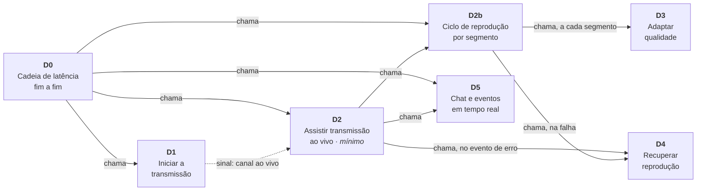
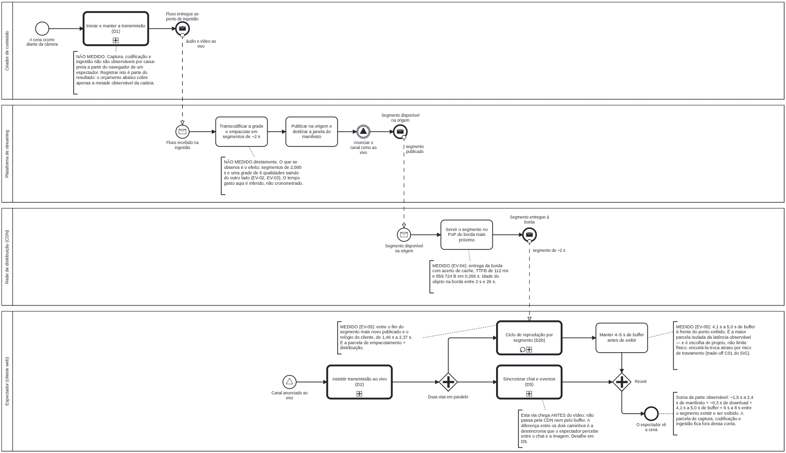
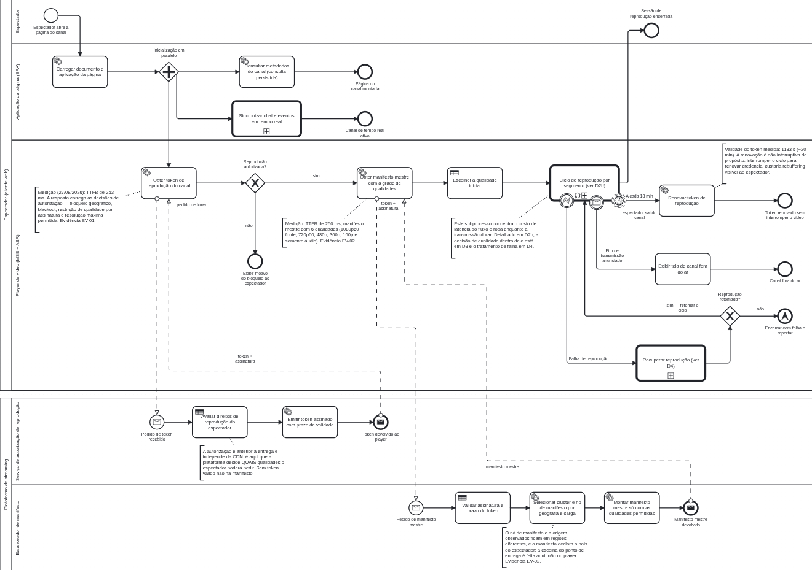
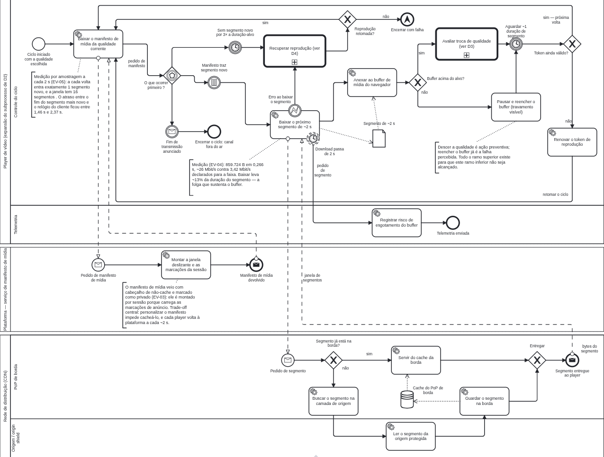
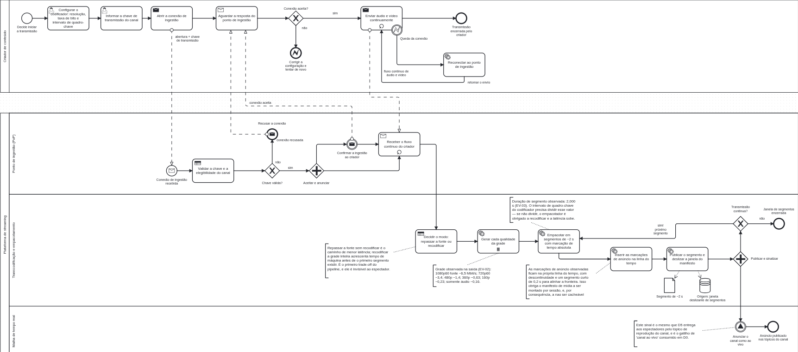
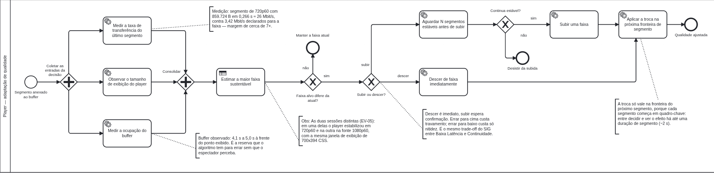
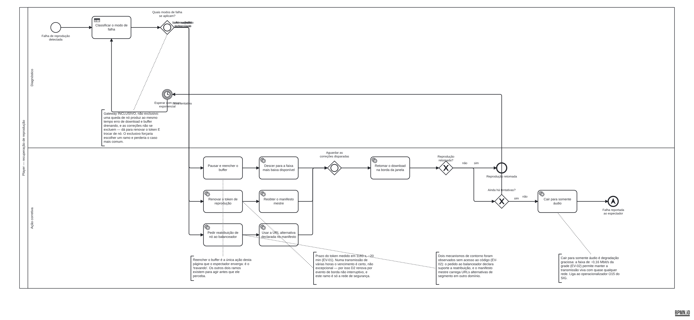
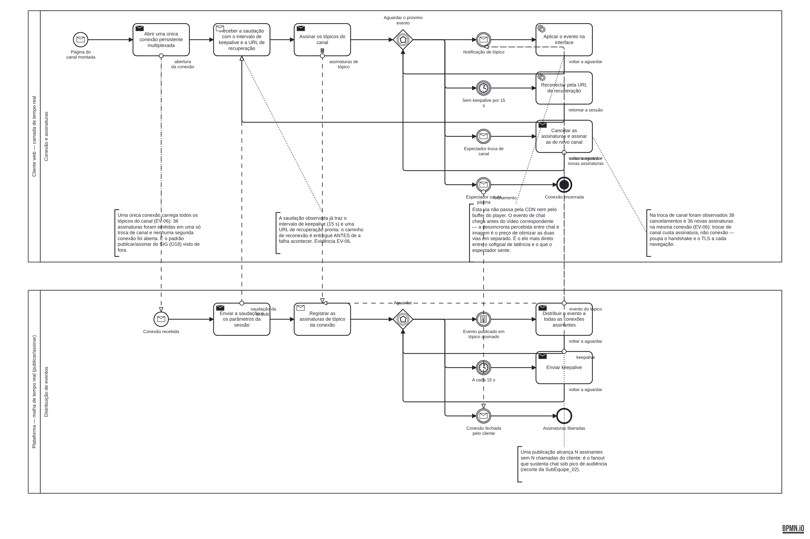

# FOCO_02 · Modelagem BPMN — SubEquipe_01

> **Entrega mínima do foco**: um modelo, na notação BPMN, do fluxo do software encontrado com a [Engenharia Reversa](3.EngenhariaReversa.md).
> **Entregue**: **sete** diagramas encadeados de **Performance/Latência**, sendo um o fluxo mínimo, um o modelo integrador e cinco os processos chamados por eles.
> **Status**: v1 concluída em 27/08/2026, com participação de toda a subequipe.

## 1. Metodologia do Foco

| Item | Definição |
| -- | -- |
| Regra de origem | **Nenhum elemento do modelo existe sem achado que o sustente.** Cada atividade, evento e decisão remete a um item de [Engenharia Reversa §6](3.EngenhariaReversa.md#_6-achados). O que não foi observado aparece no modelo marcado como não observado, não some e não é inventado |
| Estratégia de decomposição | Um fluxo grande recolhido em atividades de chamada, cada uma detalhada em diagrama próprio. Sete diagramas em três níveis, em vez de um diagrama único ilegível — ver [§3.1](#_31-por-que-sete-diagramas-e-não-um) |
| Ferramenta de edição | **Camunda Modeler / bpmn.io** ([Metodologia §2](../../../Projeto/Metodologia.md#_2-ferramentas)). Os `.bpmn` versionados abrem diretamente nele |
| Como os arquivos foram produzidos | A especificação de cada diagrama é código versionado em [`tools/bpmn/diagramas/`](https://github.com/UnBArqDsw2026-2-Turma01/2026.2-T01-_G6_ProjetoStreamingVideo_Entrega_01/tree/main/tools/bpmn/diagramas); [`gerador.py`](https://github.com/UnBArqDsw2026-2-Turma01/2026.2-T01-_G6_ProjetoStreamingVideo_Entrega_01/blob/main/tools/bpmn/gerador.py) emite o BPMN 2.0 com geometria, e [`renderizar.sh`](https://github.com/UnBArqDsw2026-2-Turma01/2026.2-T01-_G6_ProjetoStreamingVideo_Entrega_01/blob/main/tools/bpmn/renderizar.sh) gera os PNG com a própria biblioteca do bpmn.io. Motivo em [§7](#_7-senso-crítico) |
| Verificação | Os sete arquivos foram carregados com `bpmn-moddle` (a biblioteca que o Camunda Modeler usa para ler BPMN): **0 avisos e 0 erros** em todos |
| Uso de IA generativa | Sim — mesma sessão da engenharia reversa. Detalhamento em [FOCO_03](5.IAGenerativa.md#_2-onde-a-ia-generativa-foi-utilizada) |

## 2. Fundamentação Teórica — BPMN

### 2.1. O que a notação é, e por que ela cabe aqui

**BPMN 2.0** (OMG, 2011) é uma notação padronizada para modelagem de processos de negócio, criada com um objetivo declarado no próprio documento: ser legível tanto por analistas de negócio quanto por quem implementa. A especificação define quatro categorias de elemento — **objetos de fluxo** (eventos, atividades, gateways), **objetos de conexão** (fluxo de sequência, fluxo de mensagem, associação), **raias** (*pools* e *lanes*) e **artefatos** (anotações, grupos, objetos de dados).

Duas características tornam a notação adequada ao resultado da engenharia reversa deste foco:

1. **Separação entre fluxo de sequência e fluxo de mensagem.** O que a coleta observou foi justamente *mensagens entre participantes autônomos*: o player não controla o balanceador de manifesto, ele pede. BPMN é uma das poucas notações de processo em que essa distinção é sintática, e não convenção de desenho — dentro de um *pool* há sequência; entre *pools*, só mensagem.
2. **Eventos como cidadãos de primeira classe.** Streaming ao vivo é dominado por tempo e por interrupção: token que vence, segmento que não chega, transmissão que acaba. Modelar isso com "se/então" perderia a natureza do fenômeno; eventos de borda e gateways baseados em evento a preservam.

WHITE e MIERS (2008) alertam para o erro mais comum na notação — usar *lanes* para o que deveria ser *pool*. A regra prática adotada aqui: **participantes que podem tomar decisão própria e falham de forma independente são *pools* distintos**. Foi por isso que a CDN, o serviço de manifesto e a plataforma ficaram separados em D2b, em vez de virarem raias de um "servidor" genérico — a coleta mostrou que eles têm domínios, políticas de cache e comportamentos de falha diferentes ([RN04, RN05](3.EngenhariaReversa.md#_63-regras-de-negócio-inferidas)).

### 2.2. Nível de modelagem escolhido

A especificação prevê três níveis de uso: **descritivo** (subconjunto para comunicação), **analítico** (comportamento completo, sem detalhe de execução) e **executável** (com dados e expressões suficientes para um motor de processo).

Os modelos desta subequipe são **analíticos**: usam o conjunto completo de eventos e gateways para expressar o comportamento real observado, mas os `.bpmn` estão marcados `isExecutable="false"` e não trazem expressões de execução. Modelar como executável seria falso — a subequipe não tem acesso aos dados internos que um motor precisaria, e afirmar que tem seria o mesmo erro de rastreabilidade que [§6.3 da Engenharia Reversa](3.EngenhariaReversa.md#_63-regras-de-negócio-inferidas) evita.

## 3. Modelo BPMN

| Item | Valor |
| -- | -- |
| Fluxo mínimo modelado | Assistir Transmissão ao Vivo (**D2**) |
| Fluxos extras modelados | Iniciar a Transmissão (**D1**), Ciclo de Reprodução por Segmento (**D2b**), Adaptação de Qualidade (**D3**), Recuperação de Falha (**D4**), Tempo Real (**D5**) |
| Modelo integrador | Cadeia de Latência Fim a Fim (**D0**) |
| Ferramenta | Camunda Modeler / bpmn.io |
| Arquivos-fonte editáveis | [`docs/assets/bpmn/`](https://github.com/UnBArqDsw2026-2-Turma01/2026.2-T01-_G6_ProjetoStreamingVideo_Entrega_01/tree/main/docs/assets/bpmn) — sete arquivos `.bpmn` |
| Versão do modelo | v1 — 27/08/2026 |
| Verificação | 0 avisos de parsing em todos os arquivos |

### 3.1. Por que sete diagramas, e não um

Os sete diagramas descrevem **um processo só**. A decomposição não é organizacional, é de legibilidade e de reuso:

| Motivo | Como aparece |
| -- | -- |
| **O ciclo de estado estacionário domina o fluxo** | O laço "baixar manifesto → baixar segmento → alimentar buffer" roda a cada 2 s por horas. Expandido dentro de D2, ele esmagaria o restante do diagrama; recolhido em atividade de chamada, D2 continua legível e o laço ganha um diagrama inteiro (D2b) onde as medições cabem |
| **Dois processos são chamados de mais de um lugar** | D4 (recuperação) é chamado por D2 *e* por D2b. D3 é chamado a cada volta de D2b. Duplicá-los seria criar duas versões que divergem na primeira correção |
| **Um dos processos roda em paralelo com todo o resto** | D5 (tempo real) começa junto com o player e não termina com ele. Enfiá-lo em D2 exigiria um ramo paralelo que atravessa o diagrama inteiro sem interagir com ele |
| **O orçamento de latência precisa de uma visão só dele** | D0 acompanha um quadro de vídeo da câmera até a tela e anota, etapa por etapa, o que foi medido e o que não foi. É o diagrama que responde à pergunta do softgoal da subequipe |

O encadeamento é explícito no arquivo, não só no desenho: cada atividade de chamada aponta, pelo atributo `calledElement`, para o identificador do processo chamado. Abrir os sete no Camunda Modeler mostra a mesma cadeia que o mapa abaixo.

*Figura 1 — Encadeamento dos sete diagramas. Seta cheia: atividade de chamada. Seta tracejada: evento de sinal entre processos.*

### 3.2. D0 — Cadeia de Latência Fim a Fim

*Figura 2 — D0: percurso de um quadro de vídeo da câmera até a tela, com o orçamento de latência anotado etapa a etapa. Autoria: Lucas Andrade Zanetti, 27/08/2026.*

### 3.3. D2 — Assistir Transmissão ao Vivo *(fluxo mínimo do foco)*

*Figura 3 — D2: da abertura da página do canal ao encerramento da sessão de reprodução. Autoria: Matheus Lemes Amaral, 27/08/2026.*

### 3.4. D2b — Ciclo de Reprodução por Segmento

*Figura 4 — D2b: expansão do subprocesso de estado estacionário de D2, onde a latência é gasta e recuperada. Autoria: Pedro Druck Montalvão Reis, 27/08/2026.*

### 3.5. D1 — Iniciar e Configurar a Transmissão

*Figura 5 — D1: ingestão, transcodificação e empacotamento — a metade da cadeia anterior ao espectador. Autoria: Heitor Macedo Ricardo, 27/08/2026.*

### 3.6. D3 — Adaptar a Qualidade durante a Exibição

*Figura 6 — D3: entradas observáveis da decisão de troca de faixa e efeito observável dela. Autoria: Lucas Andrade Zanetti, 27/08/2026.*

### 3.7. D4 — Recuperar a Reprodução após Falha

*Figura 7 — D4: tratamento dos três modos de falha evidenciados do lado do cliente. Autoria: Heitor Macedo Ricardo, 27/08/2026.*

### 3.8. D5 — Sincronizar Chat e Eventos em Tempo Real

*Figura 8 — D5: conexão persistente multiplexada por tópicos, no padrão publicar/assinar. Autoria: Matheus Lemes Amaral, 27/08/2026.*

## 4. Elementos da Notação Utilizados

O conjunto abaixo é o inventário real dos sete arquivos, conferido elemento a elemento contra os `.bpmn` versionados: **36 tipos de elemento** inventariados, somando **447 elementos**. A coluna da direita é o que importa — nenhum recurso entrou por enfeite; cada um resolve um problema que a alternativa mais simples não resolveria.

### 4.1. Raias

| Elemento | Onde aparece | Por que foi usado |
| -- | -- | -- |
| **Pool** (15) | Espectador, plataforma, CDN, criador, malha de tempo real | Um *pool* por participante que decide sozinho e falha sozinho. A CDN é *pool* separado porque tem política de cache própria ([RN04](3.EngenhariaReversa.md#_63-regras-de-negócio-inferidas)) |
| **Lane** (16) | Espectador/SPA/player; ingestão/transcodificação/tempo real; borda/origem | Papéis dentro do mesmo participante. Separar "aplicação da página" de "player" foi o que deixou visível que o player fala com serviços que a página nunca toca |

### 4.2. Eventos

| Elemento | Qtd. | Onde e por quê |
| -- | :--: | -- |
| Início simples | 6 | Entrada de cada processo chamado |
| Início de mensagem | 9 | Todo processo do lado servidor começa por requisição recebida — é o que caracteriza um serviço |
| **Início de sinal** | 1 | D0: o espectador entra no fluxo porque o canal foi anunciado ao vivo, não porque alguém o chamou |
| Fim simples | 17 | Encerramentos normais |
| Fim de mensagem | 8 | Serviço que responde: o processo termina entregando algo a outro *pool* |
| **Fim de erro** | 1 | D1: ingestão recusada — falha que volta para quem chamou |
| **Fim de escalonamento** | 3 | Reprodução não recuperada: não é erro técnico do processo, é problema que precisa subir para o nível de cima (o espectador vê a mensagem) |
| **Fim de terminação** | 1 | D5: quando o espectador fecha a página, os ramos pendentes da conexão morrem juntos. Fim simples deixaria a conexão "viva" no modelo |
| Intermediário de mensagem (captura) | 5 | Espera por notificação de tópico e por fim de transmissão |
| **Intermediário de temporizador (captura)** | 5 | Espera de ~2 s entre voltas do ciclo, 15 s sem keepalive, recuo exponencial entre tentativas |
| **Intermediário condicional (captura)** | 2 | "O manifesto trouxe segmento novo" — não é mensagem que chega nem tempo que passa: é condição que passa a valer sobre um dado rebaixado |
| Intermediário de mensagem/sinal (lançamento) | 3 | Confirmação de ingestão; anúncio de canal ao vivo (o sinal que liga D1 a D2 e a D0) |
| **Evento de borda interruptivo — erro** | 3 | Falha de reprodução: interrompe o ciclo e desvia para a recuperação |
| **Evento de borda interruptivo — mensagem** | 1 | Fim de transmissão anunciado: o ciclo não pode continuar |
| **Evento de borda NÃO interruptivo — temporizador** | 2 | Renovação de token a cada 18 min e telemetria de manifesto lento. **É a escolha mais carregada do modelo**: interromper o ciclo para renovar credencial custaria rebuffering visível, então o ramo corre ao lado sem parar o vídeo |

### 4.3. Atividades

| Elemento | Qtd. | Onde e por quê |
| -- | :--: | -- |
| Tarefa de serviço | 39 | Passos automáticos executados por software |
| **Tarefa de regra de negócio** | 7 | Passos onde uma *decisão de política* é aplicada: autorizar reprodução, validar chave, estimar faixa sustentável, classificar falha. Distingue "o sistema calcula" de "o sistema decide segundo uma regra" |
| Tarefa de envio / recebimento | 8+4 | Extremidades de fluxo de mensagem entre *pools* |
| Tarefa de usuário | 2 | Configurar o codificador e informar a chave: passos do criador, não do sistema |
| Tarefa abstrata | 7 | Passos cuja natureza não foi observada — o modelo não finge saber se são automáticos |
| **Atividade de chamada** (7 + 2 com marcador de laço) | 9 | O mecanismo de encadeamento entre os sete diagramas |
| **Marcador de laço padrão** | 4 | Ciclo de reprodução, envio contínuo do fluxo, recebimento contínuo — repetição enquanto uma condição valer |
| **Marcador de multi-instância paralela** | 2 | Gerar cada qualidade da grade (6 faixas ao mesmo tempo) e assinar os tópicos do canal (36 assinaturas na mesma troca). Laço sequencial seria factualmente errado: as 6 qualidades saem juntas |

### 4.4. Gateways

| Elemento | Qtd. | Onde e por quê |
| -- | :--: | -- |
| Exclusivo | 15 | Decisões binárias e mutuamente excludentes: autorizado ou não, buffer suficiente ou não, cache na borda ou não |
| Paralelo | 7 | Divisões que sempre ocorrem juntas: metadados + player + tempo real na abertura da página; três medições simultâneas do ABR |
| **Inclusivo** | 2 | D4: uma queda de nó produz erro de download **e** buffer drenando ao mesmo tempo, e as correções não se excluem. O exclusivo forçaria escolher um ramo e perderia o caso mais comum |
| **Baseado em evento** | 3 | O ciclo de reprodução e a conexão de tempo real não *decidem*: elas **esperam** pelo que vier primeiro — segmento novo, estouro de tempo ou fim de transmissão. Um exclusivo aqui inverteria a causalidade |

### 4.5. Dados e artefatos

| Elemento | Qtd. | Onde e por quê |
| -- | :--: | -- |
| **Objeto de dados** | 2 | O segmento de ~2 s, produzido em D1 e consumido em D2b — é a unidade que atravessa a cadeia inteira |
| **Armazenamento de dados** | 2 | A janela deslizante na origem e o cache do PoP de borda: estado que persiste entre voltas do laço, ao contrário do objeto de dados |
| Associação de dados (entrada/saída) | 6 | Quem escreve e quem lê cada um deles |
| **Anotação de texto** | 35 | Onde a medição entra no diagrama. Cada anotação traz o número, a unidade, a evidência que o sustenta e, quando é o caso, a palavra **NÃO MEDIDO** |
| Associação | 35 | Ligação das anotações aos elementos anotados |
| Fluxo de mensagem | 21 | Toda comunicação entre *pools* |
| Fluxo de sequência | 170 | Ordenação dentro de cada processo |

## 5. Leitura do Modelo

### 5.1. D2 — o fluxo mínimo, do início ao fim

O processo começa quando o **espectador abre a página do canal**. A aplicação carrega o documento e, num **gateway paralelo**, dispara três frentes que não dependem uma da outra: consultar os metadados do canal, abrir a camada de tempo real (chamada a **D5**) e iniciar o player. As três são simultâneas de fato — foi assim que apareceram na coleta ([A01, A02, A10](3.EngenhariaReversa.md#_62-atividades-e-decisões-do-fluxo)).

O ramo do player é o que carrega o softgoal. Ele **pede o token de reprodução** por fluxo de mensagem ao *pool* da plataforma. Do outro lado, o serviço de autorização **avalia os direitos** — tarefa de regra de negócio, porque ali se aplica política, não cálculo — e devolve um token assinado com prazo. O **gateway exclusivo** seguinte é o primeiro ponto em que o fluxo pode morrer sem nenhum byte de vídeo ter trafegado: bloqueio geográfico, blackout ou restrição de assinatura levam ao fim "exibir motivo do bloqueio" ([RN01, RN02, RN14](3.EngenhariaReversa.md#_63-regras-de-negócio-inferidas)).

Autorizado, o player **pede o manifesto mestre** ao balanceador, que valida a assinatura, **escolhe cluster e nó por geografia e carga** e monta a grade só com as qualidades permitidas — a decisão de *onde* entregar é do servidor, não do cliente ([RN05](3.EngenhariaReversa.md#_63-regras-de-negócio-inferidas)). O player escolhe a qualidade inicial e entra no **ciclo de reprodução**, atividade de chamada com marcador de laço que aponta para D2b.

O ciclo roda até uma de três coisas acontecer, e as três estão modeladas como **eventos de borda**:

- **temporizador não interruptivo (18 min)** → renova o token *sem parar o vídeo*. O prazo medido foi de ~20 min ([RN03](3.EngenhariaReversa.md#_63-regras-de-negócio-inferidas)); numa transmissão de horas o vencimento é certeza, não exceção;
- **mensagem interruptiva** → fim de transmissão anunciado pela camada de tempo real: o ciclo para e a tela de canal fora do ar é exibida;
- **erro interruptivo** → falha de reprodução: chama **D4** e, se a recuperação der certo, **volta para o ciclo**; se não, termina em escalonamento.

### 5.2. D2b — onde a latência acontece

Cada volta começa **baixando o manifesto de mídia**. O que vem depois é um **gateway baseado em evento**, e a escolha desse gateway é o ponto central do diagrama: o player não decide nada aqui, ele **espera** pelo primeiro dos três: segmento novo na janela, estouro de tempo (3× a duração-alvo) ou fim de transmissão.

Com segmento novo, o player o **baixa da borda** — e é aqui que a medição mais reveladora aparece: 859.724 B em 0,266 s, ~13% da duração do segmento ([RN10](3.EngenhariaReversa.md#_63-regras-de-negócio-inferidas)). Sobra folga de 87% em cada volta. O segmento é **anexado ao buffer**, e um **gateway exclusivo** pergunta se o buffer está acima do alvo. Se está, o player chama **D3** para reavaliar a qualidade e **espera ~2 s**; se não está, cai no ramo do **rebuffering** — a única ação de todo o modelo que o espectador enxerga.

Do lado direito, dois *pools* separados, e essa separação é um achado, não uma escolha estética: o **serviço de manifesto de mídia** responde com cabeçalho de não-cache, porque monta a janela por sessão para embutir as marcações de anúncio; o **PoP de borda** serve o segmento de cache, com idade observada entre 2 s e 26 s ([RN04](3.EngenhariaReversa.md#_63-regras-de-negócio-inferidas)). Os dois objetos vêm do mesmo fluxo de vídeo e têm políticas opostas.

### 5.3. D0 — o orçamento de latência

D0 é o diagrama que responde à pergunta da subequipe: **onde o tempo é gasto?** Ele acompanha um quadro de vídeo por quatro *pools*, e cada etapa carrega uma anotação com o número medido ou a palavra **NÃO MEDIDO**:

| Etapa | Parcela | Origem |
| -- | -- | -- |
| Captura, codificação e ingestão | **não medida** | Não observável por caixa-preta de espectador |
| Transcodificação e empacotamento | **não medida diretamente** | Observa-se o efeito (segmentos de 2,000 s, grade de 6 qualidades), não o tempo |
| Publicação, distribuição e janela do manifesto | **1,46 s – 2,37 s** | EV-05 |
| Download do segmento na borda | **~0,27 s** (TTFB de 112 ms) | EV-04 |
| Buffer do player antes de exibir | **4,1 s – 5,0 s** | EV-05 |
| **Soma da parte observável** | **~6 s – 8 s** | — |

O que o diagrama torna difícil de ignorar: **a maior parcela isolada da latência observável é o buffer do player**, e ela é decisão de projeto, não limite físico. Com 87% de folga de banda por volta, encurtar o buffer é tecnicamente possível — o que se troca é atraso por risco de travamento. É exatamente o trade-off **C01** que o [SIG](2.NFRFramework.md#_52-conflitos-e-trade-offs) registrou de forma qualitativa, agora com número.

### 5.4. O que os outros diagramas acrescentam

- **D1** mostra que a duração de 2 s do segmento não é escolha do player: ela nasce no empacotamento e amarra o intervalo de quadro-chave do codificador do criador. Também é onde as marcações de anúncio entram na linha do tempo — a causa de o manifesto de mídia não poder ser cacheado.
- **D3** modela a **assimetria** do algoritmo de qualidade: descer é imediato, subir espera confirmação. Errar para cima custa travamento; errar para baixo custa nitidez. O modelo registra as três entradas observáveis da decisão e declara a regra interna como caixa-preta ([FE03](../../../Projeto/EscopoProduto.md#_7-fora-de-escopo)).
- **D4** reúne os três modos de falha atrás de um **gateway inclusivo**, porque eles se sobrepõem na prática. O ramo final — cair para somente áudio — só existe porque a grade observada tem uma faixa de ~0,16 Mbit/s ([RN06](3.EngenhariaReversa.md#_63-regras-de-negócio-inferidas)).
- **D5** contém a observação mais desconfortável do conjunto: a via de tempo real **não passa pela CDN nem pelo buffer**. O evento de chat chega antes do vídeo correspondente, e a dessincronia que o espectador percebe entre chat e imagem é o preço de otimizar as duas vias em separado ([RN12](3.EngenhariaReversa.md#_63-regras-de-negócio-inferidas)).

## 6. Rastreabilidade & Elos com Outros Artefatos :id=rastreabilidade-elos

> Regra do foco: todo elemento do BPMN tem origem rastreável em um achado documentado. A tabela abaixo cobre os elementos que carregam decisão de modelagem; os demais derivam diretamente das atividades A01–A11.

| Elemento do modelo | Origem (achado) | Elo com | Onde |
| -- | -- | -- | -- |
| *Pools* Espectador / Plataforma / CDN | Atores identificados por fronteira de rede | Eng. Reversa §6.1 | [§6.1](3.EngenhariaReversa.md#_61-atores-identificados) |
| Raia *Serviço de autorização* + tarefa de regra | A03, A04, RN01, RN02 | Eng. Reversa §6.2/6.3 | [EV-01](https://github.com/UnBArqDsw2026-2-Turma01/2026.2-T01-_G6_ProjetoStreamingVideo_Entrega_01/blob/main/docs/assets/engenharia-reversa/subequipe_01/performance-latencia/ev01-token.json) |
| Gateway "Reprodução autorizada?" | RN14 (campos de bloqueio no token) | Eng. Reversa §6.3 | EV-01 |
| Evento de borda de temporizador (18 min) | RN03 (validade medida: 1183 s) | Eng. Reversa §6.3 | EV-01 |
| Raia *Balanceador* + "selecionar cluster e nó" | A05, RN05 | Eng. Reversa §6.2 | [EV-02](https://github.com/UnBArqDsw2026-2-Turma01/2026.2-T01-_G6_ProjetoStreamingVideo_Entrega_01/blob/main/docs/assets/engenharia-reversa/subequipe_01/performance-latencia/ev02-manifesto-mestre.m3u8) |
| *Pool* separado do serviço de manifesto (D2b) | **RN04** — não cacheável, montado por sessão | Eng. Reversa §6.3 | [EV-03](https://github.com/UnBArqDsw2026-2-Turma01/2026.2-T01-_G6_ProjetoStreamingVideo_Entrega_01/blob/main/docs/assets/engenharia-reversa/subequipe_01/performance-latencia/ev03-manifesto-de-midia.m3u8) |
| Armazenamento *Cache do PoP de borda* + gateway de acerto | RN04, H04 | Eng. Reversa §3.1/6.3 | [EV-04](https://github.com/UnBArqDsw2026-2-Turma01/2026.2-T01-_G6_ProjetoStreamingVideo_Entrega_01/blob/main/docs/assets/engenharia-reversa/subequipe_01/performance-latencia/ev04-tempos.txt) |
| Gateway baseado em evento do ciclo | RN07 (1 segmento novo por volta de 2 s) | Eng. Reversa §6.3 | [EV-05](https://github.com/UnBArqDsw2026-2-Turma01/2026.2-T01-_G6_ProjetoStreamingVideo_Entrega_01/blob/main/docs/assets/engenharia-reversa/subequipe_01/performance-latencia/ev05-medicoes-de-latencia.txt) |
| Temporizador "aguardar ~1 duração de segmento" | RN07 | Eng. Reversa §6.3 | EV-05 |
| Anotações de orçamento em D0 | RN08, RN09, RN10 | Eng. Reversa §6.3 | EV-04, EV-05 |
| Multi-instância "gerar cada qualidade da grade" (D1) | RN06 (6 faixas declaradas) | Eng. Reversa §6.3 | EV-02 |
| Multi-instância "assinar os tópicos" (D5) | RN11 (36 tópicos numa conexão) | Eng. Reversa §6.3 | [EV-06](https://github.com/UnBArqDsw2026-2-Turma01/2026.2-T01-_G6_ProjetoStreamingVideo_Entrega_01/blob/main/docs/assets/engenharia-reversa/subequipe_01/performance-latencia/ev06-tempo-real.txt) |
| Temporizador de 15 s + reconexão por URL de recuperação (D5) | A10, EV-06 (saudação) | Eng. Reversa §6.2 | EV-06 |
| Ramo "cair para somente áudio" (D4) | RN06 (faixa de ~0,16 Mbit/s) | [SIG · O15](2.NFRFramework.md#_51-operacionalizações-propostas) | Degradação graciosa |
| Gateway inclusivo de modos de falha (D4) | RN13 + leitura de sobreposição de falhas | Eng. Reversa §6.3 | EV-02 |
| Sinal "canal ao vivo" (D1 → D2/D0) | Tópico de reprodução do canal | Eng. Reversa §6.2 | EV-06 |
| *Pools* e raias de D2 | Atores do [Rich Picture](1.ArtefatoGeneralista.md) | FOCO_01 | Os atores desenhados por hipótese viraram raias verificadas |
| Ciclo buffer × latência (D2b, D3, D0) | [SIG · C01](2.NFRFramework.md#_52-conflitos-e-trade-offs) | FOCO_01 | O modelo **quantifica** o trade-off que o SIG registrou qualitativamente |
| Ausência de segmentos parciais no ciclo | **H03b refutada** | Eng. Reversa §3.1 | O modelo reflete o que foi observado, não o que o SIG assumiu — ver [§7](#_7-senso-crítico) |
| Via de tempo real separada da via de vídeo (D5, D0) | RN12 | [SIG · O18](2.NFRFramework.md#_51-operacionalizações-propostas) | Confirma o padrão publicar/assinar e revela o custo dele |

## 7. Senso Crítico

**A granularidade não é uniforme, e isso foi deliberado.** D2b tem quase o mesmo número de elementos que D2, embora represente um único passo dele. A régua usada não foi "cada diagrama com N elementos", e sim **detalhe proporcional ao custo de latência**: o que consome tempo aparece em detalhe, o que não consome aparece recolhido. Um leitor que espere granularidade uniforme vai achar D2b desproporcional — a justificativa é o softgoal da subequipe.

**Metade do processo modelado não foi medida.** D1 inteiro e a etapa de transcodificação em D0 vêm de documentação pública e de inferência sobre o resultado. O modelo diz isso na cara, com anotações "NÃO MEDIDO", em vez de esconder atrás de caixas iguais às demais. É uma escolha de honestidade que **piora** a aparência do diagrama e melhora o valor dele.

**O modelo contradiz o SIG em um ponto, e o SIG é que está desatualizado.** O ciclo de D2b modela segmentos inteiros de 2 s porque foi isso que a coleta encontrou; o SIG classificou LL-HLS como MAKE (O04). Manter os dois artefatos divergentes sem apontar seria pior do que a divergência: o encaminhamento está em [Engenharia Reversa §8](3.EngenhariaReversa.md#_8-senso-crítico) e a correção do SIG é pendência anterior à entrega.

**Um subprocesso incorporado teria sido mais fiel do que uma atividade de chamada.** O ciclo de reprodução é, semanticamente, um subprocesso de D2 — não um processo independente que D2 invoca. Optou-se por atividade de chamada porque é o mecanismo que o BPMN oferece para ligar **arquivos diferentes**, e a legibilidade de D2b em arquivo próprio venceu a fidelidade semântica. Quem quiser refazer: bastaria expandir D2b dentro de D2 e aceitar um diagrama de ~70 elementos.

**Modelar decisão sem conhecer a regra é o limite estrutural.** D3 é o caso mais claro: o gateway "subir ou descer" existe porque o comportamento foi observado, mas a política que decide é caixa-preta. O modelo registra as três entradas e o efeito, e declara o meio como não observado. Um modelo que desenhasse a fórmula ali seria mais bonito e falso.

**A geração automática dos arquivos tem custo.** Descrever os diagramas em código deu coerência entre os sete e tornou uma correção barata — mudar um rótulo em D2b e regerar tudo leva um comando. O preço é que o **layout é determinístico, não bonito**: sobram cruzamentos de linha que um humano evitaria no editor. Os `.bpmn` abrem no Camunda Modeler exatamente para isso — o ajuste fino visual antes da apresentação é trabalho manual, e ainda não foi feito.

**O que falta para a v2**: segunda coleta para dar peso estatístico às anotações; ajuste fino de layout no Camunda Modeler; e a medição que ficou faltando — cronometrar chat e vídeo lado a lado para transformar RN12 de inferência em medida.

## 8. Participantes & Comprobatórios :id=participantes-comprobatorios

| Membro | Contribuição | Comprobatório (commit/PR) |
| -- | -- | -- |
| Lucas Andrade Zanetti | Arquitetura do conjunto; especificação e autoria dos diagramas D0 e D3; ferramentas de geração e renderização; redação desta página | [Commit 0ccd707](https://github.com/UnBArqDsw2026-2-Turma01/2026.2-T01-_G6_ProjetoStreamingVideo_Entrega_01/commit/0ccd707e7c9ef14a0cb6f04ed7a0c870f3123863) · [Ata S1_04](../../../Projeto/Atas/Atas_Sg1/ata-S1-04-2026-08-27.md) |
| Heitor Macedo Ricardo | Especificação e autoria dos diagramas D1 e D4; revisão da aderência à notação | [Commit 0ccd707](https://github.com/UnBArqDsw2026-2-Turma01/2026.2-T01-_G6_ProjetoStreamingVideo_Entrega_01/commit/0ccd707e7c9ef14a0cb6f04ed7a0c870f3123863) · [Ata S1_04](../../../Projeto/Atas/Atas_Sg1/ata-S1-04-2026-08-27.md) |
| Matheus Lemes Amaral | Especificação e autoria dos diagramas D2 e D5; revisão da rastreabilidade | [Commit 0ccd707](https://github.com/UnBArqDsw2026-2-Turma01/2026.2-T01-_G6_ProjetoStreamingVideo_Entrega_01/commit/0ccd707e7c9ef14a0cb6f04ed7a0c870f3123863) · [Ata S1_04](../../../Projeto/Atas/Atas_Sg1/ata-S1-04-2026-08-27.md) |
| Pedro Druck Montalvão Reis | Especificação e autoria do diagrama D2b; revisão do modelo | [Commit 0ccd707](https://github.com/UnBArqDsw2026-2-Turma01/2026.2-T01-_G6_ProjetoStreamingVideo_Entrega_01/commit/0ccd707e7c9ef14a0cb6f04ed7a0c870f3123863) · [Ata S1_04](../../../Projeto/Atas/Atas_Sg1/ata-S1-04-2026-08-27.md) |

## 9. Referências

Consolidadas em [Referências](6.Referencias.md) — em especial R05 (OMG, BPMN 2.0), R12 (White & Miers), R10 (Chikofsky & Cross) e R08 (HLS).

## Histórico de Versões

| Versão | Data | Descrição | Autor(es) | Revisor(es) | Descrição da revisão |
| -- | -- | -- | -- | -- | -- |
| 1.0 | 21/08/2026 | Criação da página | Lucas Andrade Zanetti | Heitor Macedo Ricardo | Revisão da estrutura inicial da página. |
| 1.1 | 23/08/2026 | Definição do fluxo modelado (Assistir Transmissão ao Vivo) e da ferramenta (Camunda), a partir da Ata S1_01 | [SubEquipe_01](../../../Projeto/Atas/Atas_Sg1/ata-S1-01-2026-08-23.md) | Lucas Andrade Zanetti | Conferência da cadeia integradora de latência (diagramas D0 a D5), notação BPMN e tempos cronometrados. |
| 1.2 | 27/08/2026 | Publicação do modelo v1: sete diagramas encadeados (D0 a D5), fundamentação da notação, inventário de 43 tipos de elemento com justificativa, leitura do modelo, rastreabilidade elemento a elemento e senso crítico | Lucas Andrade Zanetti | Heitor Macedo Ricardo, Matheus Lemes Amaral, Pedro Druck Montalvão Reis | Validação da formatação dos diagramas e rastreabilidade com as evidências de engenharia reversa. |
