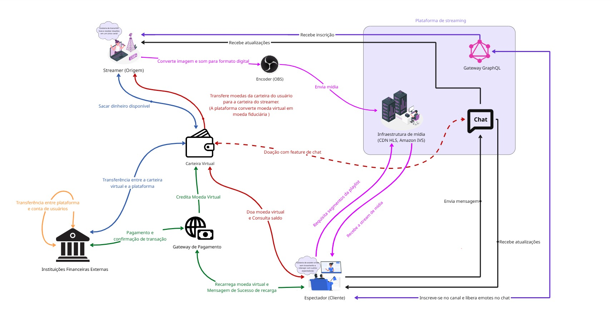

# FOCO_01 · Artefato Generalista — SubEquipe_02

> **Entrega mínima do foco**: um artefato generalista, com **escopo restrito a Rich Picture ou Mapa Mental**.
> **Status**: 🟢 Concluído (28/08/2026) · **Responsáveis**: Davi Severiano Freitas, Daniel de Oliveira Lira, Mateus Rodrigues Barreto e Pedro Henrique Freire Rodrigues.

## 1. Metodologia do Foco

O artefato generalista da subequipe 2, rich picture, foi construído seguindo a estratégia de colaboração definida na [Ata S2_01](../../../Projeto/Atas/Atas_Sg2/ata-S2-01-2026-08-23.md).

| Item | Definição |
| -- | -- |
| **Sessão de trabalho** | Elaboração de rascunhos individuais a partir de 23/08/2026 e trabalho conjunto por toda a subequipe em 27/08/2026. |
| **Ferramenta utilizada** | **Miro**, escolhido pela facilidade de desenho vetorial, possibilidade de edição simultânea em tempo real e compartilhamento direto na nuvem. |
| **Fontes de informação** | Navegação exploratória na plataforma de referência (Twitch) e documentação técnica coletada no escopo da [Engenharia Reversa](3.EngenhariaReversa.md). |
| **Divisão de tarefas** | Davi Severiano Freitas iniciou o rascunho base no Figma. Pedro Henrique Freire Rodrigues definiu fluxo base do escopo de chat e doações voluntárias (compra e envio de moedas virtuais). | Davi Severiano Freitas, Daniel de Oliveira Lira, Mateus Rodrigues Barreto e Pedro Henrique Freire Rodrigues trabalharam sincronamente na plataforma Miro para correções e detalhamento da rich picture.

---

## 2. Fundamentação Teórica — Rich Picture

O **Rich Picture** é uma técnica originada na *Soft Systems Methodology* (SSM) de Peter Checkland (Checkland, 1981; Checkland e Scholes, 1990; Checkland e Poulter, 2006). Segundo as diretrizes da [*Open University*](https://www.open.edu/openlearn/science-maths-technology/engineering-technology/rich-pictures), trata-se de um resumo visual em estilo livre ("cartoon", sem regras sintáticas rígidas) que reúne em um único plano físico todas as informações coletadas sobre uma situação complexa e desorganizada (*complex messy situation*). O artefato funciona como um ponto de partida (*jumping-off point*) para a compreensão do domínio, devendo ser elaborado antes de qualquer tentativa de estruturar o sistema formalmente.

Seus princípios metodológicos principais são:
* **Dados Factuais (*Hard*) e Subjetivos (*Soft*)**: Mapeia tanto a infraestrutura técnica (estruturas e processos) quanto aspectos humanos e subjetivos (papéis sociais, sentimentos e atitudes, representados por balões de fala) e conflitos (representados por espadas cruzadas).
* **Construção Sequencial**: A elaboração inicia na identificação das **estruturas** relativamente estáveis (pessoas, arranjos físicos), passa para os **processos** dinâmicos (atividades em mudança) e finaliza no mapeamento das **relações** entre ambos.
* **Conexões Ausentes e Perspectiva**: Identifica conexões de causa, efeito e influência sem forçar uma coerência artificial (lacunas de conexão podem evidenciar problemas de comunicação). Reflete a perspectiva de quem o desenha com base nos dados que foi capaz de coletar.

### Por que escolher o Rich Picture para a SubEquipe_02?
Diferente de um Mapa Mental que organiza ideias em uma árvore hierárquica a partir de um nó central, o Rich Picture permite mapear fluxos concorrentes e bidirecionais, essenciais para o escopo de Confiabilidade e Disponibilidade da subequipe.

---

## 3. Artefato

*Figura 1 — Rich Picture da SubEquipe_02. Autores: Davi Severiano Freitas, Daniel de Oliveira Lira, Pedro Henrique Freire Rodrigues e Mateus Rodrigues Barreto, 27/08/2026*

| Item | Valor |
| -- | -- |
| **Tipo do artefato** | Rich Picture |
| **Ferramenta utilizada** | Miro |
| **Arquivo-fonte editável** | [Projeto Miro - SubEquipe 02](https://miro.com/welcomeonboard/OUd6THZ2L254M2F4dkFKeTNnNjQ4Vk9aSTZ0cFhlOWxXSGZzY3JPeDRYRGtPdVlBVFB4UXlueEoxU2JqVDR2MnRUMmhSUjJTQStINVlZWFpWQUQvcys4Y3ZobEZGVG1nMXVUaVo4U0NhYWhQL1RDU3JERXFJYWJUQ2ZIbVkvc3BNakdSWkpBejJWRjJhRnhhb1UwcS9BPT0hdjE=?share_link_id=927045733281) *(Acesso compartilhado com a equipe)* |
| **Versão do artefato** | v1.0 |

---

## 4. Descrição / Leitura do Artefato

O Rich Picture representa visualmente o ecossistema da aplicação de referência com foco nas preocupações de **Confiabilidade e Disponibilidade** da SubEquipe_02. O diagrama organiza-se em seis fluxos coloridos que atravessam atores humanos, componentes da plataforma e sistemas externos descritos na §4.3.

### 4.1. Visão Geral do Sistema
A rich picture da subequipe 2 representa o ecossistema em torno dos escopos básicos de transmissão de livestream, interação em chat aberto e compra/doação de moedas virtuais a canais da plataforma de streaming. Nesse sentido, a representação se relaciona com os requisitos não-funcionais de confiabilidade, no que diz respeito à garantia da transmissão ao vivo da playlist e à garantia das transações de pagamento para compra/doação de moedas virtuais; e disponibilidade, no que diz respeito à operação da plataforma adequadamente no momento da atividade do usuário.

### 4.2. Fronteiras e Atores
Atores humanos: Streamer, Espectador.
Componentes do sistema: Infraestrutura de mídia (CDN HLS, Amazon IVS), Chat, Gateway GraphQL.
Atores/componentes externos: Instituições financeiras externas, Carteira virtual, Gateway de pagamento (Recurly, PayPal e Amazon Pay), Encoder (OBS).

### 4.3. Fluxos de Operação e Pontos de Falha
Fluxo 1 (preto), Espectador - Chat - Streamer: 
- Espectador envia mensagem no chat e visualiza mensagens enviadas por outros espectadores em tempo real.
- Streamer visualiza mensagens enviadas por todos os espectadores em tempo real.

Fluxo 2 (violeta), Espectador - Gateway GraphQL - Streamer: 
- Espectador, em interação com Gateway GraphQL, segue o canal e recebe liberação de emojis para utilizar no chat.
- Streamer, em interação com Gateway GraphQL, recebe inscrições de espectadores.

Fluxo 3 (rosa), Espectador - Infraestrutura de mídia - Encoder - Streamer:
- Espectador, em interação com Infraestrutura de mídia, requisita segmentos da playlist e recebe a stream de midia.
- Encoder (OBS), em interação com Streamer, converte imagem e som para formato digital.
- Encoder (OBS), em interação com Infraestrutura de mídia, envia mídia para servidor de hospedagem e transmissão.

Fluxo 4 (verde), Espectador - Gateway de pagamento - Carteira virtual - Instituições financeiras externas:
- Espectador, em interação com Gateway de pagamento, recarrega moeda virtual e recebe mensagem de sucesso/falha de recarga.
- Gateway de pagamento, em interação com Carteira virtual, credita moeda virtual na conta do Espectador/Streamer.
- Gateway de pagamento, em interação com Instituições financeiras externas, realiza pagamento e recebe confirmação de realização de transação.

Fluxo 5 (vermelho), Espectador - Carteira virtual - Chat - Streamer:
- Espectador, em interação com Carteira virtual, realiza doação de moeda virtual e consulta saldo.
- Chat, em interação secundária (seta tracejada) com Carteira virtual, realiza doação (fluxo de doação específico dentro do chat da plataforma).
- Carteira virtual, em interação com Streamer, transfere moedas da carteira visual do Espectador para a carteira do Streamer.

Fluxo 6 (azul), Instituições financeiras externas - Carteira virtual - Streamer:
- Instituição financeira externa, em interação com Carteira virtual, realiza transferência entre Carteira virtual e a plataforma.
- Streamer, em interação com Carteira virtual, saca dinheiro disponível.

---

## 5. Rastreabilidade & Elos com Outros Artefatos

A tabela a seguir estabelece correspondência entre os elementos visuais do Rich Picture e os artefatos formais da SubEquipe_02: [Engenharia Reversa](3.EngenhariaReversa.md), [BPMN](4.BPMN.md) e [SIG · NFR Framework](2.NFRFramework.md). Comportamentos registrados na coleta DevTools vinculam-se a atividades e regras da ER; representações inferidas ou lacunas do diagrama (setas tracejadas) identificam-se na coluna *Natureza do elo*, conforme o §8 da ER.

| Elemento do Rich Picture | Elo com | Onde (link) | Natureza do elo |
| -- | -- | -- | -- |
| Espectador e Streamer | Atores da ER; pools do BPMN (Chat e Bits) | [3. Engenharia Reversa §6.1](3.EngenhariaReversa.md#61-atores-identificados) · [4. BPMN §3](4.BPMN.md#3-modelo-bpmn) | Atores de domínio mapeados como participantes nos fluxos formais |
| Fluxo 1 (preto): interação via chat | A02, A03; RN07, RN08; mutação `sendChatMessage` | [3. Engenharia Reversa §6.2](3.EngenhariaReversa.md#62-atividades-e-decisões-do-fluxo) · [4. BPMN §3.1](4.BPMN.md#31-fluxo-chat--envio-de-mensagem) | Interação documentada na ER; sequenciamento no BPMN de chat |
| Recebimento de mensagens de terceiros | RN09; contenção sob pico | [3. Engenharia Reversa §6.3](3.EngenhariaReversa.md#63-regras-de-negócio-inferidas) | Não observado na coleta; representação visual inferida |
| Fluxo 2 (violeta): Gateway GraphQL e follow | A07; requisição `POST gql`; metadados `Stream` | [3. Engenharia Reversa §6.2](3.EngenhariaReversa.md#62-atividades-e-decisões-do-fluxo) · [4. BPMN §3.1](4.BPMN.md#31-fluxo-chat--envio-de-mensagem) | Follow e emotes observados na interface; contrato GraphQL específico não isolado |
| Fluxo 3 (rosa): infraestrutura de mídia e encoder | A08 a A10; RN04 a RN06; Figs. 16 a 19 | [3. Engenharia Reversa §6.2](3.EngenhariaReversa.md#62-atividades-e-decisões-do-fluxo) | Entrega HLS, falha de rede, encerramento e retomada na origem |
| Recuperação de falha e polling do player | A08; RN04; resiliência do player | [2. NFR Framework §5.1](2.NFRFramework.md#51-operacionalizações-propostas-e-práticas-de-mercado) (O02) | Comportamento da ER alinhado ao softgoal de resiliência de vídeo |
| Fluxo 4 (verde): gateway de pagamento | A04 a A06; RN01 a RN03; checkout parcial | [3. Engenharia Reversa §6.2](3.EngenhariaReversa.md#62-atividades-e-decisões-do-fluxo) · [4. BPMN §3.2](4.BPMN.md#32-fluxo-compra-de-bits--checkout-parcial) | Compra modelada até checkout pendente; cobrança concluída tracejada |
| Confirmação de recarga bem-sucedida | Fig. 25 (demonstração pública L01) | [3. Engenharia Reversa §5](3.EngenhariaReversa.md#5-evidências-coletadas) | Evidência complementar, externa à sessão DevTools principal |
| Fluxo 5 (vermelho): carteira virtual e doação | A04 a A06; `CreatorWalletCheckoutQuery`; cheer no chat | [3. Engenharia Reversa §6.2](3.EngenhariaReversa.md#62-atividades-e-decisões-do-fluxo) · [3. Engenharia Reversa §8](3.EngenhariaReversa.md#8-senso-crítico) | Consulta de carteira observada; doação via chat e crédito de saldo permanecem lacuna |
| Fluxo 6 (azul): instituições financeiras externas | Processadores §6.1; consistência transacional | [2. NFR Framework §5.1](2.NFRFramework.md#51-operacionalizações-propostas-e-práticas-de-mercado) (O07 a O13) | Repasse e saque no diagrama; operacionalizações do SIG para confiabilidade de pagamentos |
| Confiabilidade e Disponibilidade (transversal) | Softgoals globais; eixos do SIG | [2. NFR Framework §3 a §5](2.NFRFramework.md#3-softgoal-escolhido-e-justificativa) | Diagrama sintetiza visualmente os cenários decompostos no SIG |
| Chat sob pico e moderação | RN09; Load Shedding e Rate Limit | [2. NFR Framework §5.1](2.NFRFramework.md#51-operacionalizações-propostas-e-práticas-de-mercado) (O04, O05) | Contenção não observada na ER; resposta proposta no NFR |
| Idempotência e estorno em transações | RN01 a RN03; ramos tracejados no BPMN Bits | [2. NFR Framework §5.1](2.NFRFramework.md#51-operacionalizações-propostas-e-práticas-de-mercado) (O11, O12) · [4. BPMN §3.2](4.BPMN.md#32-fluxo-compra-de-bits--checkout-parcial) | Fluxos de monetização conectados à consistência transacional do SIG |

---

## 6. Senso Crítico

**O que o artefato entrega bem.** O Rich Picture consolida, em um único plano, os eixos de chat, transmissão de mídia e monetização, orientados pelos requisitos de Confiabilidade e Disponibilidade da subequipe. A codificação por cores dos seis fluxos favorece a comunicação com partes interessadas não técnicas e explicita interdependências que, dispersas em artefatos formais, demandariam maior esforço de integração. Parte do desenho fundamenta-se em achados da Engenharia Reversa (contrato de chat, falha de rede do cliente, interrupção na origem), o que confere ao artefato base empírica distinta de modelos puramente especulativos.

**Limitações reconhecidas.** A notação livre do Rich Picture não representa ordem temporal, concorrência ou condições de decisão; essas dimensões cabem ao BPMN. A agregação de componentes (por exemplo, a carteira virtual como nó único) simplifica a leitura, mas omite contratos de interface detalhados na ER. Elementos tracejados (doação no chat, follow em GraphQL, pico no chat) correspondem a lacunas da coleta e estão representados de maneira mais abstraída da realidade.

**O que a subequipe faria diferente.** Estabelecer legenda, critério de abstração e fronteiras do diagrama antes da elaboração visual, reduzindo rearranjos ao cruzar com a ER ou ao trocar de ferramenta. Aplicar checklist de rastreabilidade elemento a elemento com a Engenharia Reversa antes da exportação da imagem. Registrar desde o início a distinção entre fluxos observados e inferidos, limitando ambiguidade na leitura isolada do artefato.

---

## 7. Participantes & Comprobatórios

| Membro | Contribuição | Comprobatório (commit/PR) |
| -- | -- | -- |
| Davi Severiano Freitas | Criação do rascunho inicial do Rich Picture no Figma; consolidação no Miro; modelagem dos fluxos de monetização, carteira virtual e gateway de pagamento; evidência complementar de checkout (Fig. 25 na ER) | [Ata S2_01](../../../Projeto/Atas/Atas_Sg2/ata-S2-01-2026-08-23.md) · [Ata S2_02](../../../Projeto/Atas/Atas_Sg2/ata-S2-02-2026-08-24.md) · [Projeto Miro §3](#3-artefato) · Commits `25ca8c6`, `9bec4a8` ([3. Engenharia Reversa §9](3.EngenhariaReversa.md#9-participantes--comprobatórios)) |
| Daniel de Oliveira Lira | Revisão dos fluxos à luz de Confiabilidade e Disponibilidade (NFR); participação na consolidação no Miro | [Ata S2_02](../../../Projeto/Atas/Atas_Sg2/ata-S2-02-2026-08-24.md) · [2. NFR Framework §8](2.NFRFramework.md#8-participantes--comprobatórios) |
| Pedro Henrique Freire Rodrigues | Definição dos fluxos de chat e de monetização por moedas virtuais; alinhamento do diagrama com a ER e o BPMN | §1 · Commits `4b2a937`, `1a8a49b` ([3. Engenharia Reversa §9](3.EngenhariaReversa.md#9-participantes--comprobatórios)) |
| Mateus Rodrigues Barreto | Modelagem do fluxo de mídia, encoder e recuperação de falha (A08 a A10); participação na consolidação no Miro | [Ata S2_02](../../../Projeto/Atas/Atas_Sg2/ata-S2-02-2026-08-24.md) · Commit `2d9ebb1` · Figs. 16 a 19 ([3. Engenharia Reversa §9](3.EngenhariaReversa.md#9-participantes--comprobatórios)) |

---

## 8. Referências

| # | Referência | Onde foi usada nesta página |
| -- | -- | -- |
| R01 | CHECKLAND, Peter. **Systems Thinking, Systems Practice**. Chichester: John Wiley & Sons, 1981. | §2 — Introdução histórica ao SSM e à técnica de Rich Picture. |
| R02 | CHECKLAND, Peter; SCHOLES, Jim. **Soft Systems Methodology in Action**. Chichester: John Wiley & Sons, 1990. | §2 — Aplicação prática de Rich Pictures para expressar problemas organizacionais complexos. |
| R03 | CHECKLAND, Peter; POULTER, John. **Learning for Action: A Short Definitive Account of Soft Systems Methodology and its use for Practitioners, teachers and Students**. Hoboken: John Wiley & Sons, 2006. | §2 — Aprofundamento metodológico sobre SSM e o uso prático de Rich Pictures. |
| R04 | OPEN UNIVERSITY. **Rich Pictures**. OpenLearn. Disponível em: <https://www.open.edu/openlearn/science-maths-technology/engineering-technology/rich-pictures>. Acesso em: 27 ago. 2026. | §2 — Diretrizes práticas para a elaboração de Rich Pictures. |

---

## Histórico de Versões

| Versão | Data | Descrição | Autor(es) | Revisor(es) | Descrição da revisão |
| -- | -- | -- | -- | -- | -- |
| 1.0 | 21/08/2026 | Criação da página | Lucas Andrade Zanetti | Heitor Macedo Ricardo | Revisão da estrutura da página. |
| 1.1 | 27/08/2026 | Detalhamento da metodologia, fundamentação teórica e definição do molde geral do artefato | Davi Severiano Freitas | — | Verificação da inserção do Rich Picture, legenda explicativa e fundamentação em SSM. |
| 1.2 | 27/08/2026 | Publicação do Rich Picture v1.0 (Miro), leitura dos seis fluxos (§4) e exportação da imagem | Davi Severiano Freitas, Daniel de Oliveira Lira, Mateus Rodrigues Barreto, Pedro Henrique Freire Rodrigues | — | Validação da consolidação dos fluxos de monetização/chat e tabela de participantes. |
| 1.3 | 28/08/2026 | Rastreabilidade (§5), senso crítico (§6), participantes (§7) e consolidação textual final | SubEquipe_02 |  | Validação do encerramento dos tópicos, conferência dos comprobatórios e consistência global. |
| 1.4 | 28/08/2026 | Revisão de redação formal e abstrata das seções §5 a §7 | SubEquipe_02 |  | Revisão técnica de conteúdo, clareza textual e aderência às diretrizes do projeto. |
