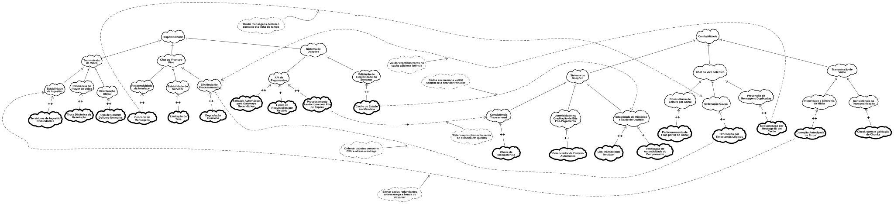

# FOCO_01 · SIG na Notação do NFR Framework — SubEquipe_02

> **Entrega mínima do foco**: um SIG (*Softgoal Interdependency Graph*) na notação do NFR Framework.  
> **Status**: 🟢 Concluído · **Integrantes**: Daniel de Oliveira Lira, Davi Severiano Freitas, Pedro Henrique Freire Rodrigues, Mateus Rodrigues Barreto

## 1. Metodologia do Foco

A modelagem de Requisitos Não Funcionais da **SubEquipe_02** utilizou o **NFR Framework** (Chung et al., 2000) para decompor e analisar sistematicamente os atributos de qualidade exigidos por uma plataforma de streaming de vídeo ao vivo, com foco absoluto nas áreas de **Confiabilidade (Reliability)** e **Disponibilidade (Availability)**.

O trabalho foi desenvolvido de forma colaborativa e integrada, seguindo as seguintes etapas:

1. **Definição de Escopo e Cenários Críticos**: A equipe delimitou a análise em três cenários de alta complexidade em arquiteturas distribuídas: Chat ao vivo sob pico de tráfego, Transmissão contínua de vídeo e Sistema de Doações.
2. **Elicitação e Decomposição Conceitual**: Os conceitos de Disponibilidade Global e Confiabilidade Global foram refinados (via decomposição AND) em sub-softgoals menores, como Estabilidade do Servidor, Responsividade da Interface, Integridade da Mídia e Consistência Transacional.
3. **Mapeamento de Operacionalizações**: Foram propostas soluções arquiteturais e padrões de projeto concretos (*Operationalizing Softgoals*) baseados em práticas reais da indústria (ex.: *Load Shedding*, *Idempotência*, *Filas de Retentativa*).
4. **Análise de Correlações e Trade-offs**: A equipe mapeou exaustivamente os efeitos colaterais das decisões de infraestrutura, evidenciando como mecanismos de garantia de disponibilidade frequentemente sacrificam a usabilidade ou a eficiência do processamento, utilizando *Claim Softgoals* para justificar essas perdas.
5. **Modelagem Visual**: O grafo foi construído progressivamente e os diagramas finais foram consolidados para versionamento no repositório da equipe.

## 2. Fundamentação Teórica — NFR Framework

O **NFR Framework** (Chung et al., 2000) é uma abordagem orientada a metas (*Goal-Oriented Requirements Engineering*) para representar e analisar requisitos não funcionais. O método trata os requisitos como **softgoals**, metas sem critério binário de cumprimento, avaliadas pelo grau em que são satisfeitas de forma suficiente (*satisficing*).

### 2.1. Elementos da Notação

*   **NFR Softgoal**: Representa um critério de qualidade de alto nível (ex.: *Disponibilidade*, *Confiabilidade*). Graficamente representado por uma nuvem clara.
*   **Operationalizing Softgoal**: Solução técnica ou padrão arquitetural implementado para viabilizar os NFR Softgoals (ex.: *Rate Limiting*, *Dead Letter Queues*). Representado por uma nuvem de contorno grosso.
*   **Claim Softgoal**: Argumento em linguagem natural que justifica uma decisão de projeto ou explica o contexto de um *trade-off*. Representado por uma nuvem pontilhada.
*   **Decomposições**: Interseções com um arco indicam relacionamentos **AND**, onde todas as sub-metas precisam ser cumpridas para que a meta pai seja atingida.

### 2.2. Tipos de Contribuição e Propagação

| Tipo | Notação | Significado |
| :--- | :---: | :--- |
| **MAKE** | `++` | Contribuição positiva extrema, implementando efetivamente o softgoal. |
| **HELP** | `+` | Contribuição parcialmente positiva. |
| **HURT** | `-` | Contribuição negativa que prejudica o softgoal, mas não o destrói completamente. |
| **BREAK** | `--` | Contribuição negativa suficiente para quebrar a satisfação do atributo de qualidade. |

## 3. Softgoal Escolhido e Justificativa

| Item | Descrição / Valor |
| :--- | :--- |
| Softgoal principal | **Disponibilidade Global** e **Confiabilidade Global** da Plataforma |
| Por que é crítico neste domínio | Plataformas de livestreaming lidam com tráfego massivo e simultâneo. A queda de um servidor de vídeo, o travamento do chat durante um campeonato de e-sports ou a cobrança duplicada em doações geram evasão imediata de usuários e prejuízos financeiros severos. |
| Relação com as ênfases do tema | **Transmissões ao vivo**: Exigem tolerância a falhas na ingestão do vídeo e re-conexões silenciosas para não interromper a experiência. **Chat e UGC**: O volume de mensagens geradas pelos usuários requer ordenação lógica e descarte controlado (*Load Shedding*) para evitar o colapso dos bancos de dados. |

## 4. SIG (Softgoal Interdependency Graph)

## 5. Leitura do SIG e Evidências da Indústria

O SIG organiza os requisitos focados da SubEquipe_02 desdobrando-se em três eixos principais avaliados tanto sob a ótica de manter o sistema no ar (Disponibilidade) quanto de garantir a correção dos dados (Confiabilidade):

1.  **Chat ao vivo sob Pico**: Garantir a estabilidade do servidor e da interface, mantendo a ordenação causal e prevenindo a duplicidade de mensagens durante enxurradas de interações.
2.  **Transmissão de Vídeo**: Assegurar a resiliência desde a ingestão (OBS do streamer) até a distribuição global, mantendo a sincronia e integridade dos pacotes de mídia.
3.  **Sistema de Doações**: Proteger a consistência transacional e a integridade de saldos mesmo diante de instabilidades em gateways de pagamento externos.

### 5.1. Operacionalizações Propostas e Práticas de Mercado

A tabela abaixo detalha as operacionalizações do SIG, relacionando-as com as soluções técnicas aplicadas para sustentar a infraestrutura:

| # | Operacionalização | Softgoal Atendido | Tipo | Prática na Indústria / Descrição |
| :--- | :--- | :--- | :---: | :--- |
| **O01** | Servidores de Ingestão Redundantes | Estabilidade de Ingestão | MAKE (`++`) | Redirecionamento automático do fluxo de RTMP/SRT para nós secundários em caso de queda do servidor primário. |
| **O02** | Troca Dinâmica de Resolução | Resiliência do Player de Vídeo | MAKE (`++`) | Adaptação do bitrate (*Adaptive Bitrate Streaming*) no cliente, reduzindo a qualidade em redes instáveis para evitar interrupções. |
| **O03** | Uso de Content Delivery Networks | Distribuição Global | MAKE (`++`) | Espelhamento do conteúdo de vídeo em nós (Edge) geograficamente próximos aos usuários para mitigar latência de carregamento. |
| **O04** | Descarte de Mensagens (Load Shedding) | Responsividade da Interface | MAKE (`++`) | Abandono de pacotes antigos em filas de mensageria estranguladas para priorizar o tráfego em tempo real no chat. |
| **O05** | Limitação de Taxa (Rate Limit) | Estabilidade do Servidor (Chat) | MAKE (`++`) | Controle de volume de mensagens permitidas por segundo/usuário via algoritmos como *Token Bucket* para prevenir sobrecarga. |
| **O06** | Degradação Graciosa (Feature Flags) | Eficiência de Processamento | MAKE (`++`) | Desativação dinâmica de recursos secundários (como renderização de emotes complexos) sob estresse de CPU. |
| **O07** | Fallback Automático para Gateways Secundários | API de Pagamentos | MAKE (`++`) | Roteamento automático de doações para um processador financeiro de backup (ex: Stripe para PayPal) se o principal cair. |
| **O08** | Limite de Requisições por Usuário | API de Pagamentos | HELP (`+`) | Restrição do número de tentativas de pagamento em curto período para evitar sobrecarga nas APIs financeiras. |
| **O09** | Processamento Assíncrono com Fila de Espera | API de Pagamentos | MAKE (`++`) | Enfileiramento seguro de solicitações de transações durante quedas, processando o lote assim que o sistema retornar. |
| **O10** | Cache de Estado em Memória | Validação de Elegibilidade do Streamer | MAKE (`++`) | Armazenamento temporário de status de usuários (ex: via Redis) para autorizar transações rapidamente sem onerar o banco central. |
| **O11** | Chave de Idempotência | Consistência Transacional | MAKE (`++`) | Inserção de ID único em requisições de compra para assegurar que falhas de rede não gerem cobrança dupla por *retries* do cliente. |
| **O12** | Gerenciador de Estorno Automático | Atomicidade na Creditação de Bits | MAKE (`++`) | Rotina assíncrona que identifica falhas na entrega de benefícios (Bits/Subs) e realiza o reembolso automático (*Saga Pattern*). |
| **O13** | Log Transacional Imutável | Integridade do Histórico e Saldo | MAKE (`++`) | Registro *append-only* (somente inserção) de todos os eventos financeiros, permitindo auditoria e reconstrução de saldos em falhas críticas. |
| **O14** | Verificação de Autenticidade do Comprovante | Integridade do Histórico e Saldo | HELP (`+`) | Checagem criptográfica de webhooks enviados por adquirentes para prevenir injeção de saldos falsos no sistema. |
| **O15** | Particionamento de Filas por ID do Canal | Consistência de Leitura por Canal | MAKE (`++`) | Garantia de que eventos de um mesmo canal sejam processados pela mesma partição de um broker (ex: Kafka) em ordem sequencial. |
| **O16** | Ordenação por Timestamps Lógicos | Ordenação Causal | MAKE (`++`) | Uso de relógios lógicos na arquitetura distribuída para reordenar pacotes de mensagens que chegam fora de ordem devido ao lag. |
| **O17** | Deduplicação por Message ID em Cache | Prevenção de Mensagens Duplicadas | MAKE (`++`) | Validação no back-end de IDs únicos gerados pelo front-end para ignorar mensagens repetidas causadas por múltiplos cliques do usuário. |
| **O18** | Correção Antecipada de Erros (FEC) | Integridade e Sincronia da Mídia | MAKE (`++`) | Envio de pacotes redundantes junto ao vídeo para que o player reconstrua falhas sem solicitar o pacote novamente ao servidor. |
| **O19** | Check-sums e Validação de Chunks | Consistência na Transcodificação | HELP (`+`) | Validação da integridade criptográfica de pequenos blocos de vídeo antes da distribuição para as redes de ponta. |

### 5.2. Conflitos e Trade-offs Arquiteturais

O framework permitiu evidenciar como decisões drásticas para manter a infraestrutura online geram impactos severos e colaterais:

| Origem (Operacionalização) | Impacto | Destino (Softgoal) | Justificativa (Claim Softgoal) |
| :--- | :---: | :--- | :--- |
| **Descarte de Mensagens** | `BREAK` (`--`) | **Ordenação Causal** | *Perda de Contexto:* Omitir mensagens sob pico destrói a linha do tempo da conversa, impossibilitando garantir contexto causal. |
| **Ordenação por Timestamps** | `HURT` (`-`) | **Eficiência do Processamento** | *Custo de Algoritmo:* Ordenar pacotes consome ciclos de CPU e atrasa a entrega, reduzindo a eficiência bruta do servidor. |
| **Deduplicação por Message ID** | `HURT` (`-`) | **Eficiência do Processamento** | *Latência de Cache:* Validar repetidas vezes IDs em um banco em memória adiciona latência de rede interna. |
| **Correção de Erros (FEC)** | `HURT` (`-`) | **Estabilidade de Ingestão** | *Consumo de Banda Extra:* Enviar pacotes redundantes sobrecarrega a banda de upload do criador de conteúdo. |
| **Cache de Estado em Memória** | `HURT` (`-`) | **Integridade do Histórico** | *Risco de Volatilidade:* Dados armazenados rapidamente em memória volátil somem em caso de reinicialização dos nós. |
| **Processamento Assíncrono** | `HELP` (`+`) | **Consistência Transacional** | *Retenção Segura:* Reter requisições na fila de mensageria evita perda de dinheiro e dados de doações durante quedas de banco. |

## 6. Rastreabilidade & Elos com Outros Artefatos

O SIG conecta-se diretamente com os demais artefatos da entrega e do projeto:

| Elemento do SIG | Elo com | Onde (link) | Natureza do elo |
| :--- | :--- | :--- | :--- |
| Interface de Chat e Recompensas | Artefato Generalista | [1.ArtefatoGeneralista.md](https://github.com/UnBArqDsw2026-2-Turma01/2026.2-T01-_G6_ProjetoStreamingVideo_Entrega_01/blob/docs/subequipe-2/docs/Base/Relatorios/1.1.2.SubEquipe_02/1.ArtefatoGeneralista.md) | Representa as funcionalidades visuais modeladas e suas exigências de alta usabilidade. |
| Operacionalizações de Cache, Mensageria e DLQ | Engenharia Reversa | [3.EngenhariaReversa.md](https://github.com/UnBArqDsw2026-2-Turma01/2026.2-T01-_G6_ProjetoStreamingVideo_Entrega_01/blob/docs/subequipe-2/docs/Base/Relatorios/1.1.2.SubEquipe_02/3.EngenhariaReversa.md) | Rastreia as soluções de infraestrutura mapeadas no levantamento de arquitetura de back-end. |
| Fluxo de Doação e Idempotência | Modelagem BPMN | [4.BPMN.md](https://github.com/UnBArqDsw2026-2-Turma01/2026.2-T01-_G6_ProjetoStreamingVideo_Entrega_01/blob/docs/subequipe-2/docs/Base/Relatorios/1.1.2.SubEquipe_02/4.BPMN.md) | Mapeia as etapas lógicas e caminhos alternativos de pagamento diante de falhas. |

## 7. Senso Crítico

*   **Maturação Arquitetural**: A aplicação rigorosa do NFR Framework revelou que manter um sistema disponível não é uma métrica isolada. Observou-se a inevitabilidade dos trade-offs: garantir a estabilidade do chat sob pico (ex: ativando *Slow Mode* ou *Load Shedding*) cobra um preço direto na usabilidade e na completude dos dados da comunidade.
*   **Limitações do Escopo**: A modelagem de confiabilidade abordou o fluxo lógico, mas em um ambiente real, métricas exatas baseadas em Acordos de Nível de Serviço (SLAs), como o percentual de falhas aceitáveis e metas de RTO/RPO para o banco de dados financeiro, seriam essenciais para definir a real ativação de *Circuit Breakers* ou descarte.

## 8. Participantes & Comprobatórios

Todos os membros da **SubEquipe_02** participaram ativamente da pesquisa, discussão de trade-offs arquiteturais e modelagem deste artefato:

| Membro | Papel e Contribuição Integrada no Foco | Comprobatório |
| :--- | :--- | :--- |
| **Daniel de Oliveira Lira** | Pesquisa de soluções arquiteturais para sustentação e confiabilidade de back-end, mapeamento de trade-offs de infraestrutura (Mensageria, Deduplicação) e estruturação de dependências cruzadas no SIG. | [Histórico de Versões](#histórico-de-versões) |
| **Davi Severiano Freitas** | Análise dos padrões de disponibilidade para o streaming de vídeo (CDN, Redundância, FEC, ABR) e suporte na documentação teórica do framework. | [Histórico de Versões](#histórico-de-versões) |
| **Pedro Henrique Freire Rodrigues** | Elaboração visual das decomposições e modelagem conceitual dos fluxos de doações, proteção transacional e idempotência. | [Histórico de Versões](#histórico-de-versões) |
| **Mateus Rodrigues Barreto** | Mapeamento de mecanismos de resiliência de pagamentos (Fallback, Filas de Espera) e revisão da propagação de rótulos (satisficing) no grafo. | [Histórico de Versões](#histórico-de-versões) |

## 9. Referências

| # | Referência (ABNT) | Onde foi usada nesta página | Link |
| :---: | :--- | :--- | :---: |
| **R01** | CHUNG, Lawrence; NIXON, Brian A.; YU, Eric; MYLOPOULOS, John. **Non-Functional Requirements in Software Engineering**. Boston: Springer Science & Business Media, 2000. | §1 e §2 — Fundamentação teórica do NFR Framework e notação de softgoals. | [SpringerLink](https://link.springer.com/book/10.1007/978-1-4615-5269-7) |
| **R02** | SERRANO, Milene; SERRANO, Maurício. **Requisitos — Aula 10: NFR Framework**. Material didático da disciplina Arquitetura e Desenho de Software, Universidade de Brasília (UnB-FGA), 2026. | §1 e §2 — Diretrizes pedagógicas e aplicação no contexto da disciplina. | — |
| **R03** | KLEPPMANN, Martin. **Designing Data-Intensive Applications: The Big Ideas Behind Reliable, Scalable, and Maintainable Systems**. O'Reilly Media, 2017. | §5.1 e §5.2 — Base teórica para limitação de taxa, particionamento e trade-offs de confiabilidade. | [O'Reilly](https://www.oreilly.com/library/view/designing-data-intensive-applications/9781491903063/) |
| **R04** | STRIPE. **Designing robust and predictable APIs with idempotency**. Stripe Engineering Blog, 2019. | §5.1 (O11) e BPMN — Padrão de mercado para proteção contra cobranças duplicadas. | [Stripe](https://stripe.com/blog/idempotency) |
| **R05** | RICHARDSON, Chris. **Microservices Patterns: With examples in Java**. Manning Publications, 2018. | §5.1 (O12) — Padrão Saga para execução de estornos automáticos assíncronos. | [Manning](https://www.manning.com/books/microservices-patterns) |
| **R06** | BENTALEB, Ali et al. **A Survey on Bitrate Adaptation Schemes for HTTP Live Streaming and DASH**. IEEE Communications Surveys & Tutorials, v. 21, n. 1, p. 562-585, 2018. | §5.1 (O02) — Algoritmos de troca dinâmica de resolução (ABR) para resiliência de vídeo. | [IEEE](https://ieeexplore.ieee.org/document/8424213) |

## Histórico de Versões

| Versão | Data | Descrição | Autor(es) | Revisor(es) |
| :---: | :---: | :--- | :--- | :--- |
| 1.0 | 24/08/2026 | Criação do documento base, pesquisa de soluções arquiteturais de back-end e estruturação do escopo do SIG. | Daniel de Oliveira Lira | Davi Severiano Freitas |
| 1.1 | 25/08/2026 | Inserção da fundamentação teórica e dos padrões de disponibilidade de vídeo (CDN, Redundância, FEC). | Davi Severiano Freitas | Pedro Henrique Freire Rodrigues |
| 1.2 | 26/08/2026 | Modelagem visual das decomposições, estruturação dos fluxos de doações e detalhamento da idempotência. | Pedro Henrique Freire Rodrigues | Mateus Rodrigues Barreto |
| 1.3 | 27/08/2026 | Mapeamento das tabelas de operacionalizações, trade-offs (correlações) e revisão da propagação de rótulos. | Mateus Rodrigues Barreto | Daniel de Oliveira Lira |
| 1.4 | 28/08/2026 | Revisão final integrativa, consolidação das evidências da indústria e formatação das referências bibliográficas. | Daniel de Oliveira Lira, Davi Severiano Freitas, Pedro Henrique Freire Rodrigues, Mateus Rodrigues Barreto | — |