# FOCO_02 · Engenharia Reversa — SubEquipe_02

> **Entrega mínima do foco** (junto com o [BPMN](4.BPMN.md)): um modelo, na notação BPMN, do fluxo do software encontrado com a Engenharia Reversa. Esta página documenta **o processo** que levou ao modelo.
> **Status**: ⬜ não iniciado · **Responsáveis**: _(preencher)_

## 1. Metodologia do Foco

<!--
PREENCHER: como a subequipe conduziu a engenharia reversa — sessões de exploração,
divisão de telas/fluxos entre membros, forma de registro dos achados.
-->
- Estudo de documentação oficial: [https://dev.twitch.tv/docs](https://dev.twitch.tv/docs)  
- Inspecionamento de página através da ferramenta DevTools (nativa do navegador)

## 2. Fundamentação Teórica — Engenharia Reversa

<!--
PREENCHER: definir Engenharia Reversa e o nível de abstração aplicado
(ex.: caixa-preta / recuperação de processo de negócio a partir da interface).
Embasar na literatura (ex.: Chikofsky & Cross, Pressman, Sommerville) e referenciar em 6.Referencias.md.
-->
_A preencher._

## 3. Contexto da Aplicação Analisada

> ⚠️ **Não usar o nome real da fonte de inspiração** (diretriz). Descrever a aplicação por características.

| Item | Valor |
| -- | -- |
| Descrição da aplicação de referência | _a definir_ |
| Plataforma analisada (site / desktop / mobile) | _a definir_ |
| Versão / data da análise | _a definir_ |
| Perfil de usuário utilizado na exploração | _a definir_ |
| Fluxo selecionado para modelagem | _a definir_ |
| Por que este fluxo foi escolhido | _a definir_ |

## 4. Processo Aplicado — Etapas

| # | Etapa | O que foi feito | Ferramenta | Responsável | Evidência |
| -- | -- | -- | -- | -- | -- |
| 1 | Planejamento da exploração | Foram definidos o alvo (Twitch) e três recortes: entrada na plataforma e no canal; interação no chat e monetização com ênfase na compra de Bits; verificação da existência de evidências para recuperação de falha de transmissão. A sessão ocorreu em paralelo à consulta da documentação oficial da Twitch, de um documento de trabalho da disciplina e do repositório do grupo. | WhatsApp, Microsoft Teams. | SubEquipe 02 | Print |
| 2 | Coleta (navegação e captura de telas) | Percorreu-se a página inicial autenticada e o canal sem autenticação; abriram-se os canais rodrigogoes e lolworldchampionship; inspecionaram-se o chat, o modal de Bits e o checkout; registrou-se o tráfego com Preserve log, bem como as abas Sources e Global Listeners. Em sessão complementar (26/08/2026), capturou-se o contrato de envio de mensagem no chat. | Navegador Google Chrome e ferramenta nativa DevTools. | Pedro Henrique Freire Rodrigues | Figuras 1–24 |
| 3 | Identificação de atores e eventos | Foram identificados, a partir da interface e dos cabeçalhos de rede, o espectador autenticado e o anônimo, os canais, o gateway GraphQL, o player IVS/HLS, os processadores de pagamento e as redes de sincronização publicitária. | Análise das capturas, IA generativa | Pedro Henrique Freire Rodrigues | Seção 6.1 |
| 4 | Identificação de atividades e decisões | Sequenciaram-se o bloqueio por faixa etária, a visualização do chat, o envio de mensagem, o follow, a escolha de pacote de Bits e o checkout. Constatou-se a ausência de compra concluída; condição de pico no chat não foi caracterizada. | Análise das capturas, IA generativa. | Pedro Henrique Freire Rodrigues | Seção 6.2 |
| 5 | Simulação de Falha de rede do Cliente (Espectador) | Interrupção forçada da rede do espectador (Network throttling). Observou-se o esgotamento do buffer, as tentativas de reconexão do player e a recuperação autônoma após o restabelecimento da rede. | Navegador baseado em Chromium e DevTools | Mateus Rodrigues Barreto | Figuras 16–17 |
| 6 | Simulação de Interrupção na Origem (Transmissor) | Encerramento e reinício voluntário do fluxo de mídia em um canal de teste. Inspecionou-se a presença da tag de finalização no manifesto HLS, o encerramento e a retomada do vídeo. | OBS Studio, Navegador baseado em Chromium e DevTools | Mateus Rodrigues Barreto | Figuras 18–19 |
| 7 | Coleta complementar — contrato de chat | Capturou-se o envio de mensagem via mutação GraphQL `sendChatMessage` (payload, cabeçalhos e resposta). | Navegador Google Chrome e DevTools | Pedro Henrique Freire Rodrigues | Figuras 20–24 |
| 8 | Consolidação do fluxo | Organizaram-se os achados nas tabelas de atores, atividades e regras inferidas; distinguiram-se fluxos consolidados e lacunas (pico, compra concluída). | Este relatório | Pedro Henrique Freire Rodrigues | Seções 6.1 a 6.3 |
| 9 | Validação interna do fluxo | Cruzaram-se interface e Network. Contratos de chat e de mídia confirmados por URL, payload e resposta. Tráfego HLS separado do chat. | Revisão captura versus tabela | Pedro Henrique Freire Rodrigues | Seções 6.2, 6.3 e 8 |

## 5. Evidências Coletadas

<!-- Salvar capturas em docs/assets/engenharia-reversa/. Numerar as figuras e legendar cada uma. -->

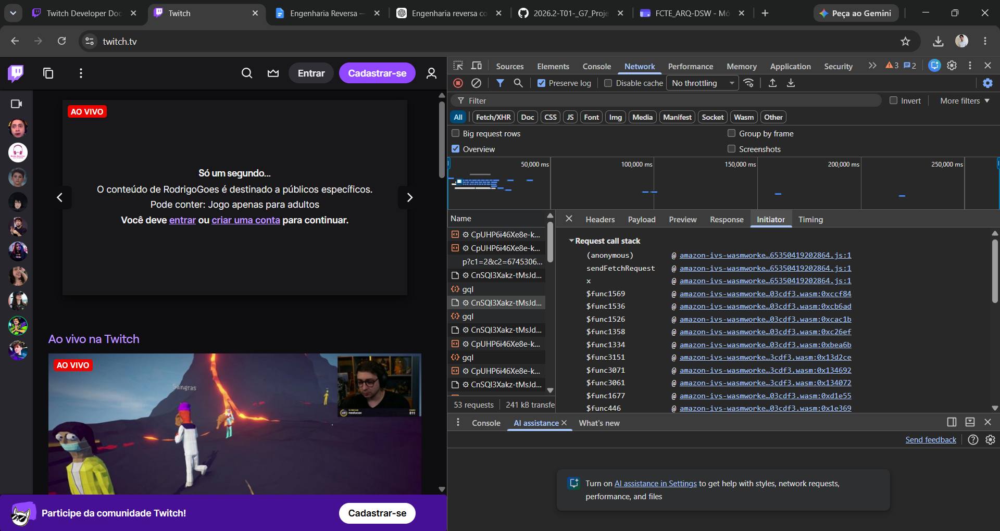

*Figura 1 — Canal RodrigoGoes sem autenticação: overlay de restrição etária, chamada para entrar ou cadastrar-se, e DevTools (Network) com `gql` e `amazon-ivs-wasmworker`. Autor(es): Pedro Henrique Freire Rodrigues, 24/08/2026.*

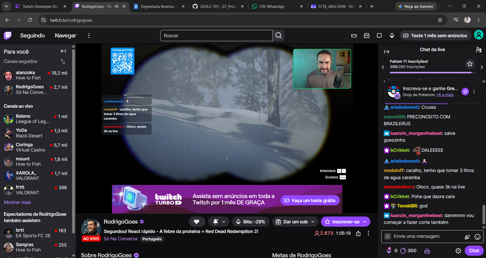

*Figura 2 — Canal autenticado `twitch.tv/rodrigogoes`: player AO VIVO, chat da live, saldo de Bits 0, trezentos pontos de canal e promoção “Bits: -29%”. Autor(es): Pedro Henrique Freire Rodrigues, 24/08/2026.*

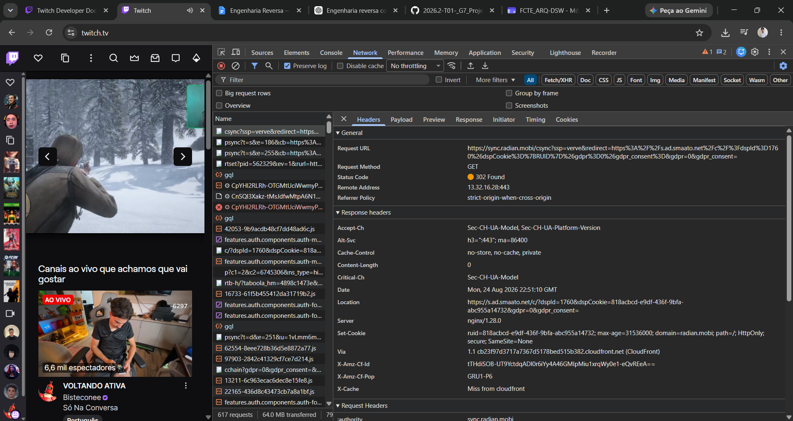

*Figura 3 — Página inicial com Network: chamadas `gql` e sincronização publicitária `csync` (GET 302, Smaato/CloudFront), Preserve log ativo. Autor(es): Pedro Henrique Freire Rodrigues, 24/08/2026.*

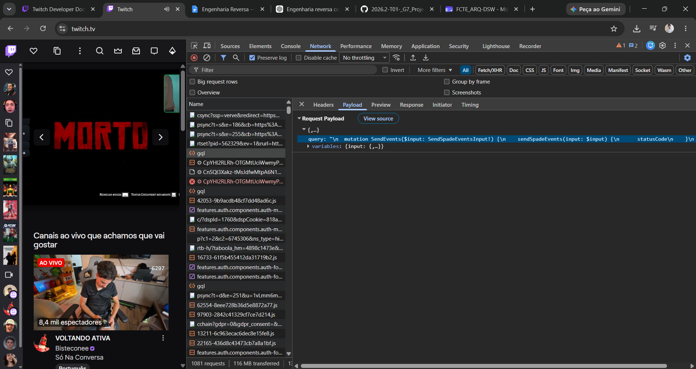

*Figura 4 — Página inicial autenticada: payload GraphQL da mutação `SendEvents` / `sendSpadeEvents`; itens `gql` com indicação de falha na lista. Autor(es): Pedro Henrique Freire Rodrigues, 24/08/2026.*

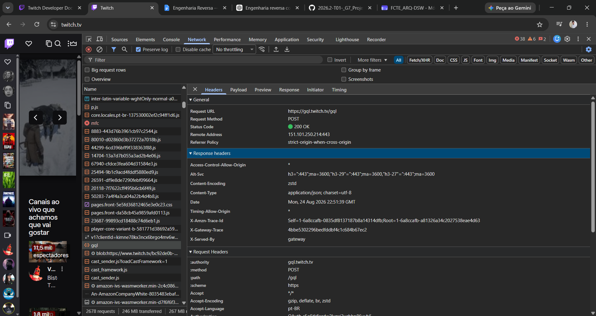

*Figura 5 — Requisição `POST https://gql.twitch.tv/gql`, status 200, cabeçalho `authorization: OAuth` e `x-served-by: gateway`; scripts do player IVS na lista. Autor(es): Pedro Henrique Freire Rodrigues, 24/08/2026.*

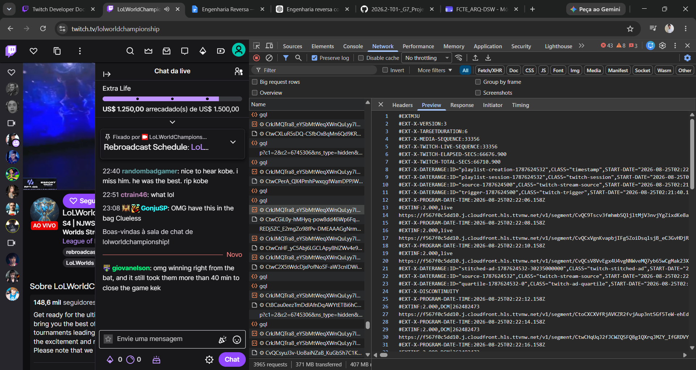

*Figura 6 — Canal LoLWorldChampionship: chat da live (campo de mensagem, Bits, campanha Extra Life) e pré-visualização HLS `.m3u8` (Cloudfront, marcadores Twitch, descontinuidade e anúncios). Autor(es): Pedro Henrique Freire Rodrigues, 24/08/2026.*

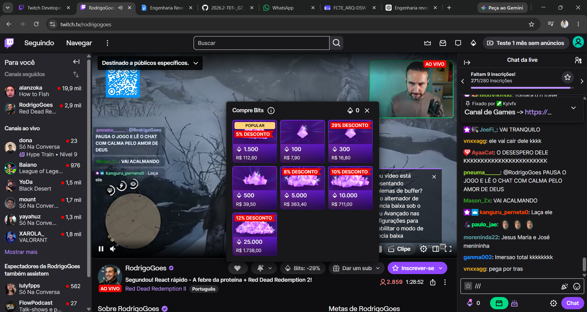

*Figura 7 — Modal **Compre Bits** (pacotes e saldo 0) e aviso de buffer no player, com recomendação de latência baixa no menu Avançado. Autor(es): Pedro Henrique Freire Rodrigues, 24/08/2026.*

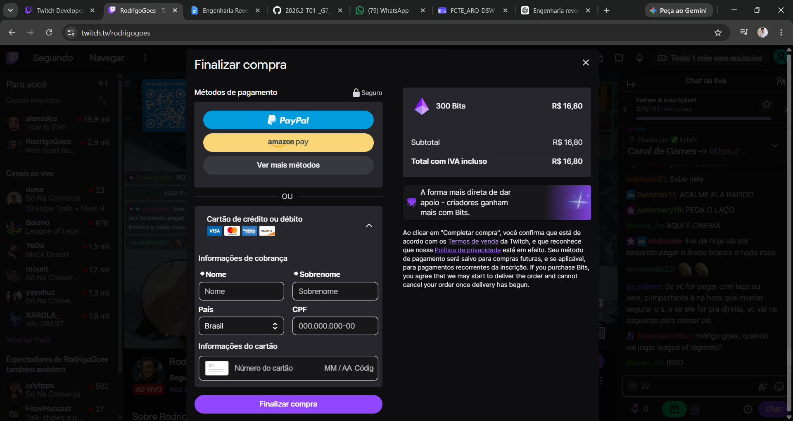

*Figura 8 — Checkout **Finalizar compra**: trezentos Bits a R$ 16,80, PayPal, Amazon Pay, cartão, país Brasil, CPF e termos de venda. Autor(es): Pedro Henrique Freire Rodrigues, 24/08/2026.*

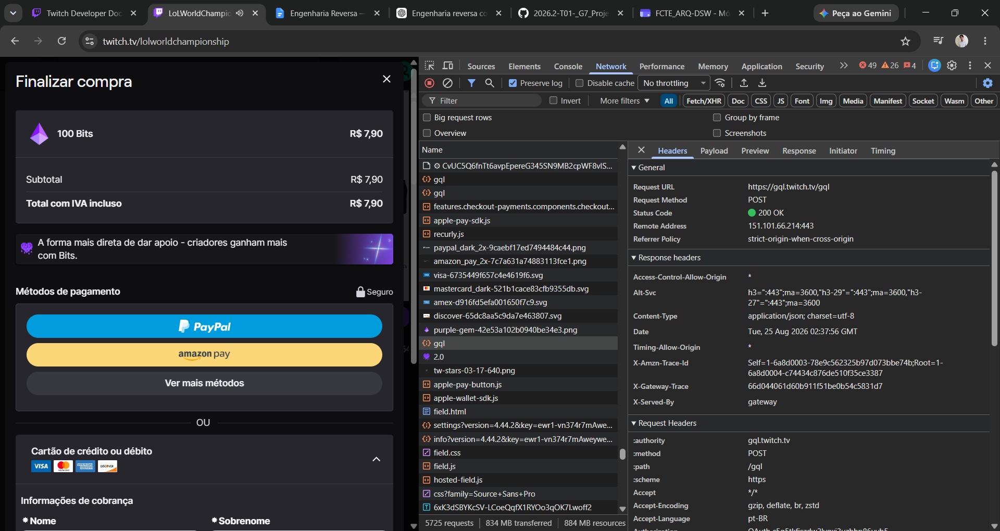

*Figura 9 — Checkout de cem Bits (R$ 7,90): `POST gql` com status 200 e carregamento de Recurly, Apple Pay e bandeiras de cartão. Autor(es): Pedro Henrique Freire Rodrigues, 24/08/2026.*

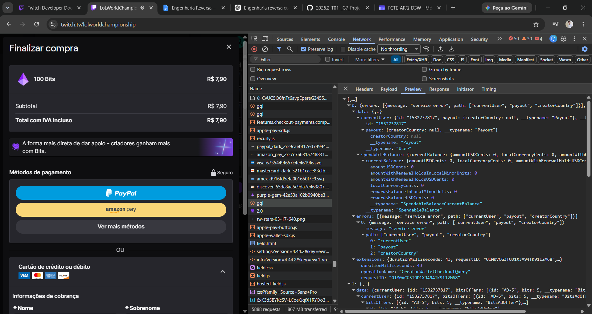

*Figura 10 — Pré-visualização `CreatorWalletCheckoutQuery`: `spendableBalance` 0, `bitsOffers` e erro em `currentUser.payout.creatorCountry`. Autor(es): Pedro Henrique Freire Rodrigues, 24/08/2026.*

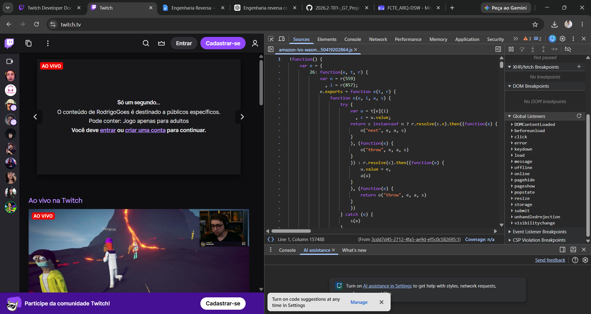

*Figura 11 — Aba Sources: `amazon-ivs-wasm-worker`; Global Listeners incluem `online`, `offline` e `error`. Autor(es): Pedro Henrique Freire Rodrigues, 24/08/2026.*

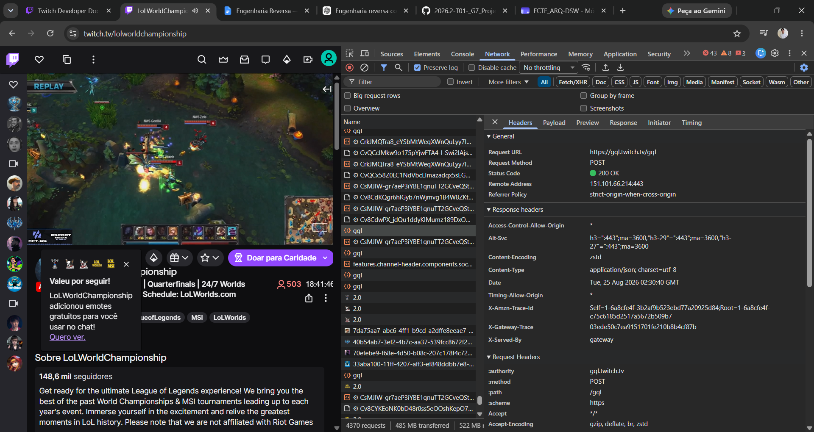

*Figura 12 — Confirmação de follow com emotes gratuitos; botão “Doar para Caridade”; `POST` a `gql.twitch.tv/gql` com status 200 (Fetch/XHR). Autor(es): Pedro Henrique Freire Rodrigues, 24/08/2026.*

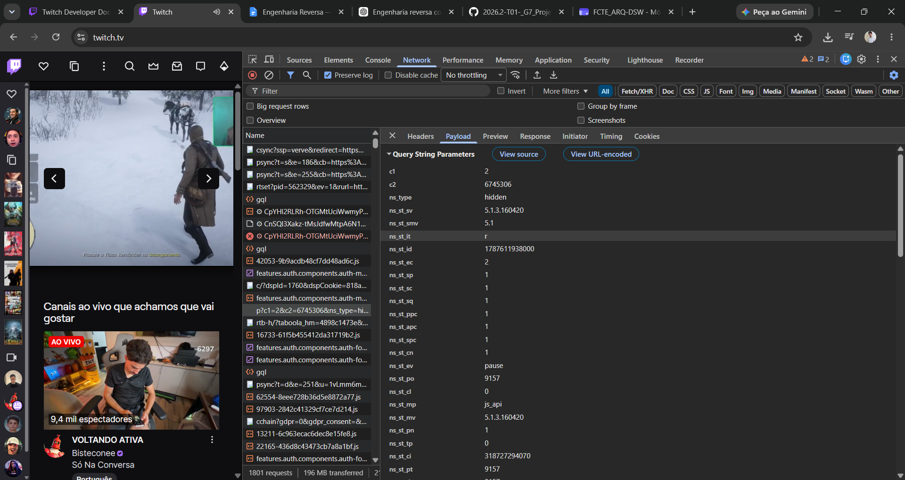

*Figura 13 — Beacon de telemetria de mídia com `ns_st_ev: pause` e `ns_st_mp: js_api`. Não documenta falha de transmissão. Autor(es): Pedro Henrique Freire Rodrigues, 24/08/2026.*

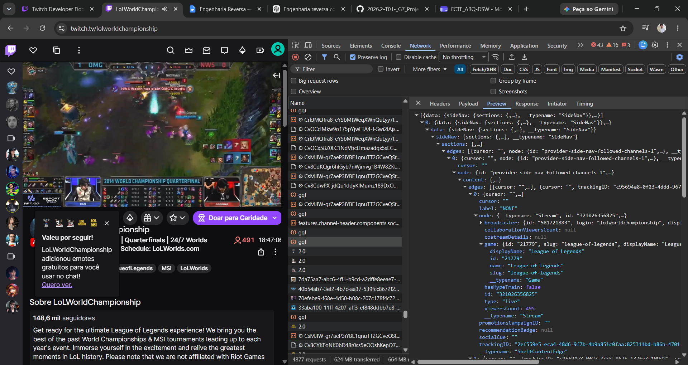

*Figura 14 — Após follow: pré-visualização GraphQL da sidebar (`Stream`, `type: live`, `viewersCount`, `login` do canal) e aviso de emotes no player. Autor(es): Pedro Henrique Freire Rodrigues, 24/08/2026.*

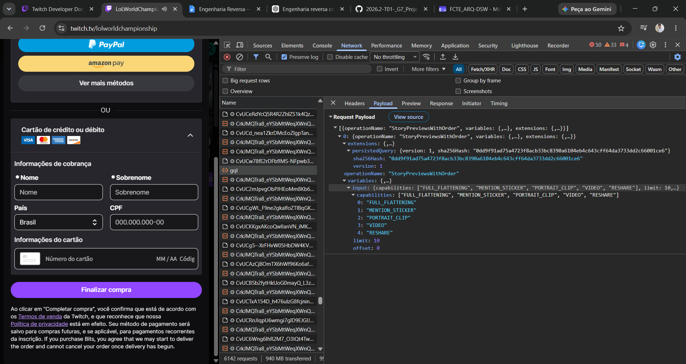

*Figura 15 — Checkout ainda aberto: payload GraphQL `StoryPreviewsWithOrder` (prévias de interface), distinto do contrato de cobrança de Bits. Autor(es): Pedro Henrique Freire Rodrigues, 24/08/2026.*

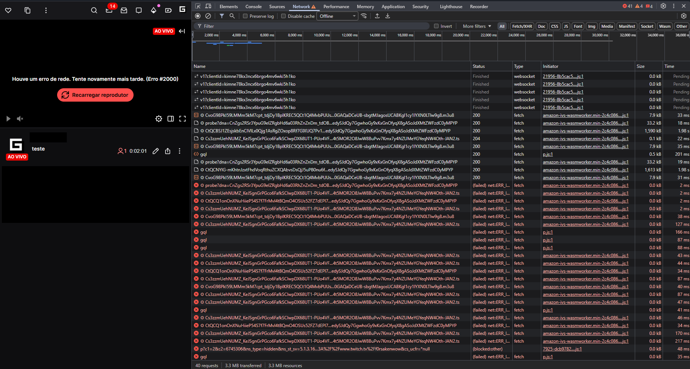

*Figura 16 — Detecção da falha de rede: Simulação de perda de conexão do cliente. O DevTools registra falhas sucessivas nas requisições do worker (status `failed`), o que leva ao esgotamento do buffer de mídia e aciona a exibição da tela de interrupção (Erro #2000). Autor(es): Mateus Rodrigues Barreto, 26/08/2026.*

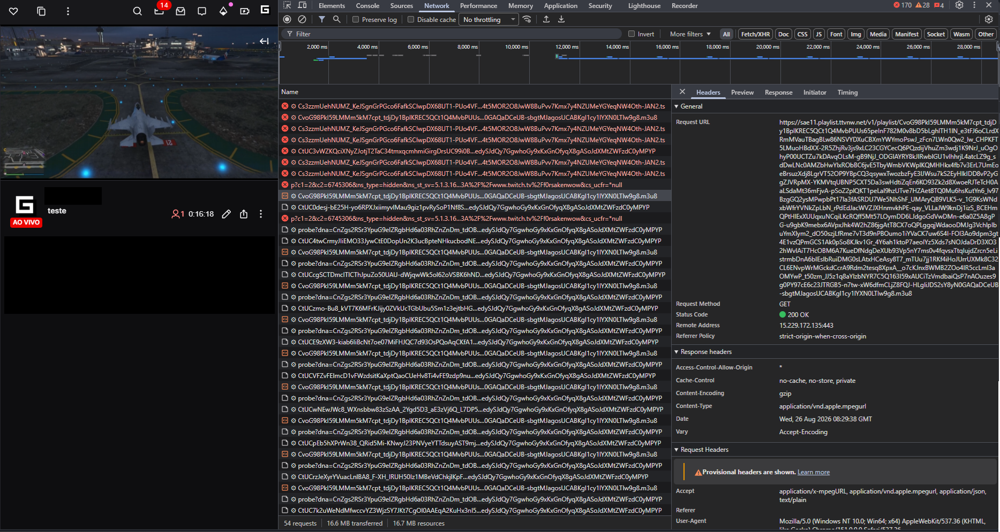

*Figura 17 — Ciclo de recuperação de falha do cliente: Após a interrupção da rede e esgotamento do buffer (requisições em vermelho), o restabelecimento da conexão aciona o mecanismo de recuperação. O player realiza um novo `GET` bem-sucedido (status 200) para a playlist de mídia (`.m3u8`) atualizada e retoma o download dos segmentos (`.ts`) para sincronizar a transmissão. Autor(es): Mateus Rodrigues Barreto, 26/08/2026.*

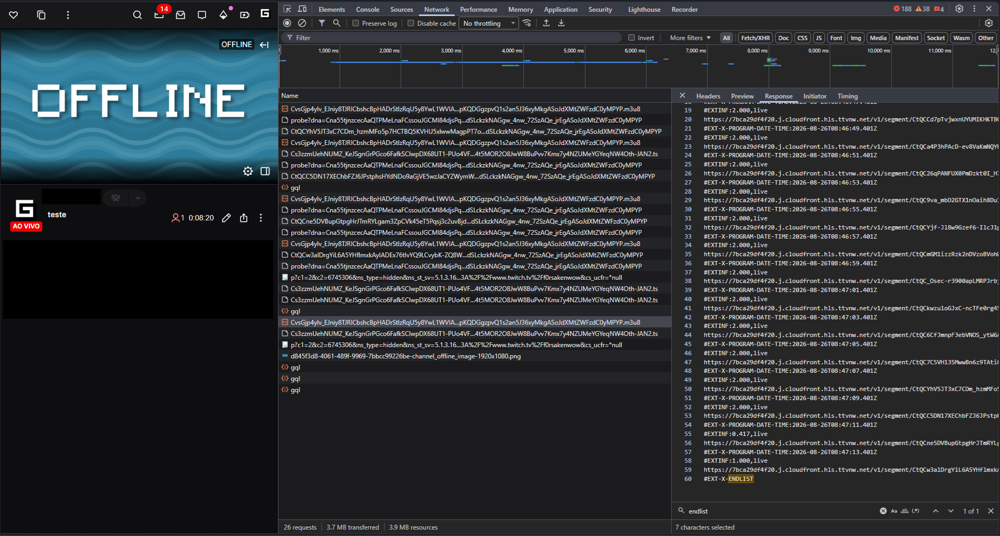

*Figura 18 — Encerramento da transmissão na origem: O DevTools registra a resposta final da playlist de mídia (`.m3u8`), contendo a tag `#EXT-X-ENDLIST`, que sinaliza ao player que não haverá novos segmentos e que a transmissão ao vivo foi finalizada. Em seguida, a requisição de segmento retorna status 204 (sem conteúdo) e o cliente carrega a imagem de "canal offline". Autor(es): Mateus Rodrigues Barreto, 26/08/2026.*

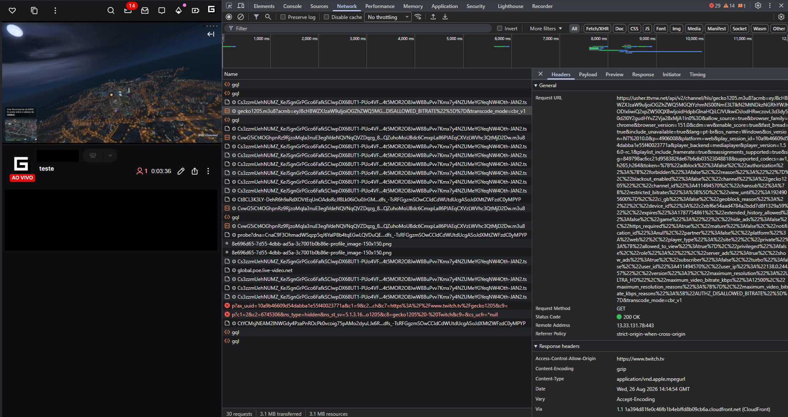

*Figura 19 — Retomada da transmissão na origem: O DevTools demonstra o retorno do fluxo de mídia após o reinício do encoder. O player volta a realizar requisições bem-sucedidas (status 200) para a playlist de índice (`.m3u8`) e para os segmentos de vídeo (`.ts`). Autor(es): Mateus Rodrigues Barreto, 26/08/2026.*

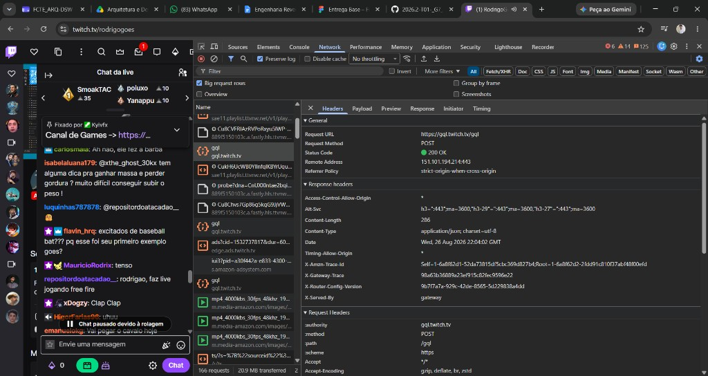

*Figura 20 — Canal `twitch.tv/rodrigogoes` com chat da live: após envio de mensagem, requisição `POST gql.twitch.tv/gql` selecionada na aba Network (Fetch/XHR). Autor(es): Pedro Henrique Freire Rodrigues, 26/08/2026.*

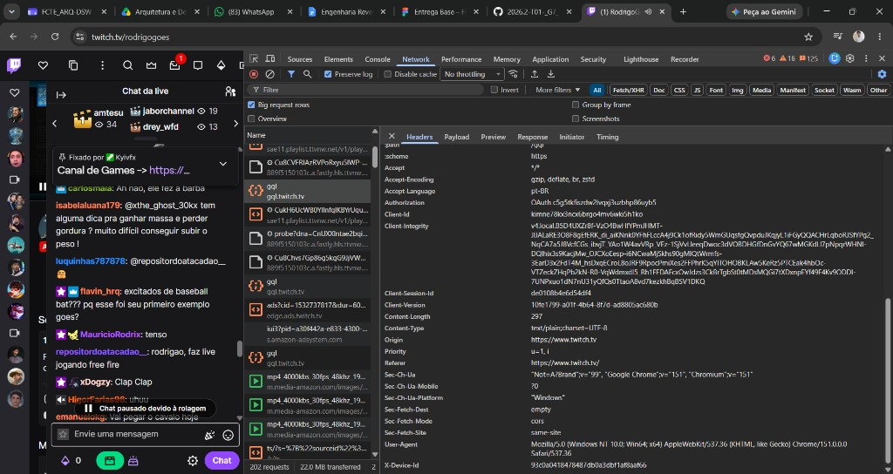

*Figura 21 — Cabeçalhos da requisição de chat: `POST https://gql.twitch.tv/gql`, status 200, `authorization: OAuth`, `client-id` e `client-integrity` (token OAuth omitido no relatório). Autor(es): Pedro Henrique Freire Rodrigues, 26/08/2026.*

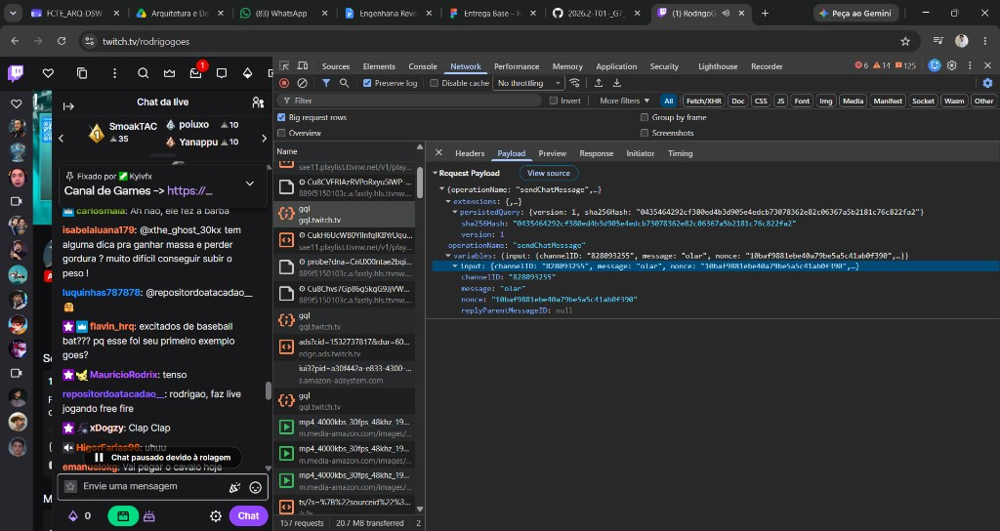

*Figura 22 — Payload da mutação `sendChatMessage`: `channelID` `828093255`, mensagem `olar`, `nonce` e `replyParentMessageID` nulo; persisted query com `sha256Hash`. Autor(es): Pedro Henrique Freire Rodrigues, 26/08/2026.*

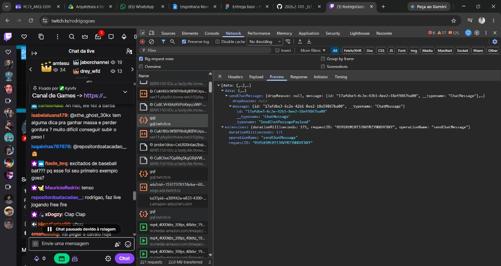

*Figura 23 — Pré-visualização da resposta: `sendChatMessage.dropReason` nulo, `message.id` retornado e `__typename` `SendChatMessagePayload` / `ChatMessage`. Autor(es): Pedro Henrique Freire Rodrigues, 26/08/2026.*

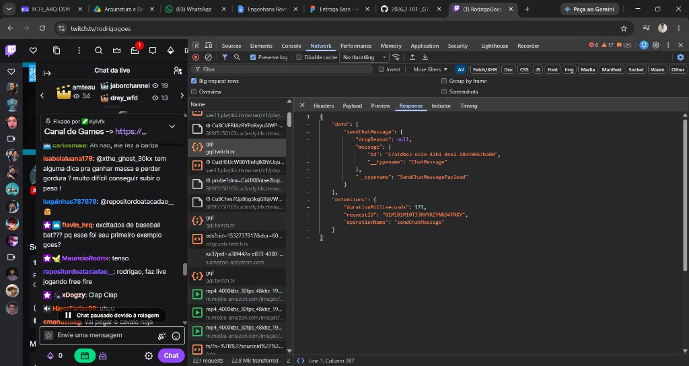

*Figura 24 — Resposta JSON completa da mutação `sendChatMessage` (`extensions.operationName`, `durationMilliseconds` 171 ms). Autor(es): Pedro Henrique Freire Rodrigues, 26/08/2026.*

## 6. Achados

### 6.1. Atores Identificados

| Ator | Papel no fluxo | Observação |
| -- | -- | -- |
| Espectador anônimo | Tenta acessar o canal | Bloqueado pelo overlay etário (Figura 1). |
| Espectador autenticado | Assiste, visualiza o chat, envia mensagens, abre Bits e segue o canal | Perfil no cabeçalho e interface do canal (Figura 2); cabeçalho `authorization: OAuth` nas chamadas GraphQL (Figuras 5, 12 e 21). |
| Canal / transmissor | Origem do conteúdo e do chat | Canais observados: rodrigogoes (`channelID` `828093255` no payload de chat, Figura 22); lolworldchampionship (campo `login` no JSON da sidebar, Figura 14). |
| Cliente web Twitch | Renderiza a interface e dispara requisições | Serviço nativo da plataforma. Domínio: twitch.tv; módulos do front-end: `features.auth.components.*` (Figuras 3 e 4). |
| Gateway GraphQL | API de dados, chat e eventos da sessão | Serviço nativo. URL: `https://gql.twitch.tv/gql`; resposta com `x-served-by: gateway` (Figura 5); mutação `sendChatMessage` no envio de mensagem (Figuras 20 a 24). |
| Amazon IVS (worker WASM) | Reprodução de vídeo | Infraestrutura Amazon integrada ao player: `amazon-ivs-wasmworker` (Figuras 1, 5 e 11). |
| CDN HLS | Entrega de segmentos | Domínio Twitch (`ttvnw.net`, `live-video.net`) sobre entrega CloudFront/HLS; tráfego `.ts` concorrente ao chat, não confundir com envio de mensagem (Figuras 6 e 20). |
| Recurly, PayPal e Amazon Pay | Checkout de Bits | Processadores externos no checkout (scripts e botões; Figuras 8 e 9). |
| Redes de anúncio e sincronização | Identidade publicitária na página inicial | Serviços externos: Smaato, Taboola, `a-mo.net` (Figura 3). |
| Spade | Coleta de eventos de comportamento | Telemetria nativa via operação GraphQL `sendSpadeEvents` (Figura 4). |
| Software de Transmissão (Encoder) | Envia o fluxo de mídia para a plataforma | Utilizado o OBS Studio para transmissão e testes. |

### 6.2. Atividades e Decisões do Fluxo

| # | Atividade / decisão | Ator | Gatilho | Resultado |
| -- | -- | -- | -- | -- |
| A01 | Abrir a página inicial | Espectador | Navegação a twitch.tv | Carrossel e recomendações; tráfego GraphQL e de anúncios (Figuras 3 e 4). |
| A02 | Assistir e visualizar o chat | Espectador autenticado | Página do canal | Player AO VIVO, chat da live e saldos de Bits/pontos visíveis (Figuras 2 e 6). |
| A03 | Enviar mensagem no chat | Espectador autenticado | Campo “Envie uma mensagem” e ação de envio | `POST https://gql.twitch.tv/gql` com mutação `sendChatMessage`; payload com `channelID`, texto da mensagem e `nonce` (Figuras 22 e 21); resposta 200 com `message.id` e `dropReason` nulo (Figuras 23 e 24). Pico de audiência e modo lento não observados. |
| A04 | Abrir a compra de Bits | Espectador | Ícone ou botão de Bits | Modal **Compre Bits**, saldo 0 e grade de pacotes (Figura 7). |
| A05 | Escolher o pacote | Espectador | Seleção de 300 ou 100 Bits | Modal **Finalizar compra** com preço em reais e IVA (Figuras 8 e 9). |
| A06 | Informar cobrança ou método | Espectador | Campos de nome, país, CPF, cartão ou PayPal / Amazon Pay | Checkout com métodos de pagamento (Figuras 8 e 9). Em paralelo, o cliente dispara a operação GraphQL `CreatorWalletCheckoutQuery` (consulta à carteira no checkout: `spendableBalance`, `bitsOffers` e dados de `currentUser`/`payout`); resposta com saldo 0 e ofertas de Bits (Figura 10). Compra não concluída nesta coleta. |
| A07 | Seguir o canal | Espectador | Ação de follow | Aviso de emotes gratuitos (Figuras 12 e 14). |
| A08 | Recuperar falha de conexão do cliente | Espectador | Queda de rede do cliente | O player exibe erro e faz polling contínuo, recuperando o vídeo automaticamente quando a rede volta (Figuras 16 e 17). |
| A09 | Encerrar transmissão na origem | Transmissor (Encoder) e Espectador | Fim da transmissão ao vivo | O player para de requisitar vídeo (HTTP 204) e a interface muda, mostrando o banner de canal offline (Figura 18). |
| A10 | Retomada da transmissão na origem | Transmissor (Encoder) e Espectador | Reinício do fluxo no encoder (atualização de status via API). | A interface atualiza o canal para “ao vivo” e o player dispara um novo GET da playlist `.m3u8`, iniciando o consumo de mídia (Figura 19). |

### 6.3. Regras de Negócio Inferidas

| # | Regra inferida | Evidência que sustenta | Grau de confiança |
| -- | -- | -- | -- |
| RN01 | Pacotes de Bits são oferecidos em reais com IVA incluso dentro do Brasil. | Figuras 7 a 9 | Alto |
| RN02 | O checkout no Brasil solicita CPF e país Brasil. | Figura 8 | Alto |
| RN03 | Após o início da entrega, o pedido digital de Bits não pode ser cancelado, segundo o texto legal exibido. | Figura 8 | Alto |
| RN04 | O player tolera falhas de rede do espectador via tentativas contínuas (polling), recuperando a mídia automaticamente ao restabelecer a conexão. | Figuras 16 e 17 | Alto |
| RN05 | O encerramento da transmissão na origem é sinalizado, transicionando a interface para OFFLINE, sem gerar erros. | Figura 18 | Alto |
| RN06 | A transição de “offline” para “ao vivo” ocorre de forma dinâmica e sem necessidade de reload manual. | Figura 19 | Alto |
| RN07 | O envio de mensagem no chat usa a mutação GraphQL `sendChatMessage` em `gql.twitch.tv/gql`, com `channelID`, texto e `nonce` no payload. | Figuras 21 e 22 | Alto |
| RN08 | Mensagem aceita retorna `message.id` e `dropReason` nulo na resposta observada. | Figuras 23 e 24 | Alto |
| RN09 | Sob pico, o chat aplica contenção (modo lento ou limitação de taxa). | Não observado nesta coleta | Não aplicável até nova evidência |

> Distinguir claramente **o que foi observado** do **o que foi inferido**. Inferência apresentada como fato é erro de rastreabilidade.

## 7. Rastreabilidade & Elos com Outros Artefatos

| Achado | Elo com | Onde (link) | Natureza do elo |
| -- | -- | -- | -- |
| Requisição POST de usuário autenticado a gql.twitch.tv/gql | API GraphQL da Twitch e, no ecossistema público, a API Helix | [Twitch Developers](https://dev.twitch.tv/docs) | Contrato de dados da plataforma |
| Mutação sendChatMessage | Envio de mensagem no chat via GraphQL | [Twitch Chat / IRC](https://dev.twitch.tv/docs/irc) | Contrato de chat observado na sessão web (Figuras 20 a 24) |
| Serviço amazon-ivs-wasmworker | Amazon Interactive Video Service | [Amazon IVS](https://docs.aws.amazon.com/ivs/) | Player de baixa latência |
| Segmentos cloudfront.hls.ttvnw.net e playlists .m3u8 | HTTP Live Streaming e rede de distribuição Amazon CloudFront | [RFC 8216 (HLS)](https://datatracker.ietf.org/doc/html/rfc8216); documentação CloudFront | Entrega de mídia |
| Serviços recurly.js, PayPal e Amazon Pay | Recurly, PayPal e Amazon Pay | [Recurly](https://docs.recurly.com/); [PayPal Developer](https://developer.paypal.com/); [Amazon Pay](https://developer.amazon.com/amazon-pay) | Processamento de pagamento e campos hospedados |
| Mutação sendSpadeEvents | Telemetria interna da Twitch (Spade) | Documentação de desenvolvedor da Twitch | Instrumentação de produto |
| Serviços csync, Smaato, Taboola, a-mo.net | Sincronização de identificadores em redes de anúncio | Documentação dos respectivos SSP/DSP (Smaato, Taboola, Index/PubMatic e correlatos) | Monetização publicitária, distinta de Bits |

## 8. Senso Crítico

A engenharia reversa foi conduzida por caixa-preta (interface + DevTools). O contrato de chat (`sendChatMessage`) e os ciclos de falha de rede do cliente e de interrupção/retomada na origem estão documentados, mas permanecem lacunas: compra de Bits concluída e chat sob pico.

Durante a live, requisições HLS (`.ts`, domínios `live-video.net` / `ttvnw.net`) ocorrem de forma contínua e podem coincidir no tempo com ações no chat; não devem ser interpretadas como envio de mensagem. A distinção exige filtrar Fetch/XHR no instante do envio e inspecionar `operationName` no payload.

Tokens OAuth e `client-integrity` foram omitidos deste relatório por segurança. O recebimento de mensagens de terceiros no feed pode depender de canal WebSocket ou subscription GraphQL não isolada nesta coleta — apenas o envio foi capturado ponta a ponta.

## 9. Participantes & Comprobatórios

| Membro | Contribuição | Comprobatório (commit/PR) |
| -- | -- | -- |
| Pedro Henrique Freire Rodrigues | Adição das etapas 1-4 do tópico 4, capturas de tela de evidência no tópico 5, tópico 6, tópico 7 | Commit 7be6f06 |
| Mateus Rodrigues Barreto | Adição das etapas 5-6 do tópico 4, simulação de falha de rede do cliente e interrupção na origem (Figuras 16-19), atualizações nos tópicos 6 e 7 | Commit 2d9ebb1 |

## 10. Referências

_A preencher._

## Histórico de Versões

| Versão | Data | Descrição | Autor(es) | Revisor(es) |
| -- | -- | -- | -- | -- |
| 1.0 | 21/08/2026 | Criação da página | Lucas Andrade Zanetti | Heitor Macedo Ricardo |
| 1.1 | 21/08/2026 | Adição das etapas 1-4 do tópico 4, capturas de tela de evidência no tópico 5, tópico 6, tópico 7 | Pedro Henrique Freire Rodrigues | Mateus Rodrigues Barreto |
| 1.2 | 26/08/2026 | Adição da metodologia, etapas 5-6 de simulação de falha de rede e interrupção na origem, evidências (Figuras 16-19) e achados correspondentes | Mateus Rodrigues Barreto | Pedro Henrique Freire Rodrigues |
| 1.3 | 26/08/2026 | Inclusão do contrato de chat (`sendChatMessage`), Figuras 20–24, atividade A03 e regras RN07–RN09 | Pedro Henrique Freire Rodrigues | — |
