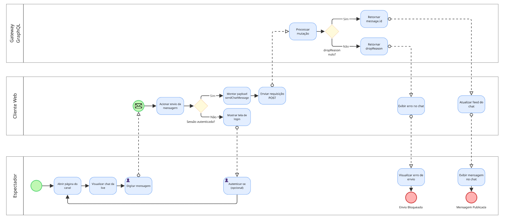
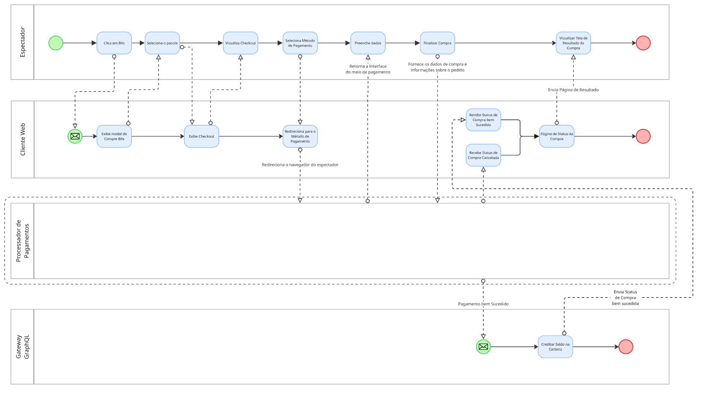
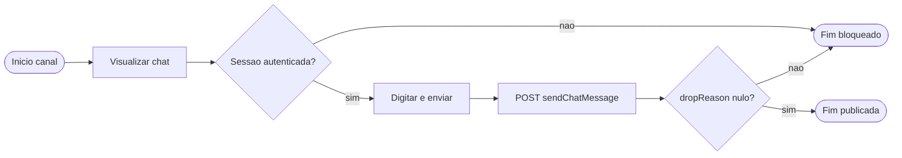
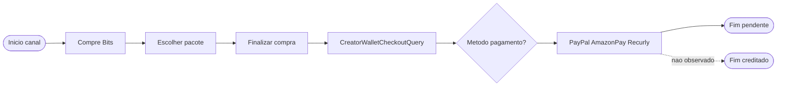

# FOCO_02 · Modelagem BPMN — SubEquipe_02

> **Entrega mínima do foco**: um modelo, na notação BPMN, do fluxo do software encontrado com a [Engenharia Reversa](3.EngenhariaReversa.md).
> **Status**: 🟡 em progresso (especificação textual completa; diagramas PNG pendentes) · **Responsáveis**: SubEquipe_02

## 1. Metodologia do Foco

O modelo BPMN foi derivado dos achados documentados na [Engenharia Reversa](3.EngenhariaReversa.md), em especial das atividades A02 a A07, das regras RN01 a RN09 e das Figuras 1 a 24. Foram modelados dois fluxos alinhados ao [Escopo do Produto §5](../../../Projeto/EscopoProduto.md#5-fluxos-selecionados-para-engenharia-reversa--bpmn): **envio de mensagem no chat** (recorte mínimo) e **compra de Bits** (recorte extra de monetização).

Cada task e gateway do modelo possui origem rastreável na ER. Elementos não observados na coleta — cobrança concluída, crédito de saldo, chat sob pico e recuperação de falha de transmissão — aparecem como ramos tracejados ou anotação explícita, sem ser apresentados como fato.

A validação seguiu a mesma lógica da ER (§4, etapa 6): cruzamento entre interface e aba Network do DevTools. Tráfego HLS (`.ts`, domínios `live-video.net` / `ttvnw.net`) foi excluído do fluxo de chat por não corresponder ao contrato `sendChatMessage`.

A diagramação gráfica está prevista no Figma ([Ata S2_01](../../../Projeto/Atas/ata-S2-01-2026-08-23.md)) ou no Camunda ([Metodologia do Projeto](../../../Projeto/Metodologia.md)). Esta página consolida a especificação textual que antecede os arquivos em `docs/assets/bpmn/`.

## 2. Fundamentação Teórica — BPMN

A **Business Process Model and Notation (BPMN) 2.0** (OMG) descreve processos de negócio por meio de eventos, atividades, gateways, pools e fluxos de sequência e de mensagem. O critério da disciplina valoriza o uso de **vários** recursos da notação; abaixo estão os empregados neste modelo e a justificativa de cada um.

| Recurso BPMN | Uso neste modelo |
| -- | -- |
| **Pool** | Separa Espectador, Cliente web, Gateway GraphQL e Processador de pagamento — atores distintos identificados na ER (§6.1). |
| **Lane** | Opcional dentro do pool Processador de pagamento (PayPal, Amazon Pay, Recurly). |
| **Evento de início** | Abertura da página do canal (chat e Bits). |
| **Evento de fim** | Mensagem publicada, envio bloqueado, checkout pendente; crédito de Bits (tracejado). |
| **Task** | Ações observáveis: visualizar chat, enviar mensagem, abrir modal Bits, consultar carteira etc. |
| **Gateway exclusivo (XOR)** | Sessão autenticada; `dropReason` nulo; método de pagamento; pagamento aprovado (último não observado). |
| **Gateway paralelo (AND)** | Checkout aberto em paralelo à consulta `CreatorWalletCheckoutQuery`. |
| **Fluxo de mensagem** | Cliente web ↔ Gateway GraphQL; Cliente web ↔ processadores externos de pagamento. |
| **Objeto de dados** | `channelID`, texto da mensagem, `nonce`, `message.id`, pacote de Bits, `spendableBalance`. |
| **Anotação de texto** | Marca ramos não observados na ER (pico, cobrança concluída). |

## 3. Modelo BPMN

| Item | Valor |
| -- | -- |
| Fluxo modelado | (1) Envio de mensagem no chat; (2) Compra de Bits (checkout parcial) |
| Ferramenta utilizada | Figma _(ou Camunda — a definir pela subequipe)_ |
| Arquivo-fonte editável (`.bpmn`) | _pendente em `docs/assets/bpmn/`_ |
| Versão do modelo | 0.1 (especificação textual; diagrama PNG pendente) |

> 🖼️ **Imagem pendente — fluxo Chat.** Salvar em `docs/assets/bpmn/subequipe_02_bpmn-chat.png` (ver [Padrão de Assets](../../../assets/README.md)) e substituir por:
>
> ```markdown
> 
> ```

*Figura 1 — Modelo BPMN do fluxo de envio de mensagem no chat. Autor(es): Pedro Henrique Freire Rodrigues, 26/08/2026.*

> 🖼️ **Imagem pendente — fluxo Bits.** Salvar em `docs/assets/bpmn/subequipe_02_bpmn-bits.png` e substituir por:
>
> ```markdown
> 
> ```

*Figura 2 — Modelo BPMN do fluxo de compra de Bits (checkout parcial). Autor(es): Pedro Henrique Freire Rodrigues, 26/08/2026.*

> Quando os diagramas forem produzidos, incluir recortes ampliados por pool/subprocesso além da visão completa.

### 3.1. Fluxo Chat — envio de mensagem

Pools: **Espectador** · **Cliente web** · **Gateway GraphQL**.

| # | Elemento | Tipo | Pool | Rastreio ER |
| -- | -- | -- | -- | -- |
| C1 | Abrir página do canal | Start | Espectador | A02, Figs. 2 e 6 |
| C2 | Visualizar painel Chat da live | Task | Espectador | A02, Figs. 2 e 6 |
| C3 | Sessão autenticada? | Gateway XOR | Cliente web | Fig. 1 vs Fig. 2 |
| C4 | Digitar mensagem | Task | Espectador | Fig. 20 |
| C5 | Acionar envio | Task | Espectador | Fig. 20 |
| C6 | Montar payload `sendChatMessage` | Task | Cliente web | A03, Fig. 22 |
| C7 | `POST gql.twitch.tv/gql` | Task + Message Flow | Cliente → Gateway | Figs. 21 e 22 |
| C8 | Processar mutação | Task | Gateway GraphQL | Figs. 23 e 24 |
| C9 | `dropReason` nulo? | Gateway XOR | Gateway GraphQL | RN08, Figs. 23 e 24 |
| C10 | Retornar `message.id` | Task | Gateway GraphQL | Fig. 23 |
| C11 | Atualizar feed do chat | Task | Cliente web | _parcial_ — API confirmada |
| C12 | Mensagem publicada | End | Espectador | — |
| C13 | Envio bloqueado | End | Espectador | ramo inferido se `dropReason` ≠ nulo |



### 3.2. Fluxo Compra de Bits — checkout parcial

Pools: **Espectador** · **Cliente web** · **Gateway GraphQL** · **Processador de pagamento**.

| # | Elemento | Tipo | Pool | Rastreio ER |
| -- | -- | -- | -- | -- |
| B1 | No canal autenticado | Start | Espectador | Fig. 2 |
| B2 | Abrir compra de Bits | Task | Espectador | A04, Fig. 7 |
| B3 | Exibir modal Compre Bits | Task | Cliente web | A04, Fig. 7 |
| B4 | Selecionar pacote | Task | Espectador | A05, Figs. 8 e 9 |
| B5 | Exibir Finalizar compra | Task | Cliente web | A05, RN01, Figs. 8 e 9 |
| B6 | Consultar carteira | Task + Message Flow | Cliente → Gateway | A06, Fig. 10 |
| B7 | Gateway paralelo | AND | Cliente web | checkout ∥ `CreatorWalletCheckoutQuery` |
| B8 | Preencher CPF e país Brasil | Task | Espectador | A06, RN02, Fig. 8 |
| B9 | Método de pagamento? | Gateway XOR | Espectador | Figs. 8 e 9 |
| B10 | PayPal / Amazon Pay / Recurly | Task | Processador | Figs. 8 e 9 |
| B11 | Clicar Finalizar compra | Task | Espectador | Fig. 8 |
| B12 | Processar cobrança | Task | Processador | _não observado_ |
| B13 | Pagamento aprovado? | Gateway XOR | Processador | _não observado_ |
| B14 | Creditar saldo de Bits | Task | Gateway | _não observado_ |
| B15 | Checkout pendente | End | Espectador | estado atual da coleta |
| B16 | Compra concluída | End | Espectador | _não observado_ — ramo tracejado |



## 4. Elementos da Notação Utilizados

| Elemento BPMN | Onde aparece no modelo | Por que foi usado |
| -- | -- | -- |
| Pool Espectador | Fluxos Chat e Bits | Representa o usuário que interage pela interface. |
| Pool Cliente web | Fluxos Chat e Bits | Dispara requisições GraphQL e renderiza modais (ER §6.1). |
| Pool Gateway GraphQL | Fluxos Chat e Bits | Centraliza `sendChatMessage` e `CreatorWalletCheckoutQuery`. |
| Pool Processador de pagamento | Fluxo Bits | Recurly, PayPal e Amazon Pay são externos (Figs. 8 e 9). |
| Evento de início | C1, B1 | Marca o ponto de entrada no canal autenticado. |
| Evento de fim | C12–C13, B15–B16 | Distingue sucesso, bloqueio e checkout pendente. |
| Gateway exclusivo | C3, C9, B9, B13 | Modela autenticação, aceite da mensagem, escolha e aprovação de pagamento. |
| Gateway paralelo | B7 | Checkout e consulta de carteira ocorrem em paralelo (Fig. 10). |
| Fluxo de mensagem | C7, B6, B10 | Liga cliente web a serviços remotos sem controle de sequência interna. |
| Objeto de dados | Payload chat; pacote Bits | Torna explícitos `channelID`, `nonce`, `spendableBalance` (Figs. 10 e 22). |
| Anotação tracejada | B12–B14, B16 | Indica lacunas da ER sem apresentá-las como observadas. |

## 5. Leitura do Modelo

### Fluxo Chat

O processo inicia quando o espectador abre a página do canal e visualiza o painel **Chat da live** (C1–C2). O cliente web verifica se há sessão autenticada (C3): sem autenticação, o envio não prossegue e o fluxo termina em bloqueio (C13), conforme o overlay etário da Figura 1.

Com sessão ativa, o espectador digita a mensagem e aciona o envio (C4–C5). O cliente monta o payload da mutação GraphQL `sendChatMessage`, com `channelID`, texto e `nonce` (C6), e envia `POST` para `https://gql.twitch.tv/gql` com cabeçalho `authorization: OAuth` (C7). O gateway processa a mutação (C8) e retorna `dropReason` e, em caso de aceite, `message.id` (C9–C10). Se `dropReason` for nulo, a mensagem é considerada aceita e o fluxo encerra em publicação (C11–C12); caso contrário, encerra em bloqueio (C13).

O tráfego contínuo de segmentos HLS (`.ts`) observado na mesma sessão **não** faz parte deste fluxo: pertence à entrega de vídeo, não ao chat.

### Fluxo Compra de Bits

O processo inicia no canal autenticado (B1). O espectador abre a compra de Bits (B2) e o cliente exibe o modal **Compre Bits** com saldo e pacotes (B3). Após a seleção do pacote — por exemplo, 100 ou 300 Bits (B4) — abre-se o modal **Finalizar compra** com preço em reais e IVA (B5, RN01).

Em paralelo ao checkout, o cliente dispara `CreatorWalletCheckoutQuery` (B6–B7), consultando `spendableBalance` e `bitsOffers` (Fig. 10). O espectador informa país Brasil e CPF (B8, RN02) e escolhe o método de pagamento — PayPal, Amazon Pay ou cartão via Recurly (B9–B10). Ao acionar **Finalizar compra** (B11), o fluxo observado termina em **checkout pendente** (B15): a coleta não registrou cobrança concluída nem saldo atualizado.

Os passos B12 a B14 e o evento de fim B16 (compra concluída) permanecem tracejados como inferência, até nova evidência de pagamento e mudança de saldo. Tráfego GraphQL alheio à cobrança — como `StoryPreviewsWithOrder` (Fig. 15) — não integra este fluxo.

## 6. Rastreabilidade & Elos com Outros Artefatos

| Elemento do modelo | Origem (achado da Eng. Reversa) | Elo com | Onde (link) |
| -- | -- | -- | -- |
| Visualizar chat (C2) | A02; Figs. 2 e 6 | Atividade ER | [§6.2](3.EngenhariaReversa.md#62-atividades-e-decisões-do-fluxo) |
| Gateway autenticação (C3) | Fig. 1 vs Fig. 2 | Ator Espectador anônimo / autenticado | [§6.1](3.EngenhariaReversa.md#61-atores-identificados) |
| `sendChatMessage` (C6–C10) | A03; Figs. 20–24; RN07–RN08 | Gateway GraphQL | [§6.1](3.EngenhariaReversa.md#61-atores-identificados) |
| Modal Compre Bits (B3) | A04; Fig. 7 | Monetização Bits | [§6.2](3.EngenhariaReversa.md#62-atividades-e-decisões-do-fluxo) |
| Finalizar compra (B5) | A05; Figs. 8 e 9; RN01 | Regra de preço/IVA | [§6.3](3.EngenhariaReversa.md#63-regras-de-negócio-inferidas) |
| `CreatorWalletCheckoutQuery` (B6) | A06; Fig. 10 | Consulta de carteira | [§6.2](3.EngenhariaReversa.md#62-atividades-e-decisões-do-fluxo) |
| CPF e Brasil (B8) | RN02; Fig. 8 | Checkout regional | [§6.3](3.EngenhariaReversa.md#63-regras-de-negócio-inferidas) |
| PayPal / Amazon Pay / Recurly (B10) | A06; Figs. 8 e 9 | Processadores externos | [§6.1](3.EngenhariaReversa.md#61-atores-identificados) |
| Checkout pendente (B15) | A06; §8 ER | Lacuna de cobrança | [§8](3.EngenhariaReversa.md#8-senso-crítico) |
| Ramo pico / modo lento | RN09; não observado | Escopo mínimo chat | [Escopo §5](../../../Projeto/EscopoProduto.md#5-fluxos-selecionados-para-engenharia-reversa--bpmn) |
| Recuperação de falha de mídia | A08–A10; Figs. 16–19; RN04–RN06 | Fora deste BPMN (fluxos Chat/Bits) | [3. Engenharia Reversa](3.EngenhariaReversa.md) |

> Todo elemento do BPMN deve ter origem rastreável em um achado documentado na página de Engenharia Reversa.

## 7. Senso Crítico

Foram modelados **dois diagramas** em vez de um único processo, para preservar legibilidade e alinhar-se ao escopo mínimo (chat) e extra (Bits) da SubEquipe_02.

No **chat**, o envio via `sendChatMessage` está documentado ponta a ponta na ER; o recebimento de mensagens de terceiros no feed e a contenção sob pico (RN09) não foram observados e não integram o modelo como fluxo completo. A publicação visual da mensagem no feed foi inferida a partir da resposta da API, mas não isolada como evidência dedicada.

Na **compra de Bits**, o modelo cobre a vitrine, o checkout e a consulta de carteira até a escolha do método de pagamento. Cobrança, aprovação e crédito de saldo aparecem apenas como ramos tracejados, coerentes com a lacuna registrada na ER.

A **recuperação de falha de transmissão** (A08–A10 na ER) foi excluída deste BPMN para manter o escopo nos fluxos de chat e Bits; um terceiro diagrama pode derivar-se desses achados futuramente.

Os arquivos PNG e `.bpmn` ainda não foram produzidos: esta página funciona como especificação rastreável que antecede a diagramação no Figma ou Camunda.

## 8. Participantes & Comprobatórios

| Membro | Contribuição | Comprobatório (commit/PR) |
| -- | -- | -- |
| _(preencher)_ | | |

## 9. Referências

_A preencher em [6.Referencias.md](6.Referencias.md)._

## Histórico de Versões

| Versão | Data | Descrição | Autor(es) | Revisor(es) |
| -- | -- | -- | -- | -- |
| 1.0 | 21/08/2026 | Criação da página | Lucas Andrade Zanetti | Heitor Macedo Ricardo |
| 1.1 | 26/08/2026 | Especificação textual dos fluxos Chat e Bits, tabelas de notação, leitura, rastreabilidade e senso crítico | Pedro Henrique Freire Rodrigues | — |
