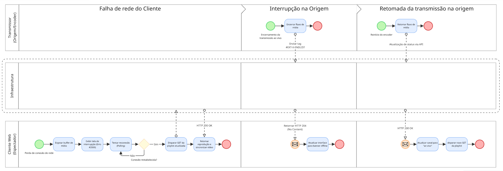

# FOCO_02 · Modelagem BPMN — SubEquipe_02

> **Entrega mínima do foco**: um modelo, na notação BPMN, do fluxo do software encontrado com a [Engenharia Reversa](3.EngenhariaReversa.md).
> **Status**: 🟢 Concluído · **Responsáveis**: Davi Severiano Freitas, Daniel de Oliveira Lira, Mateus Rodrigues Barreto, Pedro Henrique Freire Rodrigues.

## 1. Metodologia do Foco

O modelo BPMN foi construído a partir dos achados documentados na fase de [Engenharia Reversa](3.EngenhariaReversa.md), alinhando-se aos [Escopos do Produto](../../../Projeto/EscopoProduto.md#fluxos-engenharia-reversa-bpmn). A modelagem buscou representar as interações de alta disponibilidade da plataforma, focando em três processos distintos e logicamente encadeados:

1. **Envio de mensagem no chat ao vivo** (recorte mínimo)
2. **Compra de Bits e monetização** (recorte extra)
3. **Recuperação de falha de transmissão** (tolerância a falhas na origem e no cliente)

A construção seguiu a mesma diretriz metodológica da engenharia reversa: **todo elemento do BPMN tem origem rastreável**. Cada tarefa, evento e decisão modelados possui evidência sustentada em atividades (ex: A02 a A10) e regras inferidas (ex: RN01 a RN09). Elementos que compõem hipóteses ou que não puderam ser verificados em completude na aba Network (como chat sob pico ou crédito final de saldo em banco) aparecem devidamente justificados e diferenciados sem forçar fatos.

## 2. Fundamentação Teórica — BPMN

A **BPMN 2.0** (Business Process Model and Notation) descreve processos de negócio de maneira padronizada, sendo inteligível tanto para analistas de negócios quanto para implementadores (OMG, 2011). Duas características fazem desta notação ideal para descrever a plataforma analisada:
- A separação entre **fluxos de sequência** e **fluxos de mensagem**, permitindo evidenciar a natureza assíncrona da comunicação entre as partes do sistema (Espectador, Cliente Web, Gateways e Processadores).
- O tratamento de **Eventos** como elementos de destaque, o que é crucial em transmissões de streaming dominadas por interrupções e reconexões (falhas, recuperação e timeout).

| Recurso BPMN | Uso neste modelo |
| -- | -- |
| **Pools** | Separa Espectador, Cliente Web, Gateway GraphQL, Camada de Borda, Processador de Pagamento e Player de Vídeo. Mantém limites claros entre domínios autônomos. |
| **Eventos (Início/Fim)** | Determina pontos de entrada independentes (ex: abrir canal, queda de rede) e desfechos funcionais (ex: mensagem enviada, erro de mídia). |
| **Atividades / Tasks** | Ações observadas de usuários e de serviços, detalhando interações de frontend e chamadas de rede. |
| **Gateways Exclusivos (XOR)** | Modela avaliações condicionais mutuamente excludentes, como `Sessão autenticada?` ou `dropReason nulo?`. |
| **Fluxo de Mensagem** | Evidencia a comunicação remota (Cliente Web ↔ Gateway GraphQL; Cliente Web ↔ CDN / Pagamentos). |
| **Objeto de Dados** | Representa o tráfego de dados concretos capturados: payload com `channelID`, `nonce`, pacotes de Bits. |

## 3. Modelo BPMN

| Item | Valor |
| -- | -- |
| Fluxos modelados | (1) Envio de Mensagem no Chat, (2) Compra de Bits, (3) Recuperação de Falha de Transmissão |
| Modelo no Miro | [Acessar Quadro](https://miro.com/app/board/uXjVHt4OsSM=/?share_link_id=883183220860) |
| Versão do modelo | 2.0 — 28/08/2026 |

Para facilitar a leitura e não criar um diagrama complexo e ilegível, o escopo foi fracionado nos três processos principais relatados na Engenharia Reversa.

### 3.1. Fluxo 1: Chat ao Vivo

*Figura 1 — Modelo BPMN do fluxo de envio de mensagem no chat. O processo detalha desde a interação com a interface até a mutação GraphQL de envio (`sendChatMessage`). Autoria: Davi Severiano Freitas, Daniel de Oliveira Lira, Mateus Rodrigues Barreto e Pedro Henrique Freire Rodrigues (2026).*

### 3.2. Fluxo 2: Compra de Bits

*Figura 2 — Modelo BPMN do fluxo de compra de Bits (checkout). Integra a experiência de visualização de saldo, consulta da carteira em segundo plano e comunicação com os processadores externos de pagamento. Autoria: Davi Severiano Freitas, Daniel de Oliveira Lira, Mateus Rodrigues Barreto e Pedro Henrique Freire Rodrigues (2026).*

### 3.3. Fluxo 3: Recuperação de Falha de Transmissão

*Figura 3 — Modelo BPMN sobre a resiliência do Player. Demonstra a recuperação autônoma do cliente frente a interrupções de conexão local ou o graceful degradation caso o próprio transmissor desligue o encoder. Autoria: Davi Severiano Freitas, Daniel de Oliveira Lira, Mateus Rodrigues Barreto e Pedro Henrique Freire Rodrigues (2026).*

## 4. Elementos da Notação Utilizados

| Elemento BPMN | Onde aparece no modelo | Por que foi usado |
| -- | -- | -- |
| **Pools** | Fluxos de Chat, Bits e Recuperação. | Identificam fronteiras de responsabilidade: Espectador, Cliente Web (SPA), Gateway GraphQL, Processadores externos e CDN HLS. O espectador não decide sozinho sobre a rede. |
| **Eventos de Início** | Início de cada diagrama. | Marca gatilhos: "Abrir página do canal", "Falha de rede do cliente" ou "Encoder encerrado". |
| **Eventos de Fim** | Extremidades dos diagramas. | Distingue o desfecho: sucesso (mensagem publicada, retomada do player), pendências (checkout pendente) ou encerramento normal (canal offline). |
| **Gateway Exclusivo** | Chat (Sessão auth?); Bits (Método?); Recuperação (Status de retomada?). | Expressa regras de negócio binárias aplicadas no sistema para roteamento de execução. |
| **Fluxos de Mensagem e Sequência** | Todo o modelo. | Diferencia ordem lógica interna da comunicação transacional pela rede. |

## 5. Leitura do Modelo

### 5.1. Fluxo de Chat (Mensagem)
O processo inicia com o **Espectador** carregando a aba de canal (C1). Um gateway no **Cliente Web** verifica se a **sessão está autenticada** (C3): sem sessão, o overlay restringe o envio terminando o fluxo (C13). Existindo sessão, a mensagem é digitada e, ao ser enviada, o frontend constrói a mutação `sendChatMessage` com o id do canal e token OAuth (C6). A requisição viaja pelo Fluxo de Mensagem até o **Gateway GraphQL**. Após processamento, o backend reporta o campo `dropReason` (RN08). Se nulo, a publicação no chat é efetivada (C12); caso contrário, cai em bloqueio da própria API. O envio de mensagem flui completamente separado do tráfego do vídeo.

### 5.2. Fluxo de Compra de Bits
A monetização é engatilhada ao abrir o modal de **Compre Bits**. O Espectador avalia e seleciona um pacote (B4), convertendo a interface ao layout de **Finalizar Compra**, aplicando a regra regional para preços em reais e tributação local (RN01, RN02). Simultaneamente a isso, o cliente interroga o gateway via `CreatorWalletCheckoutQuery` para levantar a carteira virtual. O usuário fornece CPF e escolhe sua forma de pagamento via gateway de decisão (B9). Por depender de processadores externos, a jornada bifurca para PayPal, Amazon Pay ou Recurly. Como a coleta da subequipe (Erros/Limites) não observou o saldo sendo creditado em banco pelo sucesso de um pagamento real no cartão, o fluxo finaliza em "Checkout Pendente" (B15), indicando lacuna metodológica em tracejado sobre a cobrança final para manter a honestidade do modelo.

### 5.3. Fluxo de Recuperação de Falhas
Este foco modela as garantias de qualidade contínua na reprodução, exibindo tratamento de falhas independentes. Se a **rede do espectador cair** (Gatilho 1), o navegador reportará falha nos workers da reprodução local (A08). O Player IVS utilizará seu buffer existente até o fim, levantando erro e aplicando a técnica de polling (tentativas contínuas). Ao restabelecer a rede, ele baixa os segmentos da CDN e normaliza a mídia (RN04).
Por outro lado, se a **queda for originada pelo Transmissor/Encoder** (Gatilho 2), a camada da CDN sinaliza de imediato a tag HLS de fechamento intencional (`#EXT-X-ENDLIST`). Sem novos pacotes para esperar, o player entende que não houve erro no cliente (A09), mas um encerramento real (RN05), transferindo organicamente a interface para o banner "Canal Offline" até que o encoder suba novamente a transmissão.

## 6. Rastreabilidade & Elos com Outros Artefatos

Todo elemento decisivo da modelagem possui rastreio direto aos achados documentados no relatório de [Engenharia Reversa](3.EngenhariaReversa.md).

| Elemento do Modelo BPMN | Origem (Achado ER) | Relação | Onde na ER |
| -- | -- | -- | -- |
| Gateway de Sessão Autenticada (Chat) | Fig. 1 vs Fig. 2 | Ator Espectador Autenticado | [§6.1](3.EngenhariaReversa.md#_61-atores-identificados) |
| Mutação `sendChatMessage` / Gateway | A03; Figs. 20–24; RN07, RN08 | Interação GraphQL de envio | [§6.2](3.EngenhariaReversa.md#_62-atividades-e-decisões-do-fluxo) |
| Preços regionais em BRL e CPF (Bits) | A05; Figs. 8 e 9; RN01, RN02 | Regras de monetização regional | [§6.3](3.EngenhariaReversa.md#_63-regras-de-negócio-inferidas) |
| Consulta paralela `CreatorWalletCheckoutQuery` | A06; Fig. 10 | Consulta de carteira oculta | [§6.2](3.EngenhariaReversa.md#_62-atividades-e-decisões-do-fluxo) |
| Uso de PayPal, Amazon Pay, Recurly | A06; Figs. 8 e 9 | Integração com terceiros | [§6.1](3.EngenhariaReversa.md#_61-atores-identificados) |
| Polling/Reconexão em Falha Local (Vídeo) | A08; Figs. 16 e 17; RN04 | Resiliência do player HLS | [§6.2](3.EngenhariaReversa.md#_62-atividades-e-decisões-do-fluxo) |
| Uso da tag `#EXT-X-ENDLIST` (Vídeo) | A09, A10; Figs. 18 e 19; RN05 | Mecanismo de degradação | [§6.2](3.EngenhariaReversa.md#_62-atividades-e-decisões-do-fluxo) |

## 7. Senso Crítico

A tática de seccionar a modelagem nos três ramos funcionais — Chat, Bits (Monetização) e Tolerância a Falhas — preservou a legibilidade individual de cada componente estrutural do software analisado.
A fidelidade do diagrama reflete com rigor aquilo que a Engenharia Reversa observou do lado cliente. Hipóteses fortes como contenção limitadora de chat sob picos (RN09), embora lógicas, não foram incorporadas ao corpo normativo do diagrama porque não deixaram lastro direto na aba Network durante a captura empírica. Do mesmo modo, o encerramento da jornada de Monetização foi representado apenas até a fronteira de processamento externo, evitando falsas afirmações sobre o modelo de dados de um serviço de banco do qual não se tem acesso à caixa-branca.

No geral, o modelo BPMN expõe com clareza como a alta interatividade proposta pelo Escopo do Produto não se dá como num diagrama unificado tradicional, mas operando na combinação inteligente de múltiplos serviços assíncronos e na robustez do player web.

## 8. Participantes & Comprobatórios

| Membro | Contribuição | Comprobatório (commit/PR) |
| -- | -- | -- |
| Davi Severiano Freitas | Análise do fluxo encontrado com a engenharia reversa, elaboração conjunta dos diagramas BPMN e revisão estrutural das regras de negócio. | [`3c1f0aa`](https://github.com/UnBArqDsw2026-2-Turma01/2026.2-T01-_G6_ProjetoStreamingVideo_Entrega_01/commit/3c1f0aa) |
| Daniel de Oliveira Lira | Análise do fluxo encontrado com a engenharia reversa, elaboração conjunta dos diagramas BPMN e revisão metodológica da rastreabilidade. | [`3c1f0aa`](https://github.com/UnBArqDsw2026-2-Turma01/2026.2-T01-_G6_ProjetoStreamingVideo_Entrega_01/commit/3c1f0aa) |
| Mateus Rodrigues Barreto | Análise do fluxo, elaboração conjunta dos diagramas BPMN (foco em Recuperação de Falhas) e estruturação do documento. | [`3c1f0aa`](https://github.com/UnBArqDsw2026-2-Turma01/2026.2-T01-_G6_ProjetoStreamingVideo_Entrega_01/commit/3c1f0aa) |
| Pedro Henrique Freire Rodrigues | Análise do fluxo, elaboração conjunta dos diagramas BPMN (foco em Chat e Bits) e especificação textual do artefato. | [`3c1f0aa`](https://github.com/UnBArqDsw2026-2-Turma01/2026.2-T01-_G6_ProjetoStreamingVideo_Entrega_01/commit/3c1f0aa) |

## 9. Referências

1. **Object Management Group (OMG).** Business Process Model and Notation (BPMN) Version 2.0.2. Disponível em: <https://www.omg.org/spec/BPMN/2.0.2/PDF>. Acesso em: 28 ago. 2026.
2. Demais referências complementares de arquitetura estão centralizadas em [6.Referencias.md](6.Referencias.md).

## Histórico de Versões

| Versão | Data | Descrição | Autor(es) | Revisor(es) | Descrição da revisão |
| -- | -- | -- | -- | -- | -- |
| 1.0 | 21/08/2026 | Criação da página | Lucas Andrade Zanetti | Heitor Macedo Ricardo | Revisão da estrutura da página. |
| 1.1 | 26/08/2026 | Especificação textual dos fluxos Chat e Bits, tabelas de notação, leitura, rastreabilidade e senso crítico | Pedro Henrique Freire Rodrigues | — | Verificação dos diagramas de fluxo de chat, transações de bits e recuperação de falhas. |
| 1.2 | 27/08/2026 | Anonimização: nome da plataforma e domínios de CDN substituídos por rótulos genéricos (não-escopo FE06), conforme legenda em [3.EngenhariaReversa.md §3](3.EngenhariaReversa.md#3-contexto-da-aplicação-analisada) | Lucas Andrade Zanetti | — | Validação da conformidade com a notação BPMN e rastreabilidade com a engenharia reversa. |
| 2.0 | 28/08/2026 | Estruturação metodológica, escrita das seções e agregação dos diagramas gráficos dos três fluxos principais. | Mateus Rodrigues Barreto | Davi Severiano Freitas | Revisão técnica de conteúdo, clareza textual e aderência às diretrizes do projeto. |
