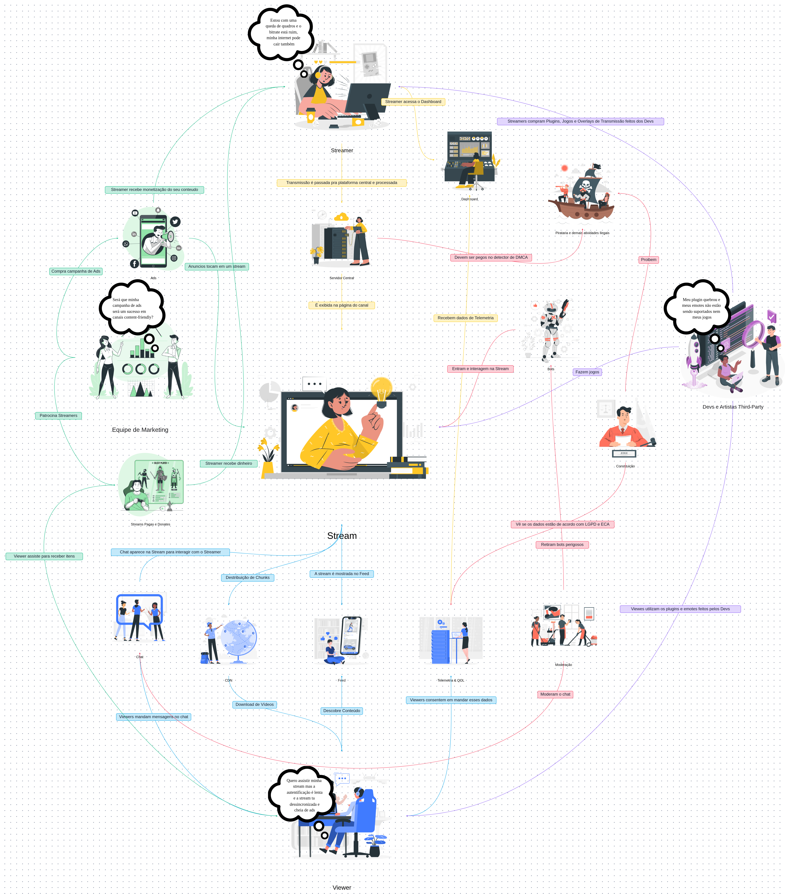

# FOCO_01 · Artefato Generalista — SubEquipe_03

> **Entrega mínima do foco**: um artefato generalista, com **escopo restrito a Rich Picture ou Mapa Mental**.  
> **Status**: 🟢 Concluído · **Integrantes**: Eduardo Lôbo Moreira, Hugo Freitas Silva, Philipe Amâncio Reis Caetano

## 1. Metodologia do Foco

O artefato generalista da **SubEquipe_03** foi concebido e elaborado **em conjunto** por todos os integrantes da subequipe, adotando uma abordagem colaborativa e iterativa para capturar a complexidade do ecossistema de uma plataforma de transmissão de vídeo ao vivo e conteúdo gerado por usuários (UGC).

| Item | Definição |
| -- | -- |
| **Sessão de trabalho** | Sessões síncronas de brainstorming e refinamento colaborativo realizadas pela subequipe, com edição simultânea do diagrama e discussão de cada fluxo e ator. |
| **Ferramenta** | Quadro colaborativo e de diagramação vetorial (**Miro**), permitindo prototipação ágil, posicionamento livre de componentes, ícones contextuais e conexão expressiva de fluxos. |
| **Ponto de partida** | Mapeamento dos múltiplos papéis do ecossistema (Streamer, Viewer, Equipe de Marketing, Desenvolvedores/Artistas Third-Party, Moderação e Órgãos Reguladores) e das tensões operacionais enfrentadas por cada um. |
| **Fontes de informação** | Exploração de plataformas líderes de streaming de vídeo ao vivo e UGC (Twitch, YouTube Live, Kick), literatura acadêmica de Engenharia de Requisitos e *Soft Systems Methodology* (SSM), e alinhamento com o escopo do projeto e os requisitos não funcionais mapeados no [NFR Framework](2.NFRFramework.md). |
| **Critério de revisão** | Discussão ponto a ponto de cada relação estabelecida: identificação de gargalos de rede, preocupações de monetização, integridade de dados (LGPD/ECA), canais de feedback e riscos de conformidade (DMCA/Pirataria). |

### Convenções Adotadas no Artefato:
- **Agrupamento por Atores e Subsistemas**: Identificação clara de quem produz, quem consome, quem gerencia, quem regula e quem estende a plataforma.
- **Balões de Pensamento (*Thoughts/Concerns*)**: Explicitação visual das dores, incertezas e preocupações centrais de cada participante do ecossistema.
- **Setas com Verbos de Ação**: Todas as conexões rotulam a interação de forma legível (ex.: *Streamer acessa o Dashboard*, *Distribuição de Chunks*, *Viewers mandam mensagens no chat*).
- **Cores Temáticas de Fluxos**: Separação visual de fluxos de vídeo/infraestrutura (azul/amarelo), monetização e anúncios (verde), interações sociais/chat e third-party (roxo/azul claro), e moderação/segurança/regulação (vermelho/rosa).

## 2. Fundamentação Teórica

O **Rich Picture** (Quadro Rico) é uma técnica originada na *Soft Systems Methodology* (SSM), proposta por **Peter Checkland** (1981, 1990), concebida especificamente para explorar, expressar e comunicar situações-problema complexas e mal estruturadas (*ill-structured problems*). Diferente de notações estritas de engenharia de software (como UML ou BPMN), o Rich Picture oferece uma linguagem visual flexível e desimpedida, combinando representações gráficas, metáforas, conexões textuais e balões de diálogo para retratar **pessoas, processos, estruturas organizacionais, fluxos de valor e preocupações conflitantes**.

Segundo **Monk e Howard (1998)**, o Rich Picture funciona como uma poderosa ferramenta de raciocínio sobre o **contexto de trabalho**: o seu maior valor não reside unicamente no desenho final, mas no processo dialógico de explicitação de pressupostos e divergências de entendimento entre os membros da equipe durante a construção do modelo.

### Por que o Rich Picture ante o Mapa Mental?
A subequipe optou deliberadamente pelo **Rich Picture** em detrimento do Mapa Mental pelas seguintes razões estruturais:
1. **Natureza em Rede versus Hierárquica**: Plataformas de streaming não possuem uma estrutura estritamente em árvore ou hierárquica. Trata-se de uma rede sociotécnica densa e bidirecional, em que o vídeo gerado pelo streamer atravessa servidores centrais e CDNs até os viewers, enquanto o chat, a telemetria, o dinheiro e a moderação percorrem caminhos simultâneos e entrelaçados.
2. **Representação Explícita de Dores e Conflitos**: O Rich Picture possibilita incluir balões de pensamento (*thought bubbles*) para expor as dores e vulnerabilidades sentidas pelos atores (ex.: queda de bitrate do streamer, lentidão de autenticação percebida pelo viewer, preocupação da equipe de marketing com *brand safety*, instabilidade de plugins de desenvolvedores third-party).
3. **Visão Holística Sociotécnica**: A inclusão de aspectos jurídicos (LGPD, ECA), governança (DMCA, moderação contra pirataria e bots) e economia de plataforma (monetização por Ads e doações diretas) é natural e fluida no Rich Picture, enriquecendo o insumo para os requisitos não funcionais.

## 3. Artefato

*Figura 1 — Rich Picture do Ecossistema de Transmissão, Moderação, Monetização e Interação de Streaming de Vídeo ao Vivo. Autores: Eduardo Lôbo Moreira, Hugo Freitas Silva e Philipe Amâncio Reis Caetano, 26/08/2026.*

| Item | Valor |
| -- | -- |
| **Tipo do artefato** | Rich Picture (*Soft Systems Methodology*) |
| **Ferramenta utilizada** | Miro (Quadro Colaborativo Digital) |
| **Imagem versionada** | [`assets/artefatos/subequipe_03_artefato-generalista.png`](../../../assets/artefatos/subequipe_03_artefato-generalista.png) — 3816 × 4096 px |
| **Versão do artefato** | v1.0 — 26/08/2026 |

## 4. Descrição / Leitura do Artefato

O Rich Picture da SubEquipe_03 organiza o ecossistema da plataforma de streaming em **7 núcleos interconectados**, cobrindo a jornada de produção, processamento, distribuição, consumo, monetização, extensão e governança:

### 4.1. Streamer (Produtor de Conteúdo)
Localizado no topo do diagrama, o **Streamer** é a fonte primária de conteúdo da plataforma:
- **Preocupação / Balão de Pensamento**: *"Estou com uma queda de quadros e o bitrate está ruim, minha internet pode cair também"* — expressa a vulnerabilidade técnica do criador frente à instabilidade de rede local, limites do encoder e oscilações na taxa de bits (*bitrate*).
- **Ações e Relações**:
  - **Acesso ao Dashboard**: Utiliza o painel de controle para gerenciar a transmissão, acompanhar métricas de audiência, status do encoder e interações em tempo real.
  - **Envio da Transmissão**: A transmissão de vídeo/áudio é enviada para a plataforma central e processada pelos servidores de ingestão.
  - **Ecossistema de Desenvolvedores**: Compra e configura plugins, overlays visuais e jogos integrados desenvolvidos pela comunidade third-party para aumentar a retenção.
  - **Monetização Múltipla**: Recebe monetização automática por anúncios veiculados (*Ads*) e repasses financeiros diretos originados de inscrições pagas e doações (*Donates*).

### 4.2. Servidor Central & Infraestrutura de Distribuição (Pipeline de Stream)
No centro da arquitetura, a infraestrutura central realiza o processamento pesado e a distribuição da mídia:
- **Servidor Central**: Recebe os pacotes brutos de transmissão, valida a integridade do sinal e encaminha para transcodificação e empacotamento.
- **Página do Canal & Feed**: Disponibiliza a transmissão ativa na página web/mobile do criador e a expõe dinamicamente no Feed de descoberta para alcançar novos espectadores.
- **Distribuição de Chunks (CDN)**: O sinal de vídeo é fragmentado em pequenos segmentos (*chunks* HLS/DASH) e replicado em servidores de borda (*Content Delivery Network*), permitindo que milhares de espectadores realizem o download contínuo com baixa latência e alta tolerância a falhas.
- **Telemetria & QoL (Quality of Life)**: Coleta dados em tempo real sobre desempenho de transmissão, taxa de quadros perdidos, buffering e tempos de resposta para otimização do serviço.

### 4.3. Viewer (Espectador / Consumidor)
Posicionado na base do diagrama, o **Viewer** interage com o conteúdo e com a comunidade:
- **Preocupação / Balão de Pensamento**: *"Quero assistir minha stream mas a autentificação é lenta e a stream ta dessincronizada e cheia de ads"* — reflete as dores de atrito no login/autenticação, dessincronia audiovisual ou de chat (*latency drift*) e excesso intrusivo de propaganda.
- **Ações e Relações**:
  - **Descoberta e Download**: Encontra lives através do Feed e consome os fluxos de vídeo por meio da CDN.
  - **Interatividade**: Envia mensagens em tempo real no Chat da transmissão.
  - **Gamificação e Recompensas**: Assiste às transmissões para acumular pontos de canal, receber itens cosméticos e participar de eventos com *drops*.
  - **Consentimento de Dados**: Consente com o compartilhamento de dados operacionais e de telemetria para melhoria contínua da qualidade do serviço.
  - **Consumo de Itens Customizados**: Utiliza emotes personalizados e extensões desenvolvidas por criadores third-party.

### 4.4. Chat & Interatividade Síncrona
Elemento crucial de engajamento comunitário:
- O **Chat** opera como barramento bidirecional síncrono que conecta os Viewers ao Streamer.
- **Overlay no Stream**: As mensagens do chat são renderizadas dinamicamente sobre a transmissão para que o criador e os espectadores visualizem o contexto da conversa.
- **Bots de Interação**: Bots automatizados entram no canal para rodar comandos, minigames e automações solicitadas pela comunidade.

### 4.5. Equipe de Marketing & Anunciantes
Situada à esquerda, representa o motor econômico da publicidade programática:
- **Preocupação / Balão de Pensamento**: *"Será que minha campanha de ads será um sucesso em canais content-friendly?"* — expressa a preocupação do anunciante com *Brand Safety*, ou seja, garantir que sua marca não seja veiculada em canais tóxicos ou inadequados.
- **Ações e Relações**:
  - **Compra de Campanhas**: Adquire inventário publicitário na plataforma.
  - **Veiculação de Ads**: Os anúncios são inseridos estrategicamente durante a reprodução da live.
  - **Patrocínio Direto**: Estabelece contratos de patrocínio direto com streamers de alto alcance.

### 4.6. Desenvolvedores e Artistas Third-Party
Localizados à direita, enriquecem a experiência da plataforma:
- **Preocupação / Balão de Pensamento**: *"Meu plugin quebrou e meus emotes não estão sendo suportados nem meus jogos"* — sintetiza o receio de mudanças inesperadas em APIs, quebra de contratos de integração ou rejeição de ativos na esteira de aprovação.
- **Ações e Relações**:
  - **Extensões e Overlays**: Criam ferramentas complementares, painéis interativos e overlays de transmissão consumidos pelos streamers.
  - **Emotes e Cosméticos**: Produzem ilustrações e emotes utilizados no chat pelos viewers.
  - **Jogos Integrados**: Desenvolvem mini-jogos executados dentro da transmissão com participação ao vivo do público.

### 4.7. Moderação, Governança e Conformidade Jurídica
Situada na faixa intermediária direita e inferior, garante a segurança jurídica e operacional da plataforma:
- **Constituição e Legislação (LGPD & ECA)**: Representada pela figura do magistrado com a diretriz *"Vê se os dados estão de acordo com LGPD e ECA"*, assegurando a privacidade dos dados pessoais dos usuários e a proteção estrita a crianças e adolescentes.
- **Moderação Operacional**:
  - **Moderação de Chat**: Aplicação de filtros automáticos e intervenção de moderadores humanos contra spam, discurso de ódio e condutas abusivas.
  - **Remoção de Bots Perigosos**: Eliminação de ataques de *viewbots*, bots de phishing e automações maliciosas.
  - **Combate a Atividades Ilegais**: Proibição ativa de pirataria, transmissões clandestinas e conteúdos ilícitos.
- **Detector de DMCA**: Mecanismo integrado ao servidor central para identificar e suspender transmissões que violem direitos autorais e propriedade intelectual (*Digital Millennium Copyright Act*).

## 5. Rastreabilidade & Elos com Outros Artefatos

O Rich Picture atua como modelo conceitual unificador da SubEquipe_03, alimentando diretamente os demais artefatos da entrega:

| Elemento do Rich Picture | Artefato Destino | Onde (link) | Natureza do Elo |
| -- | -- | -- | -- |
| Balão do Streamer (queda de quadros/bitrate) e Ingestão Central | SIG (NFR Framework) | [SIG · NFR Framework](2.NFRFramework.md#4-sig-softgoal-interdependency-graph) | Insumo direto para o softgoal `sg-rel-ingest` (*Confiabilidade da Ingestão de Vídeo*) e operacionalizações de failover e reconexão resiliente. |
| Balão do Viewer (lentidão de autenticação e dessincronia) | SIG (NFR Framework) | [SIG · NFR Framework](2.NFRFramework.md#4-sig-softgoal-interdependency-graph) | Base para os softgoals de *Desempenho de Autenticação* (`sg-perf-auth`), *Baixa Latência de Distribuição* e balanceamento de anúncios. |
| Detector de DMCA, Moderação de Chat e LGPD/ECA | SIG (NFR Framework) | [SIG · NFR Framework](2.NFRFramework.md#4-sig-softgoal-interdependency-graph) | Fundamenta o pilar `sg-sec` (*Segurança & Conformidade*) e o sub-softgoal `sg-sec-ugc` (*Moderação de Conteúdo UGC em Tempo Real*). |
| Interação Viewer → Chat → Moderação → Streamer | Modelagem BPMN | [Modelagem BPMN](4.BPMN.md) | Os nós e fluxos de interação do chat definem as *lanes* e a sequência de eventos do fluxo modelado em BPMN da subequipe. |
| CDN de Chunks, Servidor Central e Telemetria | Engenharia Reversa | [Engenharia Reversa](3.EngenhariaReversa.md) | Hipóteses de arquitetura a serem confirmadas mediante inspeção de tráfego de rede, requisições de mídia e chamadas de API. |
| Streamer, Viewer, Anunciante, Moderação, Devs | Escopo do Produto | [Escopo do Produto §5 e §6](../../../Projeto/EscopoProduto.md#5-fluxos-selecionados-para-engenharia-reversa--bpmn) | Alinhamento com a matriz de escopo e definição dos fluxos críticos sob responsabilidade da SubEquipe_03. |

## 6. Senso Crítico

### Pontos Fortes e Contribuições do Artefato
- **Visão Sistêmica Completa**: O artefato não se limitou ao pipeline linear de vídeo; integrou atores satélites fundamentais como anunciantes, desenvolvedores third-party, órgãos de governança jurídica e agentes maliciosos (pirataria e bots perigosos).
- **Mapeamento de Tensões e Trade-offs Reais**: Os balões de pensamento expressam as tensões genuínas que guiam as decisões arquiteturais: o conflito entre monetização agressiva (Ads) e satisfação do usuário, ou entre rigidez de moderação e latência em transmissões ao vivo.
- **Riqueza Expressiva**: A combinação de elementos lúdicos e técnicos facilitou a comunicação interna e o alinhamento de escopo entre todos os membros da subequipe.

### Limitações Reconhecidas e Decisões de Recorte
- **Ausência de Sequenciamento Temporal**: O Rich Picture é um retrato estrutural estático; ele não define a ordem cronológica estrita de troca de mensagens ou estados transitórios de rede (lacuna que é suprida pelo BPMN).
- **Granularidade Arquitetural Heterogênea**: Conceitos de alta abstração (como a "Constituição" e "LGPD/ECA") convivem no mesmo plano visual que componentes técnicos específicos (como a "Distribuição de Chunks via CDN"). Esse desnível é aceito na literatura de SSM para priorizar a abrangência do contexto.
- **Simplificação do Mecanismo de DMCA**: O detector de DMCA é representado como uma caixa no servidor central, sem detalhar o pipeline interno de *fingerprinting* de áudio/vídeo ou moderação assistida por IA.

### Alternativas Consideradas e Descartadas
- **Mapa Mental**: Considerado na etapa inicial, mas descartado por forçar uma hierarquização radial que ocultaria as relações cruzadas e os laços de feedback essenciais entre criadores, anunciantes, moderadores e espectadores.
- **Diagrama de Blocos / Arquitetura Formal**: Descartado neste foco generalista por não comportar a expressão de sentimentos, dores, aspectos regulatórios e interações humanas informais.

### O que a Subequipe Faria Diferente
Em iterações futuras, a subequipe incluiria uma distinção visual mais explícita entre conexões que operam sob protocolos síncronos e assíncronos (ex.: WebSockets para Chat versus HTTP polling para Telemetria), além de detalhar visualmente os fluxos de doação direta entre o Viewer e o Streamer.

## 7. Participantes & Comprobatórios

Todos os membros da **SubEquipe_03** participaram ativamente de todas as fases de concepção, levantamento de requisitos, desenho visual no Miro, revisão crítica e documentação do Rich Picture:

| Membro | Contribuição Específica no Foco | Significância | Comprobatório |
| -- | -- | :--: | -- |
| **Eduardo Lôbo Moreira** | Concepção dos fluxos de infraestrutura de mídia (Servidor Central, Ingestão, Distribuição de Chunks em CDN), definição do núcleo do Viewer e telemetria, fundamentação teórica em SSM/Checkland e redação da documentação técnica. | Excelente | [Histórico de Versões](#histórico-de-versões) |
| **Hugo Freitas Silva** | Mapeamento dos fluxos do Streamer (queda de bitrate, encoder, Dashboard), concepção da camada de governança (Detector de DMCA, LGPD, ECA, Pirataria e Bots), análise dos balões de preocupação e estruturação do senso crítico. | Excelente | [Histórico de Versões](#histórico-de-versões) |
| **Philipe Amâncio Reis Caetano** | Modelagem da camada de interação comunitária (Chat, Moderação, Bots), estruturação do ecossistema de marketing/anúncios e desenvolvedores/artistas third-party, e elaboração da matriz de rastreabilidade. | Excelente | [Histórico de Versões](#histórico-de-versões) |

## 8. Referências

| # | Referência (ABNT) | Onde foi usada nesta página |
| -- | -- | -- |
| R01 | CHECKLAND, Peter. **Systems Thinking, Systems Practice**. Chichester: John Wiley & Sons, 1981. | §2 — Origem do Rich Picture e fundamentos da Soft Systems Methodology (SSM). |
| R02 | CHECKLAND, Peter; SCHOLES, Jim. **Soft Systems Methodology in Action**. Chichester: John Wiley & Sons, 1990. | §2 — Aplicação de modelos conceituais para situações-problema mal estruturadas. |
| R03 | MONK, Andrew; HOWARD, Steve. The Rich Picture: A Tool for Reasoning About Work Context. **interactions**, v. 5, n. 2, p. 21-30, 1998. | §2 — O papel do Rich Picture na explicitação de divergências e análise de contexto de trabalho. |
| R04 | SERRANO, Milene; SERRANO, Maurício. **Requisitos — Aula 04: Elicitação, Modelagem e Rich Picture**. Material didático da disciplina Arquitetura e Desenho de Software, Universidade de Brasília (UnB-FGA), 2026. | §1 e §2 — Diretrizes pedagógicas e notação de Rich Picture no contexto da disciplina. |
| R05 | BRASIL. **Lei Geral de Proteção de Dados Pessoais (LGPD)**, Lei nº 13.709, de 14 de agosto de 2018. Brasília, DF: Presidência da República, 2018. | §4.7 — Conformidade regulatória de privacidade e tratamento de dados de telemetria. |
| R06 | BRASIL. **Estatuto da Criança e do Adolescente (ECA)**, Lei nº 8.069, de 13 de julho de 1990. Brasília, DF: Presidência da República, 1990. | §4.7 — Salvaguarda e proteção de crianças e adolescentes no ecossistema digital de streaming. |

Consolidação geral em [6.Referências](6.Referencias.md).

## Histórico de Versões

| Versão | Data | Descrição | Autor(es) | Revisor(es) |
| :--: | :--: | -- | -- | -- |
| 1.0 | 21/08/2026 | Criação da estrutura base da página | Lucas Andrade Zanetti | Heitor Macedo Ricardo |
| 1.1 | 26/08/2026 | Inclusão do Rich Picture v1.0 (`subequipe_03_artefato-generalista.png`), detalhamento da metodologia colaborativa, fundamentação teórica (SSM), leitura completa dos 7 núcleos, matriz de rastreabilidade, senso crítico e registro de participações ativas da SubEquipe_03 | Eduardo Lôbo Moreira, Hugo Freitas Silva, Philipe Amâncio Reis Caetano | Equipe G6 |

