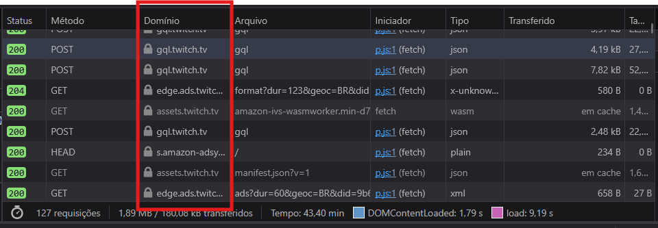
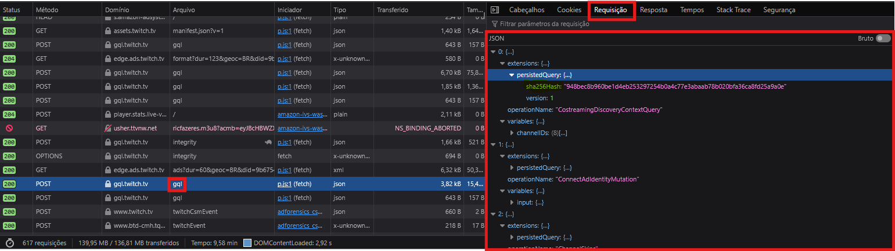
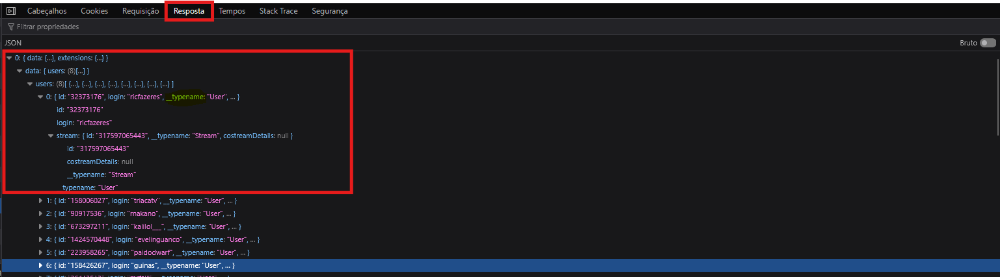
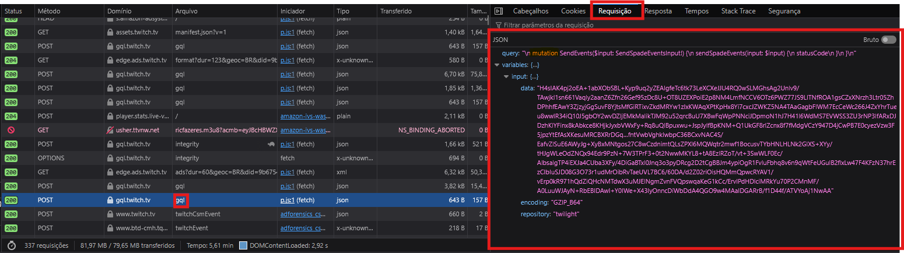
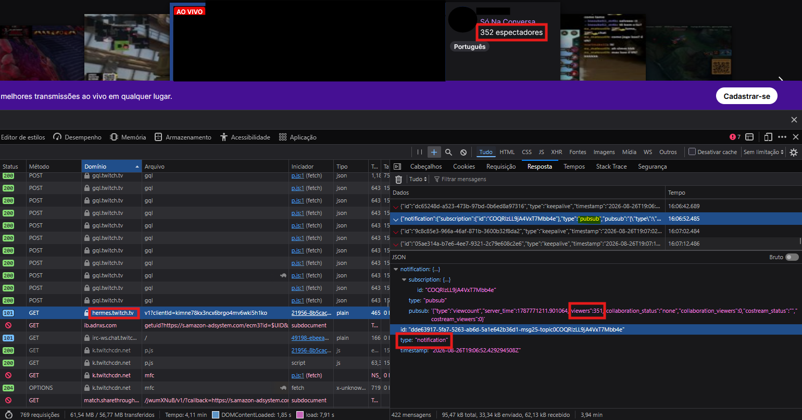
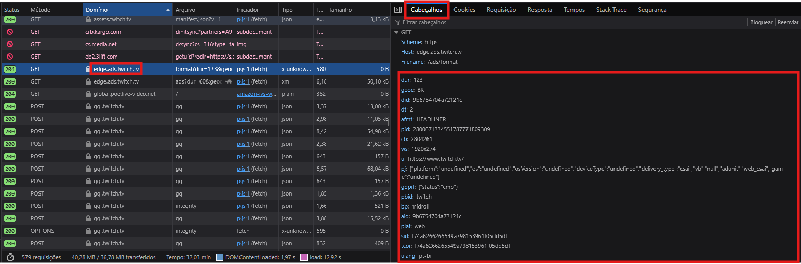
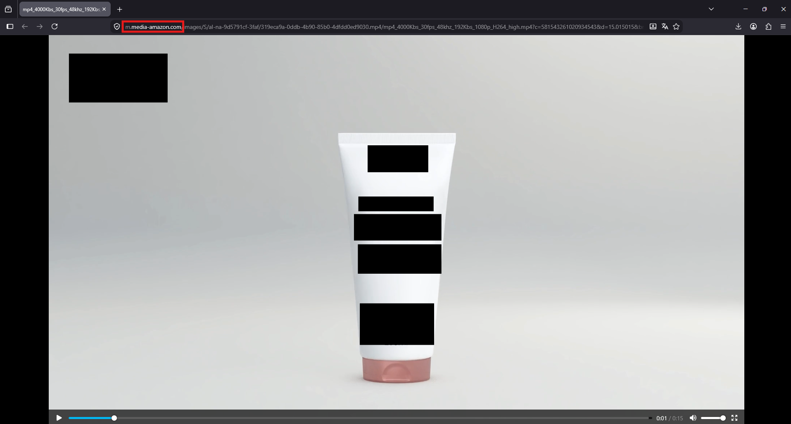

# FOCO_02 · Engenharia Reversa — SubEquipe_03

> **Entrega mínima do foco** (junto com o [BPMN](4.BPMN.md)): um modelo, na notação BPMN, do fluxo do software encontrado com a Engenharia Reversa. Esta página documenta **o processo** que levou ao modelo.
> **Status**: ✅ Concluído · **Responsáveis**: [Eduardo Lôbo Moreira](https://github.com/EduLoboM), [Hugo Freitas Silva](https://github.com/HugoFreitass) e [Philipe Amâncio Reis Caetano](https://github.com/Phill-Chill)

## 1. Metodologia de Foco

Em uma reunião realizada via Discord, a Subequipe 3 reuniu-se para conduzir o processo de engenharia reversa. Utilizamos a técnica de **análise de fluxo de dados**[1] por meio das ferramentas de desenvolvedor dos navegadores (Firefox e Chrome). A partir dessa inspeção, levantamos uma modelagem parcial do banco de dados da plataforma, além de mapear comportamentos de transição de dados.

* **Planejamento:** Inicialmente, mapeamos os tipos de requisições que trafegavam na rede. Identificamos o download de _chunks_ (blocos de dados das transmissões de vídeo via HTTP Live Stream - HLS), requisições de _assets_ estáticos (imagens e ícones para o front-end) e requisições de banco de dados centralizadas na API GraphQL. Além disso, identificamos por meio da infraestrutura do Cloudflare a presença de rotas abertas (como `/spades`, `/assets` e `/hermes`), descobertas que foram relatadas e documentadas na seção de Segurança.

* **Desenvolvimento:** Ao isolar o tráfego da API GraphQL, verificamos que ela retorna os dados sob demanda, evitando o envio de tráfego desnecessário (_over-fetching_), o que justifica a modelagem parcial do banco. Na resposta dessa API, identificamos que a chave oculta `__typename` atua como uma metatag [2] — especificando e diferenciando o tipo de objeto em meio aos dados retornados pela API —, revelando a entidade lógica, enquanto as chaves simples correspondem aos atributos da tabela. Também mapeamos que o corpo original dessas requisições fica oculto no tráfego de rede por meio de um hash SHA-256, evidenciando o uso da técnica de _Persisted Queries_ (onde o cliente envia um código identificador ao invés da consulta completa em texto).

* **Formalização:** Nesta fase, utilizamos a assistência de uma Inteligência Artificial para sanitizar, decodificar e reestruturar os payloads capturados, visto que algumas requisições eram significativamente extensas. Isso facilitou a extração dos dados brutos para a construção da modelagem final do banco.

---

### 1.2. Comportamentos de Transição de Dados

Durante a análise, identificamos os seguintes padrões de comunicação entre o cliente e os servidores:

* **Agrupamento de Requisições (Query Batching):** O front-end empacota múltiplas requisições independentes (Consentimento, Anúncios, Navegação) em um único array JSON, reduzindo a sobrecarga de conexões de rede.
* **Mascaramento e Economia com Hashes:** Por meio de _Persisted Queries_, consultas GraphQL extensas não trafegam em texto puro. O cliente envia um código `sha256Hash` que o servidor reconhece e executa.
* **Atualização Silenciosa (Polling):** A interface dispara requisições assíncronas periódicas em segundo plano para atualizar métricas altamente dinâmicas, como a contagem de espectadores (`viewersCount`), sem necessidade de recarregar a página.
* **Fluxo de Telemetria:** A arquitetura injeta identificadores de rastreamento (ex: `trackingID`) e utiliza mutações (ex: `sendSpadeEvents`) para despachar silenciosamente os eventos de interação do usuário para rotas de análise (`/spades`).
* **Separação de Mídias:** A plataforma isola o tráfego de texto/dados (GraphQL) do tráfego de mídia, processando o vídeo em _chunks_ e requisitando imagens via CDNs independentes.

---

### 1.3. Sincronização em Tempo Real (WebSockets / PubSub)

Além das requisições HTTP baseadas na API GraphQL, a inspeção de rede revelou o uso de conexões contínuas via protocolo WebSocket, implementando o padrão arquitetural _Publish-Subscribe_ (PubSub).

A análise dos _payloads_ revelou o ciclo de vida completo dessa comunicação bidirecional em três etapas (identificadas pela equipe):

* **Assinatura (`subscribe`):** Ao acessar uma transmissão, o cliente envia um pacote informando ao servidor em quais tópicos deseja se conectar (ex: `content-policy-properties.[CHANNEL_ID]`), gerando um ID de requisição único.
* **Confirmação (`subscribeResponse`):** Imediatamente após o pedido, o servidor retorna um evento de Acknowledgment (ACK). O _payload_ valida a conexão com um `"result": "ok"` e utiliza o campo `parentId` para rastrear e espelhar o ID do pedido original do cliente, garantindo a integridade do aperto de mão (_handshake_).
* **Notificações Assíncronas (`notification`):** Uma vez estabelecido e confirmado o canal, o servidor "empurra" (_push_) os dados ao vivo. Os dados capturados mostram atualizações de estado em milissegundos, como a flutuação imediata da chave `"viewers"` (variando de 1083 para 1108 espectadores) e os _status_ de colaboração (`costream_status`).

Essa arquitetura elimina a necessidade de _polling_ agressivo na página de exibição principal, poupando recursos de servidor e garantindo que métricas críticas (como o número de espectadores e mensagens do chat) sejam atualizadas em tempo real.

### 1.4. Modelagem de Banco de Dados

Com base nas metatags (`__typename`) e chaves estrangeiras inferidas dos payloads GraphQL, estabelecemos o seguinte modelo lógico parcial:

#### 1.4.1. Núcleo: Usuários, Jogos e Transmissões

* **`users`**: `id` (PK), `login`, `display_name`, `profile_image_url`, `primary_color_hex`, `description`
* **`user_roles`**: `user_id` (PK, FK), `is_partner`, `is_participating_dj`
* **`broadcast_settings`**: `id` (PK, FK), `title`
* **`games`**: `id` (PK), `name`, `display_name`, `category_slug`, `box_art_url`, `original_release_date`, `viewers_count`
* **`streams`**: `id` (PK), `broadcaster_id` (FK), `game_id` (FK), `viewers_count`, `created_at`, `type`, `is_encrypted`, `has_hype_train`, `preview_image_url`, `height`, `width`

#### 1.4.2. Taxonomia: Tags e Classificação

* **`tags`** (Pré-definidas): `id` (PK), `tag_name`, `localized_name`, `is_language_tag`
* **`freeform_tags`**: `id` (PK), `name`
* **`content_classification_labels`**: `id` (PK)

> **Tabelas Intermediárias (Pivot):** `stream_tags`, `stream_freeform_tags`, `stream_content_classifications`

#### 1.4.3. Monetização e Colaboração

* **`subscription_products`**: `id` (PK), `user_id` (FK), `tier`
* **`emote_sets`**: `id` (PK), `subscription_product_id` (FK)
* **`emotes`**: `id` (PK), `set_id` (FK), `token`, `asset_type`
* **`guest_star_sessions`**: `id` (PK), `host_id` (FK)
* **`guest_star_slots`**: `id` (PK), `session_id` (FK), `user_id` (FK), `slot_id`

    > **OBS.:** Chaves primárias e estrangeiras definidas com auxílio da IA.

---

### 1.6. Ecossistema de Injeção e Auditoria de Publicidade (Ad Targeting)

A análise do tráfego revelou que o sistema de inserção de anúncios da plataforma não opera de forma isolada, mas através de uma engrenagem composta por três microsserviços integrados ao ecossistema da empresa controladora (Amazon). O ciclo de vida publicitário mapeado divide-se nas seguintes etapas:

1. **Negociação e Segmentação (`edge.ads.twitch.tv`):** A tomada de decisão inicia-se com uma requisição HTTP GET onde o cliente envia parâmetros da sessão via _Query String_. Foram identificadas variáveis de geolocalização (`geoc=BR`), idioma (`ulang=pt-br`) e dimensões da janela de renderização (`ws=1920x274`). O _payload_ indica o uso do modelo **CSAI** (_Client-Side Ad Insertion_), mostrando que o front-end solicita ativamente a publicidade mais adequada ao perfil momentâneo do usuário.
2. **Entrega de Ativos Visuais (`m.media-amazon.com`):** Uma vez decidido qual conteúdo será exibido, os recursos de mídia pesados (como as imagens de banners no formato `HEADLINER`) não trafegam pelos servidores dedicados a transmissões ao vivo. Eles são requisitados diretamente da CDN global de mídia corporativa da Amazon, otimizando a entrega estática e o gerenciamento de campanhas.
3. **Auditoria e Sincronização (`s.amazon-adsystem.com`):** Para fechar o ciclo, o front-end realiza chamadas em segundo plano para o núcleo de publicidade da Amazon. Foi constatado o uso intencional do método HTTP **`HEAD`**, que solicita apenas os cabeçalhos de resposta (consumindo tráfego mínimo na ordem de 234 Bytes). Esse método atua silenciosamente como um mecanismo de _Cookie Syncing_ — cruzando o perfil do espectador com o ecossistema de _e-commerce_ da Amazon para _retargeting_ — além de servir como um detector nativo de bloqueadores de anúncio (_AdBlockers_).

---

### 1.5. Mapeamento de Domínios e Infraestrutura

Para consolidar as descobertas sobre a segregação de responsabilidades e o roteamento do tráfego, a equipe mapeou os principais domínios interceptados durante a exploração. A tabela a seguir sintetiza os microsserviços identificados e suas respectivas funções na arquitetura de rede da aplicação analisada:

**Tabela 1: Mapeamento de Domínios e Serviços da Arquitetura**

| Domínio | Categoria / Função Principal | Método(s) Observado(s) |
| :--- | :--- | :--- |
| **`gql.twitch.tv`** | API de Dados e Lógica de Negócio (GraphQL) | `POST`, `OPTIONS` |
| **`assets.twitch.tv`** | CDN de Aplicação (Scripts JS, Wasm, Manifestos) | `GET` |
| **`static-cdn.jtvnw.net`** | CDN de Mídia (Imagens de Perfil, Emotes, Thumbnails) | `GET` |
| **`k.twitchcdn.net`** | CDN Secundária / Estática | `GET`, `OPTIONS` |
| **`spade.twitch.tv`** | Telemetria de Interação do Usuário | `POST` |
| **`hermes.twitch.tv`** | Pub/Sub WebSocket | `POST` |
| **`player.stats.live-video.net`** | Telemetria e Monitoramento de Qualidade do Player | `POST` |
| **`edge.ads.twitch.tv`** | Gerenciamento e Injeção de Publicidade | `GET` |
| **`s.amazon-adsystem.com`** | Infraestrutura de Anúncios da Amazon | `HEAD` |
| **`usher.ttvnw.net`** | Gateway de Mídia (Requisição Inicial das Playlists HLS) | `GET` |
| **`sae13.playlist...`** | Entrega das Playlists de Transmissão (Arquivos `.m3u8`) | `GET` |
| **`016b8a.rufio.hl...`** | Servidores de Borda de Vídeo (Entrega dos _chunks_ contínuos) | `POST` |

<!--
PREENCHER: como a subequipe conduziu a engenharia reversa — sessões de exploração,
divisão de telas/fluxos entre membros, forma de registro dos achados.
-->
_A preencher._

## 2. Fundamentação Teórica

 A seguir apresentaremos como formamos nossa fundação teórica para desenvolver esse etapa do projeto.

### 2.1. Engenharia Reversa de Software e de Dados

O processo analítico deste trabalho fundamenta-se nos conceitos de Engenharia Reversa, baseando-se nos materiais de estudo da Universidade Federal Fluminense (UFF). A engenharia reversa de software é definida como o processo de analisar um sistema computacional para identificar seus componentes e suas inter-relações, visando criar representações do sistema em um nível mais alto de abstração do que o original.

Dentro desse campo, o projeto aplica a **Engenharia Reversa de Dados**. Segundo a teoria, esse braço da engenharia busca recuperar o modelo conceitual ou lógico de um banco de dados a partir de sua implementação física ou da observação de seu comportamento em tempo de execução. Devido à indisponibilidade de acesso ao código-fonte ou ao SGBD da plataforma (modelo de observação de Caixa-Preta), a abstração do banco foi fundamentada no mapeamento sistemático do fluxo de entradas e saídas da aplicação web.

### 2.2. A Arquitetura GraphQL

Para embasar a interpretação do tráfego de rede, adotou-se a documentação oficial do **GraphQL**. A documentação teórica estabelece o conceito de requisições "sob demanda", que mitigam problemas clássicos de _over-fetching_ (receber mais dados do que o necessário) e _under-fetching_ (receber dados insuficientes), além da estrura de requisições e respostas.

<!--
PREENCHER: definir Engenharia Reversa e o nível de abstração aplicado
(ex.: caixa-preta / recuperação de processo de negócio a partir da interface).
Embasar na literatura (ex.: Chikofsky & Cross, Pressman, Sommerville) e referenciar em 6.Referencias.md.
-->
_A preencher._

## 3. Contexto da Aplicação Analisada

> ⚠️ **Não usar o nome real da fonte de inspiração** (diretriz). Descrever a aplicação por características.

| Item | Valor |
| -- | -- |
| Descrição da aplicação de referência | Transmissão de vídeos síncronos ou assíncronos |
| Plataforma analisada (site / desktop / mobile) | Site |
| Versão / data da análise | 24/08/2026 |
| Perfil de usuário utilizado na exploração | Usuário |
| Fluxo selecionado para modelagem | Transmissão de vídeo e chat |
| Por que este fluxo foi escolhido | É o fluxo fundamental da aplicação |

## 4. Processo Aplicado — Etapas

| # | Etapa | O que foi feito | Ferramenta | Responsável | Evidência |
| -- | -- | -- | -- | -- | -- |
| 1 | Planejamento da exploração | Definição do escopo (Player/Home) e divisão de monitoramento de tráfego (HLS vs API). | Discord | Eduardo, Hugo, Philipe | Commits |
| 2 | Coleta (navegação e captura de telas) | Interceptação de pacotes de dados, telemetria (Spade), CDN corporativa e conexões PubSub. | DevTools (Network) | Eduardo, Philipe | Imagens na Seção 5 |
| 3 | Identificação de atores e eventos | Mapeamento das consultas, mutações GraphQL, *Ad Targeting* (CSAI) e rotas de entrega via CDN. | IA, DevTools | Hugo, Philipe | JSONs decodificados |
| 4 | Identificação de atividades e decisões | Análise da lógica de *Query Batching*, auditoria de anúncios (HEAD) e flutuações no WebSocket. | DevTools | Eduardo, Hugo | Notificações de payload |
| 5 | Consolidação do fluxo | Estruturação das Tabelas e mapeamento das chaves estrangeiras baseadas na metatag `__typename`. | Markdown | Eduardo, Hugo, Philipe | Modelo Lógico (Seção 1.4) |
| 6 | Validação interna do fluxo | Revisão da modelagem e unificação da documentação final de arquitetura e infraestrutura. | Git / GitHub | Eduardo, Hugo, Philipe | Commits / Pull Request |

## 5. Evidências Coletadas

As capturas de tela a seguir documentam o processo de inspeção de rede (caixa-preta) e fundamentam as análises arquiteturais e lógicas apresentadas ao longo deste documento.

_Figura 1 — Mapeamento do tráfego de rede e roteamento de domínios._
> **Análise:** A captura evidencia a segregação de responsabilidades (microsserviços) na arquitetura da plataforma. Observa-se a divisão clara entre o domínio central de dados (`gql.twitch.tv`), a rede de entrega de arquivos estáticos e de cache (`assets.twitch.tv` atuando como CDN) e os pontos de extremidade dedicados à telemetria.

_Figura 2 — Inspeção de leitura de dados e otimização de rede na API GraphQL._
> **Análise:** Detalhamento do envio de requisições do tipo _Query_. A imagem comprova a utilização da técnica de _Query Batching_, onde o front-end empacota múltiplas consultas em um único payload HTTP POST. Além disso, evidencia-se o uso de _Persisted Queries_: o cliente não trafega a consulta em texto, mas envia um identificador criptográfico (`sha256Hash`) que aponta para a _query_ armazenada no servidor. Isso otimiza o consumo de banda e oculta a lógica estrutural da plataforma no tráfego de rede.

_Figura 3 — Resposta do servidor revelando a estrutura lógica de dados._
> **Análise:** Payload de resposta do servidor destacando a presença da metatag `__typename`. Esta característica estrutural do GraphQL foi a peça-chave para a modelagem parcial do banco de dados, pois expõe explicitamente a tipagem dos objetos aninhados (como `User` e `Stream`) e suas chaves primárias e estrangeiras.

_Figura 4 — Disparo de eventos de telemetria através de operações de mutação._
> **Análise:** Ilustração de operações de escrita (_Mutations_), especificamente o disparo de eventos de rastreamento comportamental via `SendSpadeEvents`. A evidência demonstra que a plataforma prioriza o desempenho ao enviar pacotes otimizados, aguardando do servidor respostas enxutas focadas em códigos de status de confirmação (ex: HTTP 204).

_Figura 5 — Sincronização em tempo real via protocolo WebSocket (PubSub)._
> **Análise:** Esta evidência ilustra o recebimento de um evento do tipo `notification` através de uma conexão contínua (WebSocket). A captura comprova a utilização do padrão arquitetural _Publish-Subscribe_, onde o servidor envia (_push_) atualizações dinâmicas diretamente para o cliente — como a flutuação do contador de espectadores (`viewers`) capturada no _payload_ — com latência na casa dos milissegundos. Essa técnica permite que o front-end mantenha os dados da transmissão ao vivo atualizados sem a necessidade de gerar tráfego HTTP adicional (_polling_).

_Figura 6 — Requisição de segmentação e injeção de publicidade (Ad Targeting)._
> **Análise:** A captura demonstra a requisição HTTP GET para o domínio `edge.ads.twitch.tv`, responsável pelo sistema de anúncios da plataforma. A _Query String_ revela o envio detalhado de parâmetros pelo front-end, incluindo geolocalização (`geoc=BR`), idioma (`ulang=pt-br`) e dimensões da janela (`ws=1920x274`). O _payload_ confirma o uso da técnica CSAI (_Client-Side Ad Insertion_), comprovando que o cliente web atua ativamente na busca e renderização direcionada de banners e propagandas com base na sessão do usuário.

_Figura 8 — Entrega de ativos multimídia de publicidade via CDN corporativa._
> **Análise:** A captura isola um ativo publicitário em formato de vídeo (`.mp4`, codificação H.264, 1080p) servido diretamente pelo domínio `m.media-amazon.com`. Esta evidência visual corrobora o mapeamento da arquitetura de injeção de anúncios (CSAI): a entrega de mídias pesadas associadas a campanhas publicitárias corporativas não consome a banda dos servidores HLS dedicados às transmissões ao vivo. O armazenamento e o roteamento desses ativos são terceirizados para a infraestrutura global da Amazon, garantindo isolamento de tráfego e alta disponibilidade.

## 6. Achados

### 6.1. Atores Identificados

| Ator | Papel no fluxo | Observação |
| -- | -- | -- |
| **Espectador (Usuário)** | Consome a transmissão de vídeo, interage com o chat e visualiza anúncios. | Ator principal; suas interações geram a telemetria (Spade). |
| **Front-end (Client Web)** | Orquestra as requisições de API, carrega o player de vídeo (*Wasm*) e gerencia o estado da interface. | Age como um intermediário ativo (ex: *Client-Side Ad Insertion* - CSAI). |
| **API Central (GraphQL)** | Fornece os metadados da transmissão, perfis de usuários e recomendações. | Centraliza as requisições usando *Query Batching* e *Persisted Queries*. |
| **Servidor PubSub (WebSocket)** | Mantém a comunicação assíncrona bidirecional (chat, contador de espectadores). | Elimina a necessidade de requisições HTTP contínuas (*polling* agressivo). |
| **Ecossistema de Ads (Amazon)** | Negocia, entrega e audita a renderização de campanhas publicitárias. | Segmenta conteúdo com base em idioma, localização e tamanho de tela. |

### 6.2. Atividades e Decisões do Fluxo

| # | Atividade / decisão | Ator | Gatilho | Resultado |
| -- | -- | -- | -- | -- |
| A01 | Carregar interface base e scripts estáticos | Front-end | Acesso à URL (Navegação) | Downloads de `.js` e `.wasm` via CDN (`assets`). |
| A02 | Buscar metadados (Canal, Jogo, Tags) | Front-end | Carregamento inicial concluído | Requisição `POST` em lote enviada para API GraphQL. |
| A03 | Estabelecer sincronização em tempo real | Front-end | Retorno positivo da API (A02) | Envio de `subscribe` e confirmação `ACK` via WebSocket. |
| A04 | Avaliar injeção de anúncio (Decisão) | Ecossistema Ads | Evento de início de *stream* / *Mid-roll* | Requisição de segmentação disparada para `edge.ads`. |
| A05 | Registrar engajamento e métricas de qualidade | Front-end | Interação do espectador com o player | Disparo silencioso de pacotes para telemetria (Spade/Hermes). |

### 6.3. Regras de Negócio Inferidas

| # | Regra inferida | Evidência que sustenta | Grau de confiança |
| -- | -- | -- | -- |
| RN01 | Consultas GraphQL são protegidas/ocultadas no tráfego de rede da aplicação. | Uso de chaves `sha256Hash` substituindo as *queries* em texto no corpo do `POST`. | Alto |
| RN02 | A renderização de banners e anúncios é montada no dispositivo do cliente, e não no servidor de vídeo (SSAI). | *Payloads* evidenciando a flag de entrega `delivery_type: "csai"` e consumo de imagens via `m.media-amazon.com`. | Alto |
| RN03 | A plataforma detecta *AdBlockers* por meio de ping na rede. | Uso sistemático do método HTTP `HEAD` direcionado ao núcleo de anúncios (`s.amazon-adsystem.com`). | Médio |

## 7. Rastreabilidade & Elos com Outros Artefatos

| Achado | Elo com | Onde (link) | Natureza do elo |
| -- | -- | -- | -- |
| **Mapeamento de Atores e Atividades (Seções 6.1 e 6.2)** | Modelo BPMN do Fluxo |  [4.BPMN.md](Base/Relatorios/1.1.3.SubEquipe_03/4.BPMN.md) | Os atores e o sequenciamento de requisições mapeados convertem-se diretamente nas *Pools*, *Lanes* e tarefas (*tasks*) do diagrama visual do processo. |
| **Arquitetura de Consultas (Seções 1.2 e 1.4)** | Documentação Oficial do GraphQL | [graphql.org/learn/queries](https://graphql.org/learn/queries/) | A documentação técnica externa fundamenta o comportamento de *Query Batching* e o uso da metatag `__typename` que validou a inferência da modelagem de banco de dados. |
| **Método de Inspeção Caixa-Preta (Seção 2.1)** | Material de Apoio Acadêmico (UFF) | [Referência 1](#10-referências) | A técnica de isolar o fluxo de dados via interface (DevTools) sem acesso ao código-fonte é fundamentada na literatura de Engenharia Reversa de Dados. |

## 8. Senso Crítico

A aplicação da engenharia reversa sob o paradigma de "Caixa-Preta" (exclusivamente via inspeção de tráfego de rede no lado do cliente) apresenta limitações intrínsecas ao processo de descoberta. Não foi possível mapear com precisão o comportamento do *back-end*, como a orquestração interna de microsserviços, o modelo físico real do banco de dados (por exemplo, o uso de bancos NoSQL em contraponto a relacionais para dados em tempo real) e as estratégias definitivas de *caching* nos servidores de borda. 

Além disso, regras complexas de moderação (como filtros de *chat* aplicados pelo servidor antes do envio via PubSub) e algoritmos de recomendação permanecem ocultos, sendo apenas tangenciados pela observação dos *payloads* de telemetria. Essas incertezas trazem riscos de simplificação excessiva para os demais artefatos estruturais do projeto, exigindo que o modelo BPMN e a modelagem lógica de dados sejam tratados estritamente como representações parciais do ecossistema estudado.

## 9. Participantes & Comprobatórios

| Membro | Contribuição | Comprobatório (commit/PR) |
| -- | -- | -- |
| **Eduardo Lôbo Moreira** | Mapeamento de CDN, análise de *payloads* e planejamento de inspeção HLS. | _(Adicionar hash/link do PR)_ |
| **Hugo Freitas Silva** | Estruturação de dados GraphQL, inferência de chaves e análise de Ads (CSAI). | _(Adicionar hash/link do PR)_ |
| **Philipe Amâncio Reis Caetano** | Captura de evidências (rede/PubSub), consolidação arquitetural e redação da modelagem. | _(Adicionar hash/link do PR)_ |

## 10. Referências

1. JUNIOR, Antonio Jorge Sapage da Canhota; SANTOS MOUTINHO, Diego Alves de Souza Diogo dos; LOHNEFINK, Felipe Paixão. Engenharia Reversa. Niterói: UFF - Universidade Federal Fluminense, 2005.
2. GRAPHQL. **Queries and Mutations**. GraphQL Documentation, 2026. Disponível em: <https://graphql.org/learn/queries/>. Acesso em: 26 ago. 2026.

## Histórico de Versões

| Versão | Data | Descrição | Autor(es) | Revisor(es) |
| -- | -- | -- | -- | -- |
| 1.0 | 21/08/2026 | Criação da página | Lucas Andrade Zanetti | Heitor Macedo Ricardo |
| 1.1 | 27/08/2026 | Adição do fluxo mapeado, modelagem de BD, tabelas de domínio e evidências visuais (SubEquipe 3) | Eduardo L., Hugo F., Philipe A. | _(A preencher)_ |