# FOCO_02 - Modelagem BPMN - SubEquipe_03

> **Entrega mínima do foco**: um modelo, na notação BPMN, do fluxo do software encontrado com a [Engenharia Reversa](3.EngenhariaReversa.md).
> **Status**: em desenvolvimento - **Responsáveis**: SubEquipe_03

## 1. Metodologia do Foco

Construímos a modelagem BPMN a partir dos achados da [Engenharia Reversa](3.EngenhariaReversa.md) sobre uma plataforma de transmissão de vídeo ao vivo com chat, monetização, moderação, VOD e colaboração. Além disso, também usamos documentações públicas para apoiar nossa modelagem.

Seguimos o seguinte processo:

1. levantamos os comportamentos observados e as fontes públicas sobre GraphQL, HLS, WebSocket/PubSub, Spade, anúncios, ingestão e domínios de infraestrutura;
2. com as evidências coletadas, consolidamos nesta página o que possui confirmação pública, evidência de engenharia reversa, confirmação parcial ou apenas hipótese arquitetural;
3. elaboramos o diagrama BPMN, organizando o fluxo em piscinas de responsabilidade, para não representar todo o sistema como uma sequência única do usuário;
4. mantivemos caminhos alternativos e decisões relevantes, como token inválido, stream key rejeitada, mensagem retida pelo AutoMod, pagamento recusado, VOD desativado e entrada negada em sessão colaborativa;
5. registramos ressalvas de rastreabilidade para elementos cujo detalhe interno não é publicamente comprovado.

Assim, entendemos que o modelo não deve ser lido como diagrama oficial da plataforma analisada, mas como uma representação arquitetural que construímos a partir de observação de caixa-preta, documentação pública e projetos públicos de engenharia reversa.

## 2. Fundamentação Teórica - BPMN

BPMN (*Business Process Model and Notation*) é uma notação gráfica para representar processos, eventos, decisões, atividades e trocas de mensagens entre participantes. Nesta entrega, usamos essa notação para transformar os achados técnicos da engenharia reversa em um fluxo compreensível de processo, evidenciando como cliente, backend, CDN, ingestão, chat e serviços auxiliares colaboram para manter uma transmissão ao vivo.

Os principais recursos que utilizamos foram:

| Recurso BPMN | Uso no modelo | Justificativa |
| -- | -- | -- |
| Pools | Cliente Web, Backend GraphQL, Camada de Borda, Ingestão/Vídeo, Chat/AutoMod, Spade, Autenticação, Banco, Social, Monetização, VOD, Guest Star e Segurança de Vídeo | Usamos pools para separar responsabilidades entre subsistemas independentes e mostrar que o fluxo depende de serviços distribuídos. |
| Eventos de início | Abertura da transmissão pelo espectador, início de live pelo streamer, login, ação social, compra, VOD, Guest Star e feed de vídeo | Usamos eventos de início para delimitar gatilhos distintos que podem ocorrer de forma independente dentro do ecossistema. |
| Eventos de fim | Reprodução ativa, ingestão abortada, mídia pronta para CDN, sessão autenticada, pagamento rejeitado, VOD disponível, live encerrada por violação | Indicamos os estados finais normais e alternativos que identificamos no fluxo. |
| Tarefas | Solicitar token GraphQL, obter playlist `.m3u8`, transcodificar, conectar chat, reter mensagem, emitir tokens, registrar dados | Representamos as atividades técnicas ou de negócio que inferimos no fluxo. |
| Gateways exclusivos | Token autorizado, chave de stream válida, música protegida, risco do AutoMod, 2FA ativa, usuário bloqueado, pagamento aprovado, VOD ativo, convidado autorizado, severidade visual | Modelamos decisões em que apenas um caminho é seguido. |
| Fluxos de sequência | Encadeamento interno de cada pool | Mostramos a ordem lógica das atividades dentro do mesmo participante. |
| Fluxos de mensagem | `POST /gql`, retorno de token, `GET .m3u8`, chunks HLS, WebSocket IRC, telemetria, persistência no banco | Representamos a comunicação entre pools e evidenciamos fronteiras de serviço. |
| Objetos/domínios de dados nos nomes das tarefas | `users`, `streams`, `tags`, `emotes`, `vods`, `clips`, `held_messages` | Relacionamos a modelagem de processo com o modelo lógico parcial que inferimos na engenharia reversa. |

## 3. Modelo BPMN

| Item | Valor |
| -- | -- |
| Fluxo modelado | Arquitetura de transmissão ao vivo: acesso do espectador, autorização de playback, distribuição HLS, chat, telemetria, ingestão do streamer, moderação, autenticação, persistência, monetização, VOD e colaboração |
| Ferramenta utilizada | bpmn-js / demo.bpmn.io |
| Arquivo-fonte editável (`.bpmn`) | [subequipe_03_bpmn.bpmn](../../../assets/bpmn/subequipe_03_bpmn.bpmn) |
| Versão do modelo | 1.0 |

### 3.1 Visão geral do modelo

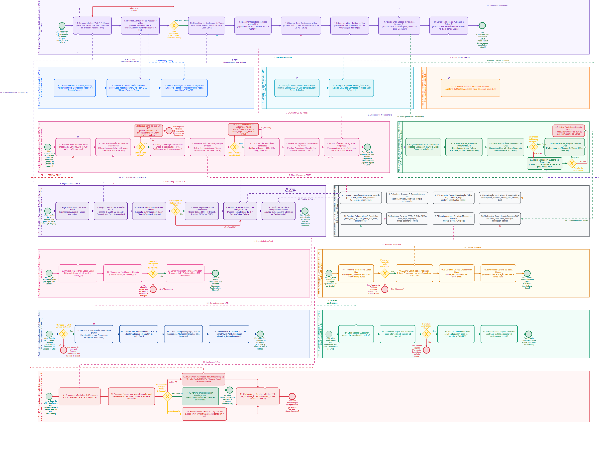

*Figura 1 - Visão geral do modelo BPMN da arquitetura de transmissão de vídeo ao vivo, chat e serviços auxiliares. Autores: SubEquipe_03, 2026.*

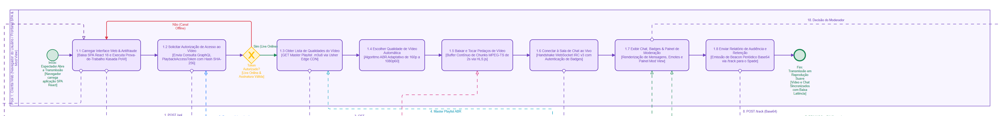

*Figura 2 - Pool 1: Cliente Web (Navegador do Usuário, Frontend SPA e Mod View). Autores: SubEquipe_03, 2026.*

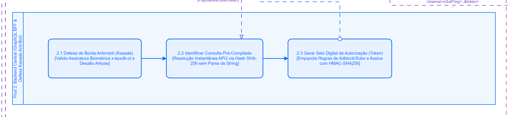

*Figura 3 - Pool 2: Backend Central (GraphQL BFF e defesa Kasada Anti-Bot). Autores: SubEquipe_03, 2026.*

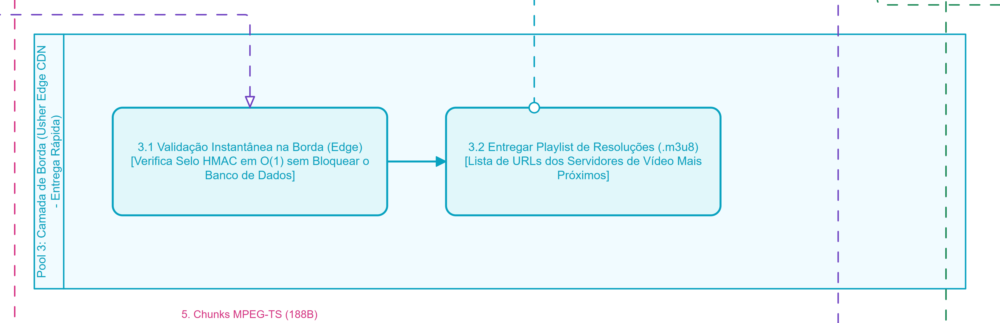

*Figura 4 - Pool 3: Camada de Borda (Usher Edge CDN e entrega de vídeo). Autores: SubEquipe_03, 2026.*

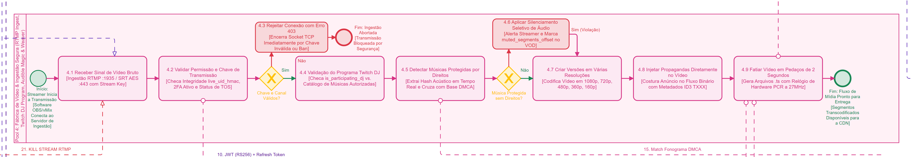

*Figura 5 - Pool 4: Fábrica de Vídeo e Ingestão Segura (RTMP Ingest, Twitch DJ Program, Audible Magic e Weaver). Autores: SubEquipe_03, 2026.*

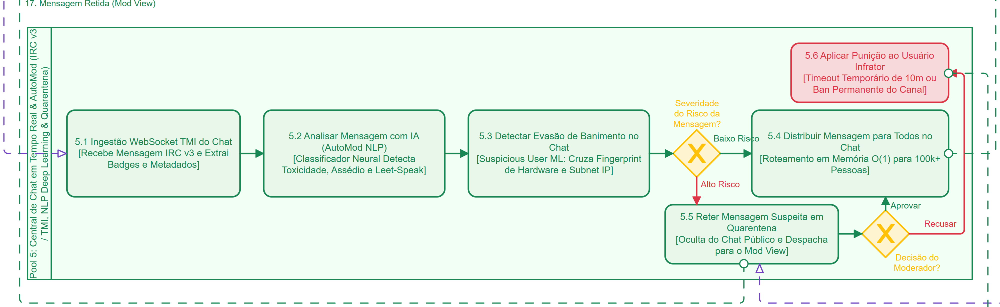

*Figura 6 - Pool 5: Central de Chat em Tempo Real e AutoMod (IRC v3, TMI e quarentena). Autores: SubEquipe_03, 2026.*

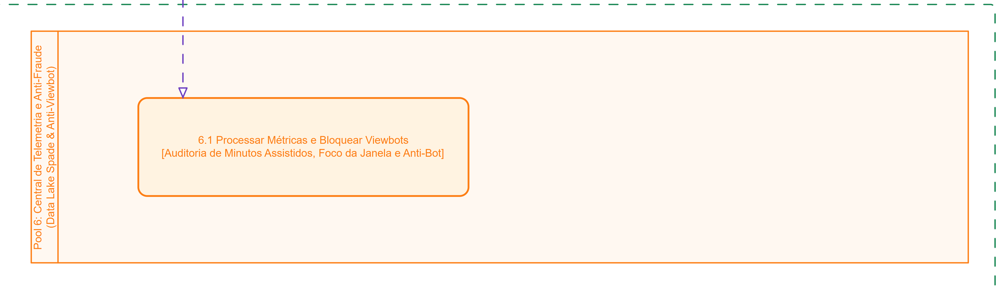

*Figura 7 - Pool 6: Central de Telemetria e Anti-Fraude (Data Lake Spade e Anti-Viewbot). Autores: SubEquipe_03, 2026.*

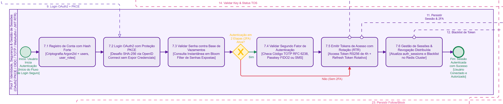

*Figura 8 - Pool 7: Identidade, Segurança e Gestão de Sessões (OAuth2, OIDC, segundo fator e tokens). Autores: SubEquipe_03, 2026.*

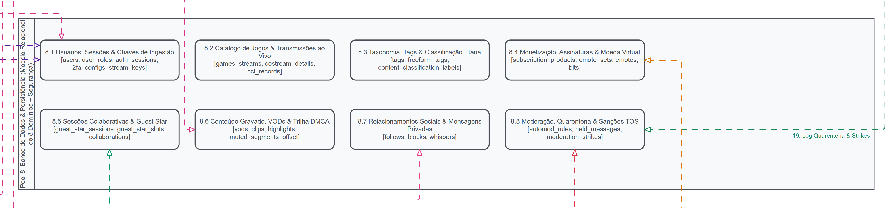

*Figura 9 - Pool 8: Banco de Dados e Persistência (modelo relacional de oito domínios). Autores: SubEquipe_03, 2026.*

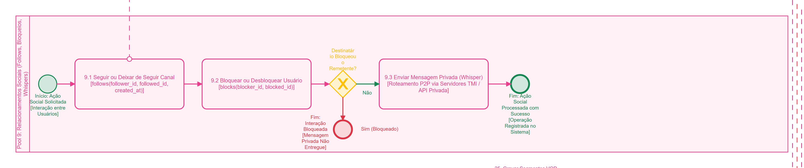

*Figura 10 - Pool 9: Relacionamentos Sociais (follows, bloqueios e whispers). Autores: SubEquipe_03, 2026.*

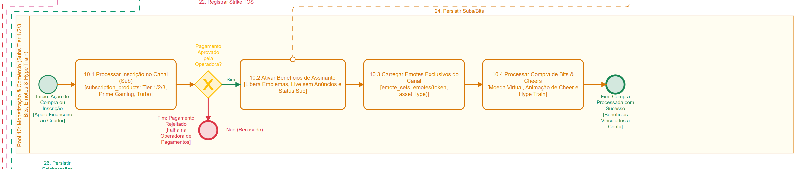

*Figura 11 - Pool 10: Monetização e Comércio (subscriptions, Bits, emotes e Hype Train). Autores: SubEquipe_03, 2026.*

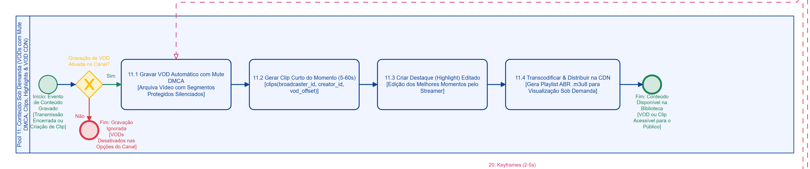

*Figura 12 - Pool 11: Conteúdo Sob Demanda (VODs, mute DMCA, clips, highlights e VOD CDN). Autores: SubEquipe_03, 2026.*

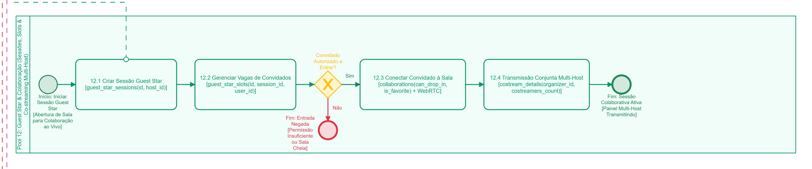

*Figura 13 - Pool 12: Guest Star e Colaboração (sessões, slots e co-streaming multi-host). Autores: SubEquipe_03, 2026.*

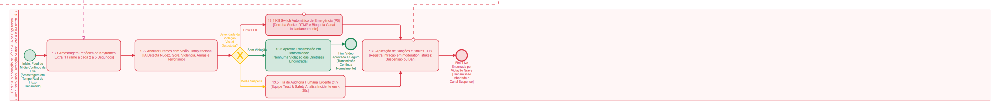

*Figura 14 - Pool 13: Moderação de Vídeo e IA de Segurança (computer vision, detecção de conteúdo sensível e kill-switch). Autores: SubEquipe_03, 2026.*

## 4. Elementos da Notação Utilizados

| Elemento BPMN | Onde aparece no modelo | Por que foi usado |
| -- | -- | -- |
| Pool | 13 pools de subsistemas | Separamos responsabilidades técnicas e evitamos misturar frontend, backend, CDN e serviços internos. |
| Evento de início | `Start_Access_Live`, `Start_Ingest_RTMP`, `Start_Auth`, `Start_Commerce`, `Start_VOD`, `Start_GS` | Representamos gatilhos independentes observados no uso da plataforma. |
| Tarefa | `Task_Req_Token`, `Task_Fetch_Master`, `Task_Download_Segments`, `Task_TMI_Receive`, `Task_Record_VOD` | Descrevemos atividades executadas por cada participante. |
| Gateway exclusivo | `Gateway_Token_Valid`, `GW_StreamKey_Valid`, `GW_AutoMod_Risk`, `GW_Payment`, `GW_Can_Join` | Modelamos bifurcações de fluxo em que há aprovação, rejeição ou tratamento alternativo. |
| Evento de fim | `End_Playback_Active`, `End_Stream_Rejected`, `End_Commerce`, `End_VOD_Disabled`, `End_Stream_Terminated` | Delimitamos resultados finais possíveis do processo. |
| Fluxo de mensagem | `MF_GQL_Req`, `MF_Usher_Req`, `MF_IRC_Handshake`, `MF_Spade_Beacon`, `MF_Commerce_DB` | Mostramos comunicação entre pools por HTTP, WebSocket, CDN e persistência. |
| Fluxo de sequência | `Seq_C1` a `Seq_C9`, `Seq_W1` a `Seq_W8`, sequências de chat, auth, commerce, VOD e Guest Star | Indicamos a progressão interna de cada processo. |
| Caminho alternativo | `Nao (Canal Offline)`, `Nao`, `Pagamento Rejeitado`, `Entrada Negada` | Explicitamos exceções e falhas de negócio/infraestrutura. |

## 5. Leitura do Modelo

No fluxo principal que modelamos, o processo inicia quando o espectador abre uma transmissão no navegador. Representamos o cliente carregando a interface web, solicitando autorização de acesso ao vídeo por GraphQL e recebendo os dados necessários para buscar a playlist HLS. Em seguida, indicamos a camada de borda entregando a playlist `.m3u8`, enquanto o cliente escolhe uma qualidade por ABR e passa a baixar segmentos de vídeo. Sustentamos esse caminho com evidências sobre `PlaybackAccessToken`, persisted queries, domínio Usher, HLS, múltiplas qualidades e distribuição por edge/CDN.

Em paralelo ao playback, modelamos a conexão do cliente ao chat em tempo real por WebSocket/IRC. Nesse trecho, o chat processa mensagens, metadados e badges, aplica regras de AutoMod e pode reter mensagens suspeitas para revisão no Mod View. Quando o moderador aprova a mensagem, ela volta ao fluxo de distribuição; quando nega, representamos a aplicação de sanções como timeout ou ban. Consideramos esse trecho bem sustentado pelas APIs e pela documentação oficial de chat e moderação.

Também representamos o fluxo do streamer separadamente, iniciando quando o software de transmissão envia vídeo por RTMP usando uma stream key. Nesse processo, incluímos validação da chave, possível rejeição da ingestão, transcodificação para variantes HLS e empacotamento para distribuição. A ingestão RTMP, a stream key, a transcodificação e as múltiplas variantes HLS possuem confirmação pública. Já detalhes como SRT como caminho padrão, duração exata de segmentos, nome interno "Weaver" e validações criptográficas internas foram mantidos como hipóteses ou simplificações do BPMN.

Incluímos ainda processos auxiliares: telemetria Spade, autenticação OAuth/OIDC/2FA, persistência de domínios lógicos, follows/bloqueios/whispers, monetização por subscriptions/Bits/emotes/Hype Train, VOD/clips/highlights e Guest Star. Esses blocos representam capacidades confirmadas ou parcialmente confirmadas por documentação pública, mas reconhecemos que eles nem sempre comprovam nomes exatos de tabelas, algoritmos internos ou detalhes de implementação.

Por fim, no pool de moderação visual de live, modelamos detecção de violações sensíveis, auditoria humana e possível encerramento da transmissão. As políticas de conteúdo e o uso geral de machine learning em segurança são confirmados, mas não encontramos comprovação pública para o pipeline específico de computer vision com kill-switch automático. Por isso, tratamos esse pool como hipótese arquitetural de risco, não como descoberta consolidada.

## 6. Rastreabilidade & Elos com Outros Artefatos

Concentramos a rastreabilidade das evidências junto aos respectivos prints na Seção 3.2. A tabela abaixo funciona como índice entre as figuras e as evidências descritas integralmente nesta página. O [relatório de Engenharia Reversa](3.EngenhariaReversa.md) permanece como elo entre os dois artefatos do foco, sem substituir as descrições e fontes apresentadas aqui.

| Figura / pool | Evidências relacionadas nesta página | Relação principal |
| -- | -- | -- |
| Figura 1 - Visão geral | 2.1 | Separação entre ingestão, transcodificação, edge, VOD e chat. |
| Figura 2 - Cliente Web | 3.1, 3.2, 3.3, 3.4, 4.1, 6.1 e 7.2 | Autorização de playback, HLS/ABR, anúncios, integridade do cliente e Mod View. |
| Figura 3 - Backend Central | 3.1 e 4.1 | GraphQL, persisted query, autorização e proteção anti-automação. |
| Figura 4 - Camada de Borda | 2.1, 3.2, 3.3, 3.4 e 6.1 | Usher, playlists, variantes, segmentos e entrega publicitária. |
| Figura 5 - Vídeo e Ingestão | 5.1, 5.2, 5.3, 14.5 e 15.1 | RTMP, stream key, transcodificação, áudio protegido e DJ Program. |
| Figura 6 - Chat e AutoMod | 7.1, 8.1 e 8.2 | IRC/WebSocket, mensagens retidas e evasão de banimento. |
| Figura 7 - Spade | 9.1 | Pipeline de telemetria e limites da inferência anti-viewbot. |
| Figura 8 - Identidade e Sessões | 10.1 a 10.5 e 11.1 | OAuth, OIDC, tokens, 2FA e persistência conceitual de sessões. |
| Figura 9 - Banco de Dados | 11.1 | Domínios públicos e schema interno inferido. |
| Figura 10 - Social | 12.1 a 12.3 | Follows, bloqueios e whispers. |
| Figura 11 - Monetização | 13.1 a 13.4 | Subscriptions, benefícios, Bits e Hype Train. |
| Figura 12 - VOD | 3.2 e 14.1 a 14.5 | Gravação, clips, highlights, mute DMCA, Audible Magic e entrega HLS. |
| Figura 13 - Guest Star | 16.1 | Sessões, convites, slots e colaboração. |
| Figura 14 - Segurança de Vídeo | 17.1 e 17.2 | Políticas de conteúdo e hipótese de moderação visual automatizada. |

> Classificamos cada relação como confirmada oficialmente, sustentada por engenharia reversa pública, parcialmente confirmada ou não comprovada. Mantemos os limites ao lado de cada print para não apresentar inferências como fatos.

## 7. Senso Crítico

Nosso BPMN cobre muitos subsistemas em um único diagrama, o que ajuda a visualizar a arquitetura geral, mas também aumenta a densidade e pode dificultar a leitura. Para uma entrega acadêmica, entendemos que a visão completa deve ser acompanhada por recortes menores, principalmente do fluxo essencial: espectador -> GraphQL -> HLS/CDN -> chat -> telemetria.

A principal limitação do nosso trabalho vem do método de engenharia reversa por caixa-preta. Observamos tráfego, domínios, payloads, metatags GraphQL e documentação pública, mas não tivemos acesso ao código-fonte nem aos bancos internos da plataforma. Portanto, tratamos nomes de tabelas, algoritmos criptográficos, estruturas de cache, regras antifraude e pipelines internos como inferências.

Ao relacionarmos cada evidência com sua pool, registramos correções importantes: `PlaybackAccessToken`, HLS, RTMP, chat IRC/WebSocket, AutoMod, Spade, OAuth/OIDC, monetização, VOD e Guest Star são bem sustentados; já React 18 específico, PKCE, WebAuthn, Argon2id, Bloom Filter, Redis Cluster, HMAC interno, segmentos exatamente de 2 segundos, ID3 TXXX, anti-viewbot detalhado e kill-switch automático por visão computacional não possuem evidência pública suficiente.

Por isso, mantivemos o modelo como uma representação de arquitetura plausível e documentada com ressalvas. Consideramos que a fidelidade é maior nos fluxos de playback, ingestão, chat, moderação textual, VOD e monetização; e menor nos blocos de segurança interna, antifraude, detalhes de banco e enforcement automático de vídeo.

## 8. Participantes & Comprobatórios

| Membro | Contribuição | Comprobatório (commit/PR) |
| -- | -- | -- |
| SubEquipe_03 | Consolidação do BPMN, análise das evidências, rastreabilidade e redação da página | A preencher após commit/PR |

## 9. Referências

- OBJECT MANAGEMENT GROUP. **Business Process Model and Notation (BPMN), Version 2.0.2**. Disponível em: <https://www.omg.org/spec/BPMN/2.0.2/>. Acesso em: 26 ago. 2026.
- TWITCH ENGINEERING. **An Introduction and Overview**. Disponível em: <https://blog.twitch.tv/en/2015/12/18/twitch-engineering-an-introduction-and-overview-a23917b71a25/>. Acesso em: 26 ago. 2026.
- STREAMLINK. **Twitch plugin**. Disponível em: <https://github.com/streamlink/streamlink/blob/master/src/streamlink/plugins/twitch.py>. Acesso em: 26 ago. 2026.
- PIGEONMILKGG. **Vodfetch: Product Requirements Document**. Disponível em: <https://github.com/pigeonmilkgg/vodfetch/blob/main/PRD.md>. Acesso em: 26 ago. 2026.
- TWITCH ENGINEERING. **Live Video Transmuxing/Transcoding, Part I**. Disponível em: <https://blog.twitch.tv/en/2017/10/10/live-video-transmuxing-transcoding-f-fmpeg-vs-twitch-transcoder-part-i-489c1c125f28/>. Acesso em: 26 ago. 2026.
- TWITCH HELP. **Dual Format Vertical Video**. Disponível em: <https://help.twitch.tv/s/article/dual-format-vertical-video>. Acesso em: 26 ago. 2026.
- JPSUCHOSKI. **Pixeltris**. Disponível em: <https://github.com/jpsuchoski/pixeltris>. Acesso em: 26 ago. 2026.
- TWITCH. **Keeping Our Community Safe: Twitch 2020 Transparency Report**. Disponível em: <https://blog.twitch.tv/pt-br/2021/03/02/keeping-our-community-safe-twitch-2020-transparency-report/>. Acesso em: 26 ago. 2026.
- TWITCHRECOVER. **TwitchGQL: playback_access_token.go**. Disponível em: <https://github.com/TwitchRecover/TwitchGQL/blob/master/playback_access_token.go>. Acesso em: 26 ago. 2026.
- CLOAKHQ. **Twitch login fails due to Kasada challenge**. Disponível em: <https://github.com/CloakHQ/CloakBrowser/issues/368>. Acesso em: 26 ago. 2026.
- TWITCH DEVELOPERS. **Video Broadcast**. Disponível em: <https://dev.twitch.tv/docs/video-broadcast/>. Acesso em: 26 ago. 2026.
- TWITCH ENGINEERING. **Live Video Transmuxing/Transcoding, Part II**. Disponível em: <https://blog.twitch.tv/en/2017/10/23/live-video-transmuxing-transcoding-f-fmpeg-vs-twitch-transcoder-part-ii-4973f475f8a3/>. Acesso em: 26 ago. 2026.
- TWITCH. **Important Changes to Audio in VODs**. Disponível em: <https://blog.twitch.tv/en/2014/08/06/important-changes-to-audio-in-vods-35939b33ee2a/>. Acesso em: 26 ago. 2026.
- TWITCH HELP. **Twitch DJ Program FAQ**. Disponível em: <https://help.twitch.tv/s/article/dj-program-faq?language=pt_BR>. Acesso em: 26 ago. 2026.
- TWITCH DEVELOPERS. **Twitch IRC**. Disponível em: <https://dev.twitch.tv/docs/chat/irc/>. Acesso em: 26 ago. 2026.
- TWITCH DEVELOPERS. **Chat Moderation**. Disponível em: <https://dev.twitch.tv/docs/chat/moderation>. Acesso em: 26 ago. 2026.
- TWITCH DEVELOPERS. **EventSub Subscription Types**. Disponível em: <https://dev.twitch.tv/docs/eventsub/eventsub-subscription-types/>. Acesso em: 26 ago. 2026.
- TWITCH DEVELOPERS. **API Reference**. Disponível em: <https://dev.twitch.tv/docs/api/reference/>. Acesso em: 26 ago. 2026.
- TWITCH ENGINEERING. **Twitch Data Analysis, Part 1: The Twitch Statistics Pipeline**. Disponível em: <https://blog.twitch.tv/en/2014/04/04/twitch-data-analysis-part-1-of-3-the-twitch-statistics-pipeline-51556a14c961/>. Acesso em: 26 ago. 2026.
- TWITCH ENGINEERING. **Twitch State of Engineering 2023**. Disponível em: <https://blog.twitch.tv/en/2023/09/28/twitch-state-of-engineering-2023/>. Acesso em: 26 ago. 2026.
- TWITCH DEVELOPERS. **Authentication**. Disponível em: <https://dev.twitch.tv/docs/authentication/>. Acesso em: 26 ago. 2026.
- TWITCH DEVELOPERS. **Getting OIDC Tokens**. Disponível em: <https://dev.twitch.tv/docs/authentication/getting-tokens-oidc/>. Acesso em: 26 ago. 2026.
- TWITCH HELP. **Authy FAQ**. Disponível em: <https://help.twitch.tv/s/article/authy-faq?language=pt_BR>. Acesso em: 26 ago. 2026.
- TWITCH HELP. **Not Receiving SMS**. Disponível em: <https://help.twitch.tv/s/article/not-receiving-sms>. Acesso em: 26 ago. 2026.
- TWITCH DEVELOPERS. **Getting OAuth Access Tokens**. Disponível em: <https://dev.twitch.tv/docs/authentication/getting-tokens-oauth>. Acesso em: 26 ago. 2026.
- TWITCH HELP. **How to Subscribe**. Disponível em: <https://help.twitch.tv/s/article/how-to-subscribe?language=en_US>. Acesso em: 26 ago. 2026.
- TWITCH HELP. **Subscriber Emotes, Badges and Benefits**. Disponível em: <https://help.twitch.tv/s/article/support-subscriptions?language=en_US>. Acesso em: 26 ago. 2026.
- TWITCH HELP. **Affiliate Settings Guide**. Disponível em: <https://help.twitch.tv/s/article/affiliate-settings-guide>. Acesso em: 26 ago. 2026.
- TWITCH HELP. **Guide to Cheering with Bits**. Disponível em: <https://help.twitch.tv/s/article/guide-to-cheering-with-bits>. Acesso em: 26 ago. 2026.
- TWITCH HELP. **Hype Train Guide**. Disponível em: <https://help.twitch.tv/s/article/hype-train-guide>. Acesso em: 26 ago. 2026.
- TWITCH HELP. **Video on Demand**. Disponível em: <https://help.twitch.tv/s/article/video-on-demand?language=pt_BR>. Acesso em: 26 ago. 2026.
- TWITCH HELP. **How to Appeal Flagged Content**. Disponível em: <https://help.twitch.tv/s/article/how-to-appeal-flagged-content>. Acesso em: 26 ago. 2026.
- TWITCH SAFETY. **Community Guidelines**. Disponível em: <https://safety.twitch.tv/articles/en_US/Knowledge/Community-Guidelines>. Acesso em: 26 ago. 2026.
- TWITCH ENGINEERING. **Smarter, Better, Faster: Using Machine Learning to Review Emotes**. Disponível em: <https://blog.twitch.tv/en/2022/06/22/smarter-better-faster-using-machine-learning-to-review-emotes/>. Acesso em: 26 ago. 2026.

## Histórico de Versões

| Versão | Data | Descrição | Autor(es) | Revisor(es) |
| -- | -- | -- | -- | -- |
| 1.0 | 21/08/2026 | Criação da página | Lucas Andrade Zanetti | Heitor Macedo Ricardo |
| 1.1 | 26/08/2026 | Preenchimento do relatório BPMN com base no modelo editável e nas evidências de engenharia reversa | SubEquipe_03 | - |
| 1.2 | 26/08/2026 | Inclusão da imagem geral e dos recortes numerados das 13 pools do BPMN | SubEquipe_03 | - |
